# Anticipatory Fuel Stress Watch (AFSW)

### Forecasting Anticipatory Energy–Carbon Stress and Household Fuel Vulnerability in the UK

**A Conservation of Resources (COR) Theory and Time-Series Forecasting Framework — UKHLS Household Panel Edition**

---

## Research Objective

To forecast UK energy and carbon price stress (FES — Forecasted Energy Stress) via a walk-forward time-series pipeline, and to identify household-level fuel vulnerability across a real 15-wave household panel (UKHLS, Understanding Society, Study 6614, 2009–2024) by operationalising Hobfoll's Conservation of Resources theory: four resource dimensions (Object, Condition, Personal, Energy) extracted two ways — a classical Structural Equation Model (COR-SEM) and an FES-conditioned Conditional Variational Autoencoder (COR-CVAE) — feeding a soft, continuous vulnerability identification stage and a set of policy geography maps.

**A second, prospective research question sits alongside the first**: not just *who is vulnerable now and what explains it*, but **who is about to become vulnerable, and roughly when** — so policymakers can act ahead of the shock rather than confirm it after the fact. Stage 5 answers this directly: it links households across consecutive UKHLS waves, trains on every known year-to-year transition across the 2009–2024 panel (does this household's current COR-resource profile plus the price shock already forecast for their own next year predict whether they become vulnerable at their next interview?), and applies the result to the most recent wave to flag likely near-term vulnerability before that year's survey data exists — genuinely forward, not a relabelling of the current-year explanatory model.

This is the **second major architecture** of this project. The first used a single-year UK cross-section (ENABLE.EU, 2017 only) split into three parallel "COR estimation routes" compared against each other. That architecture is fully removed from this repo (see [Migration note](#migration-note-from-the-enable-architecture) below) — every household in that dataset shared one FES value, so forecasted prices could only ever be background context, never a real predictor. UKHLS's panel structure fixes that: each household's interview year differs, so realised *and* forecasted price stress vary genuinely row-by-row.

---

## Conceptual Logic

```
Stage 1 — Forecasting (forecast_pipeline.py)
  Raw UK gas/electricity/carbon + macro series
             ↓
  4 models (SARIMA, Prophet, LSTM, TFT) × 2 modes (core, macro) × 3 series
             ↓
  Equal-weighted FES index (sum of z-scored components)
             ↓
  Single-year (train→2016, forecast 2017) OR
  Rolling walk-forward (train through year Y, forecast Y+1, for every feasible Y)
             ↓
  FES variant selection: Equal_Core vs Equal_Macro, lowest mean RMSE vs realised FES wins

Stage 2 — Latent extraction (household_stream.py, UKHLS Study 6614 panel)
  15-wave household panel (waves a–o, interview years 2009–2024)
             ↓
  FES Magnitude (walk-forward forecast, joined by interview_year)
  FES Current  (realised, own interview year)  →  FES Delta = Magnitude − Current
             ↓
  COR-SEM (Stage 2b): 4-factor CFA → BASELINE resource-stock factor
                       → FES-moderation regression
  COR-CVAE (Stage 2c): 4-dim latent space aligned to COR-SEM, FES-conditioned
                       encoder + decoder → counterfactual FES-shift simulation

Stage 3 — Vulnerability identification (fuzzy c-means + one-class SVM +
           logistic driver analysis), validated against the objective
           fuel-to-income ratio (UK's 10% fuel-poverty threshold)

Stage 4 — Policy geography maps (real UK region boundaries, ONS Open
           Geography Portal, 12 regions): resource-to-stress hotspot /
           fuzzy-membership / vulnerability vector-shift

Stage 5 — Forward vulnerability prediction (household_stream.py, hrpid-linked)
  Link households across consecutive waves via hrpid (household reference
  person's pidp) -- hidp alone can't, it's reissued whenever household
  composition changes
             ↓
  14 wave-to-wave transition datasets (a->b ... n->o, 2009-2024): features
  from wave t (COR-SEM/CVAE scores, fes_magnitude), label from wave t+1
             ↓
  Logistic model, walk-forward validated (train a->b...l->m, hold out
  m->n/n->o) -> refit on all 14 -> score wave o using each household's own
  profile + own already-forecast fes_magnitude
             ↓
  Per-household forward vulnerability probability for their own next
  interview year (2024/2025) -- "who's about to become vulnerable, and
  roughly when," not just who is vulnerable now
```

The framework does **not** claim FES *causes* household outcomes in a strict experimental sense. FES enters the household-level analysis in exactly two disciplined ways: (1) as `fes_delta` — a direct regression predictor and an interaction term with the SEM's `baseline_score`, testing Hobfoll's claim that low-resource households absorb a price shock worse than high-resource households — and (2) as a genuine conditioning variable in the CVAE's encoder and decoder, enabling a counterfactual "this household's own realised exposure vs. the shared forecasted shock" simulation. Both are the *actual mechanisms*, not a hand-wave: see [Stage 2](#stage-2--ukhls-household-panel-cor-sem-and-cor-cvae) below for exactly how.

---

## How to Run

```bash
pip install -r requirements.txt

# Stage 1, rolling walk-forward FES (train through year Y, forecast Y+1,
# for every feasible Y — ~15-18 years x 24 model fits; 45-90min in --fast
# mode, multi-hour without). This is the reported path -- run it once
# before Stage 2 so FES Magnitude/Delta vary by household interview year
# AND month instead of falling back to a single constant. Defaults to
# capping at 2025 (src.config.DEFAULT_TARGET_YEAR) -- see note below.
python forecast_pipeline.py --rolling --fast

# Stage 2-5 (requires Stage 1 to have produced at least the rolling FES
# table above; falls back to a single constant with a logged warning if not)
python main.py --stage household
python household_stream.py                     # equivalent, run directly
python household_stream.py --skip-cvae          # skip Stage 2c (most expensive)
                                                 # -- Stage 5 still runs, on SEM scores only

# Stage 1 single-year dev/diagnostics path -- also defaults to 2025
python forecast_pipeline.py

# Full pipeline: Stage 1 single-year dev path (target year 2025 by
# default, NOT the reported results -- see Stage 1 below) then Stage 2-5
python main.py

# Development mode: fewer LSTM/TFT epochs
python main.py --fast
```

**Why default to 2025, not "whatever's latest"?** The raw UK gas/electricity/carbon price series get updated independently of (and faster than) the UKHLS social-science panel this project is built around, which currently only covers interview years 2009–2024. Both `forecast_pipeline.py` and `main.py` default `--target-year`/`--max-target-year` to `src.config.DEFAULT_TARGET_YEAR` (currently **2025**) for exactly this reason: a purely data-driven "one year ahead of whatever the price CSVs contain" default silently raced past 2025 the moment the raw price data itself reached 2026 — producing a 2026 forecast that no longer lines up with anything the household panel can use. Pass `--target-year YYYY` / `--max-target-year YYYY` explicitly to target a different year for one run (`0` restores the fully dynamic latest-available-year detection); bump `DEFAULT_TARGET_YEAR` by hand once UKHLS releases a new wave.

---

## Stage 1 — Macro Forecasting and the Forecasted Energy Stress (FES) Index

**Data.** UK gas, electricity, and carbon (EUA futures) monthly YoY growth series (`data/raw/`), plus a macro control set (CPIH inflation, GDP, temperature volatility, gas futures, electricity demand — `src/data_loader.py`). The usable history is auto-detected from the raw files at runtime (currently ~2006–2026), not hardcoded.

**Models.** SARIMA(X) (order search via `pmdarima.auto_arima`), Prophet (macro-mode regressors regularised via a tunable `regressor_prior_scale`, default 0.5, tighter than Prophet's ~10.0 default — macro regressors can go out-of-distribution in the forecast window), LSTM (Monte-Carlo dropout for prediction intervals; tuning re-enabled with epoch counts matched to production training, `config.LSTM_EPOCHS[_FAST]`), and TFT (`pytorch-forecasting`'s `TemporalFusionTransformer`, `lightning.pytorch.Trainer` — fits on train, evaluates against the genuine held-out test period, then refits on the full history and forecasts genuinely beyond it), each in **core** mode (target series only) and **macro** mode (+ exogenous macro regressors) — 24 model fits per forecast year (4 models × 2 modes × 3 series).

**FES formula** (`src/fes_calculator.py`):

```
FES_t = z(GasGrowth_t) + z(ElecGrowth_t) + z(CarbonGrowth_t) + z(Uncertainty_t)
```

z-scored against the training-period mean/std. Only the **equal-weighted** variant is computed (volatility-weighted and Bayesian-Kalman-filtered variants, and a 9-scenario macro simulation layer, were dropped as unused overhead — see [Migration note](#migration-note-from-the-enable-architecture)).

**Two ways to run Stage 1:**

- **Single-year** (`compute_fes`, `python forecast_pipeline.py` without `--rolling`): train on one window, forecast one target year — defaults to `src.config.DEFAULT_TARGET_YEAR` (2025, aligned with the UKHLS panel's own coverage); pass `--target-year YYYY` to target a different year for one run, or `--target-year 0` for the fully dynamic "most recent year with a full December of real data" detection (which can run ahead of what the panel needs — see [How to Run](#how-to-run)) — a fast dev/diagnostics iteration path only. Its figures (`forecast_comparison_*`, `forecast_vs_actual_*`, `fes_monthly_{year}`, `prediction_intervals_{year}`, `model_ranking_polar_*`) are **not part of the reported results** and are not tracked in this repo — a single-year snapshot doesn't reflect how the pipeline is actually used (see below), so it isn't presented as if it did.
- **Rolling walk-forward** (`run_rolling`, `--rolling` flag) — **this is the reported path**: for every feasible year Y (enough training history before Y, real data through Y available), retrain all 24 models on data through Y and forecast Y+1, selecting the best model **fresh each year** per (series, mode) rather than fixing one model across the whole timeline. `compute_fes` already produces this at 12-month resolution internally; `run_rolling` saves both the annual mean (`outputs/fes/fes_rolling_yearly.csv`) and the full month-level detail (`outputs/fes/fes_rolling_monthly.csv`) instead of discarding it — this is what makes FES Magnitude genuinely vary by household interview year **and month** in Stage 2, instead of being one fixed constant.

**FES variant selection.** After a rolling run, `_select_best_fes_variant()` compares Equal_Core vs Equal_Macro's RMSE against three realised-FES benchmarks, averaged across every rolling year, and picks one winner to use exclusively downstream (`outputs/fes/fes_variant_selection.csv`). `fes_metrics_selected_variant_by_year.csv` then reports that winning variant's own RMSE and Pearson r for *every* rolling year individually (replaces the two-heatmap format — one clean table instead of a variant × benchmark grid per year), so accuracy over time is inspectable at a glance rather than only as one overall mean.

<table>
<tr>
<td align="center" width="33%"><br><sub>Rolling walk-forward FES by target year</sub></td>
<td align="center" width="33%">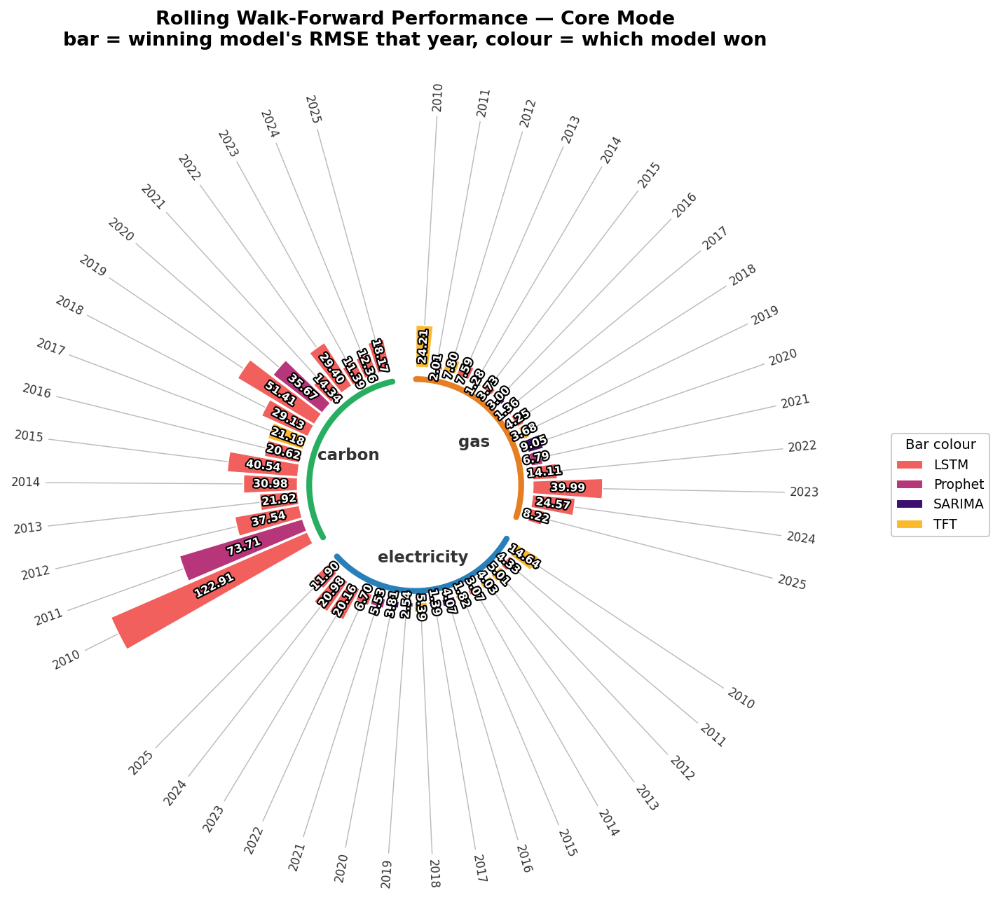<br><sub>Rolling performance, core mode — groups=series, bars=years</sub></td>
<td align="center" width="33%">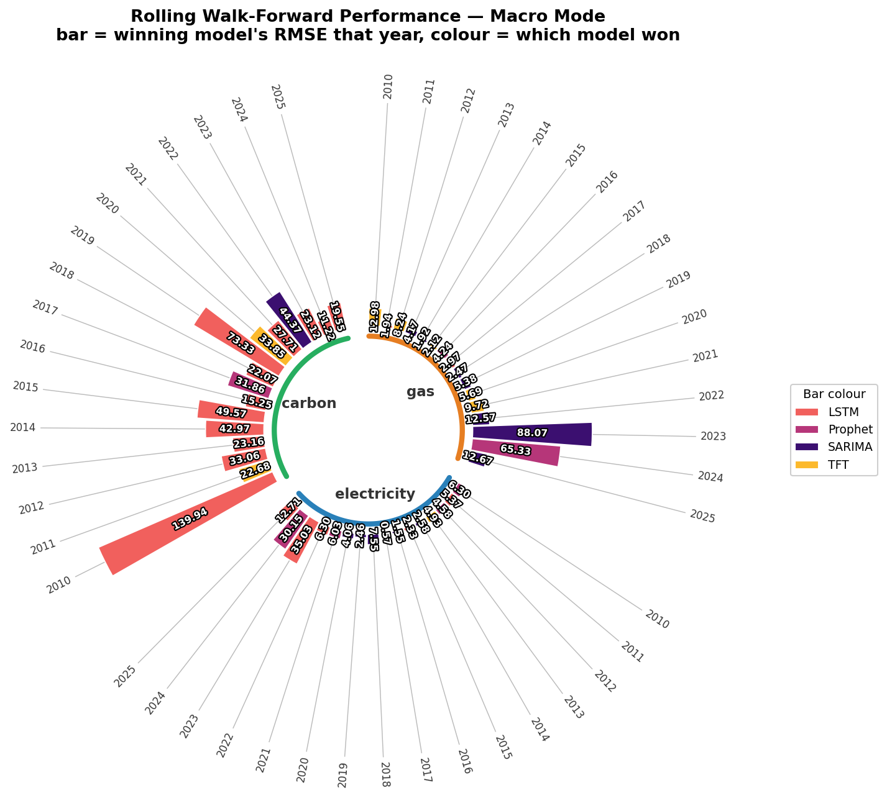<br><sub>Rolling performance, macro mode</sub></td>
</tr>
<tr>
<td align="center" width="33%">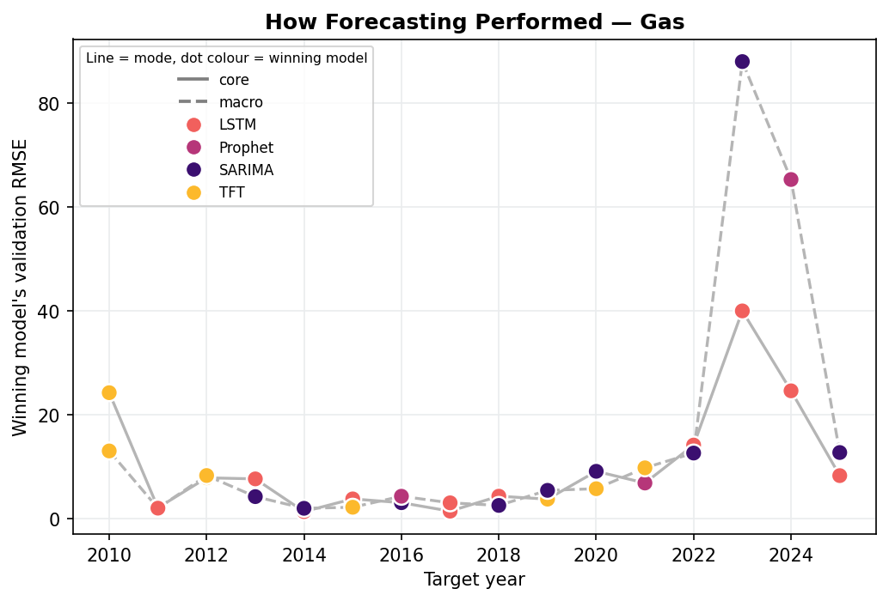<br><sub>Winning model's RMSE by year — gas</sub></td>
<td align="center" width="33%"></td>
<td align="center" width="33%"></td>
</tr>
</table>

`rolling_forecast_performance_{series}.png` is one figure **per series** (gas/electricity/carbon each get their own file, matching `forecast_vs_actual_{series}.png`'s pattern) instead of one combined 3-panel figure; core/macro mode is shown as linestyle (solid/dashed) and each point is coloured by which model actually won that year (same `plotting_utils.MODEL_COLORS` palette as the polar charts) rather than a rotated text label next to every point.

**Every polar chart in this project** (Stage 1 model ranking/rolling performance, COR-SEM loadings, COR-CVAE alignment) shares one house style, `plotting_utils.plot_grouped_circular_bars`: each chart is a set of colour-coded **groups**, each drawn as its own arc + centred label, containing **individual (non-stacked) bars** — one per item — radiating from a common inner baseline circle, with item labels placed outside via thin leader lines. Nothing is summed into an ambiguous stacked total; a "winner" (when one exists) is shown structurally via a bolder gold arc + label, never inferred from bar length.

- `model_selection_polar_{core,macro}.png` (one per mode): groups = the 3 series, each item = a rolling target year, bar height = that year's winning model's validation RMSE, bar colour = which model won.
- `model_ranking_polar_{series}_{mode}.png` (single-year dev path only, not tracked here): groups = the 4 models, items = the same fixed evaluation-metric list every time (`forecast_actual_MAE/RMSE/SMAPE` once the target year is realised, falling back to 7 validation-period metrics otherwise) — the pipeline-selected model's group gets the gold highlight.
- `outputs/ukhls_cor_sem/figures/cor_sem_loadings_polar.png`: groups = the 4 COR factors, items = each factor's own indicator items, bar = `|standardized loading|`.
- `outputs/ukhls_cor_cvae/figures/cvae_alignment_polar.png`: groups = the 4 CVAE latent dimensions, items = the 4 COR-SEM factors, bar = `|Pearson r|` between them.

---

## Stage 2 — UKHLS Household Panel, COR-SEM, and COR-CVAE

**Data.** Understanding Society (UKHLS), UK Data Service Study 6614, waves a–o (`data/raw/ukhls/*.dta`, not committed — see `.gitignore`; obtain your own UKDS-registered extract). Column-selective Stata reads (`src/ukhls_preprocessing.py`) build a **339,201-row household-wave panel** spanning interview years 2009–2024.

**Target.** `fuel_to_income_ratio` (total fuel spend ÷ net household income) and `high_fuel_vulnerable` = 1 if ratio ≥ 10% — the UK's standard fuel-poverty threshold. This is an **objective, government-standard** target, not a survey-derived composite.

**Introducing the dataset** (`src/ukhls_dataset_overview.py`, Stage 2a-overview) — descriptive figures with no modeling, run right after the panel is built: sample size by wave (with the calendar year each wave was fielded), interview timing by calendar month (near-uniform, which is exactly why month-resolution FES matching below is viable), a real-map view of sample size by UK region, missingness by key variable, and histograms of the core outcome/control variables.

<table>
<tr>
<td align="center" width="50%"><br><sub>Sample size by wave + interview-month timing</sub></td>
<td align="center" width="50%"><br><sub>Sample size by calendar year, split by contributing wave</sub></td>
</tr>
<tr>
<td align="center" width="50%"><br><sub>Sample size by UK region (real map)</sub></td>
<td align="center" width="50%"><br><sub>Missingness by key variable</sub></td>
</tr>
<tr>
<td align="center" width="50%" colspan="2"><br><sub>Key variable distributions</sub></td>
</tr>
</table>

**FES Magnitude / Current / Delta** (`attach_price_context` + `attach_fes_delta`, the mechanism connecting Stage 1 to Stage 2) — **month-resolution, not just year-resolution**, since UKHLS's own `month` fieldwork-timing variable gives ~100% `interview_month` coverage across all 15 waves and both the core price series and the rolling FES table are themselves genuinely monthly:

- **FES Current** — sum of z-scores of the household's own realised gas/electricity/carbon growth for its *exact* `(interview_year, interview_month)`, standardized against each series' full-history **monthly** mean/std. Falls back to that year's annual mean for any row whose exact month doesn't match (in practice, essentially none).
- **FES Magnitude** — from the Stage 1 rolling table, joined by `(interview_year, interview_month) == (as_of_year, target_month)`: "what was forecast for *this household's own interview month*, one year ahead, using only data available as of their interview year." Falls back to that year's annual mean, then to a single constant, if the finer tables haven't been computed yet — each fallback stage logged so the active resolution is never just assumed. That single-constant fallback is `fes_selected`'s mean for the target year (`src/fes_calculator.py`'s `_select_best_mode_per_series` — for each series independently, whichever of core/macro has the lower `forecast_actual_MAE` wins, rather than committing the whole index to one mode), not the older `fes_core`-only fallback.
- **FES Delta = Magnitude − Current** — the genuinely anticipatory, ex-ante "shock coming" signal, now varying by household-wave at month resolution (e.g. 2009 alone spans −4.94 to −4.85 across its 12 interview months, not one flat value).
- **`fes_actual_prior_year`** — a separate, additional constant attached alongside Magnitude/Current/Delta: the realised FES for the year immediately *before* the forecast target window (`src/fes_calculator.py`'s `_compute_actual_fes_for_window`), i.e. "what the index actually was last year" next to "what we forecast for next year." Not used inside `fes_delta` (which already compares Magnitude against each household's own realised exposure via Current); provided as an additional reference point for analyses that want it.

### COR resource dimensions (`src/ukhls_mapping.py`)

| Factor | Items (final, post-recode) | Notes |
|---|---|---|
| **OBJECT** | `hsrooms`, `hsbeds`, `ncars`, `carval`, `hsval` | `hsval`/`carval` structurally missing for non-owners — CFA uses FIML, not row-drop |
| **CONDITION** | `tenure_security`, `jbstat_security`, `bill_security` | 3rd item (`bill_security`, from "problems paying bills") added and empirically validated this iteration — see below |
| **PERSONAL** | `health_good`, `sf1_good`, `qfhigh_band` | `dvage` deliberately excluded (loads with the *opposite* sign — kept as a plain control instead) |
| **ENERGY** | `fihhmnnet1_dv`, `fiyrinvinc_dv` | `inoutflows2/3/4` excluded (waves m/o only, ~7% coverage — caused a degenerate FIML fit) |

Two candidate revisions to CONDITION/PERSONAL were **empirically tested and rejected** — kept as documented negative results rather than silently discarded:
- Adding `heatch` (has central heating) to CONDITION → standardized loading **0.012** (central heating is near-universal in the UK sample, almost no variance to correlate with anything). Reverted.
- Excluding `sf1_good` from PERSONAL (its coverage collapses from ~99% in waves a–e to 0.3–11% in waves f–o, the same sparse-item pathology documented for `inoutflows2/3/4`) → CFI/TLI got **worse**, not better (0.17→−2.37, −0.14→−3.63), while SRMR only marginally improved. Reverted; item kept.
- `bill_security` **was kept**: loading 0.226 (real, not near-zero), and it *strengthened* the other two CONDITION items too (`tenure_security` 0.254→0.372, `jbstat_security` 0.314→0.449).

### Stage 2b — COR-SEM (`src/ukhls_cor_sem.py`)

4-factor CFA (FIML, `semopy`) → second-order `BASELINE =~ OBJECT + CONDITION + PERSONAL + ENERGY` → FES-moderation OLS:

```
fuel_to_income_ratio ~ baseline_score + fes_delta + baseline_score × fes_delta
```

**Latest measurement loadings** (all correctly signed, all p<0.001):

| Factor | Item | Std. loading |
|---|---|---|
| OBJECT | hsbeds / ncars / hsval / hsrooms / carval | 0.67 / 0.67 / 0.55 / 0.58 / 0.43 |
| CONDITION | jbstat_security / tenure_security / bill_security | 0.45 / 0.37 / 0.23 |
| PERSONAL | sf1_good / health_good / qfhigh_band | 0.85 / 0.59 / 0.38 |
| ENERGY | fihhmnnet1_dv / fiyrinvinc_dv | 0.58 / 0.37 |

**FES-moderation result:** `baseline_score` (−0.026) and `fes_delta` (−0.001) both negative and significant, as expected; the interaction `baseline_x_fes` is **positive** (+0.00024, p<0.001) — i.e. this run's data does **not** support the COR-consistent hypothesis that high-baseline households are shielded from an FES shock. Reported transparently, not hidden.

**A known tool limitation** (documented in `src/ukhls_cor_sem.py`, verified empirically against a complete-case MLW comparison): under FIML, `semopy` 2.3.11 produces CFI/TLI outside [0,1] and an implausibly small chi² regardless of specification changes — this is a fit-*statistic-computation* limitation, not evidence the measurement model itself is misspecified. Read the loadings and the FES-moderation test as the primary evidence; RMSEA/SRMR are reported alongside as a partial cross-check. The pooled 15-wave CFA also assumes measurement invariance over 2009–2024, untested here.

### Stage 2c — COR-CVAE (`src/ukhls_cor_cvae.py`)

```
encoder(items, FES Delta) → μ, logσ²     (4-dim latent, aligned to COR-SEM factor scores)
z = μ + σ·ε
decoder(z, FES Delta) → reconstruction
predictor(z) → high_fuel_vulnerable (sigmoid)

Loss = recon_MSE + β·KL + λ·align(μ, SEM scores) + γ·BCE(predictor(z), label)
```

`fes_magnitude` (constant per run before a rolling table exists) is never scaled/fed into the conditioning path — only `fes_delta` is, avoiding a std=0 StandardScaler blow-up. The **counterfactual FES-shift query** re-encodes each household's real item vector under its own realised `fes_current` vs. the shared forecast `fes_magnitude`, reporting the predicted-vulnerability probability shift — a labelled *simulation*, never presented as an observed outcome.

<table>
<tr>
<td align="center" width="33%"><br><sub>COR-SEM measurement loadings by factor</sub></td>
<td align="center" width="33%"><br><sub>BASELINE second-order structural paths</sub></td>
<td align="center" width="33%"><br><sub>CVAE latent ↔ COR-SEM factor-score alignment</sub></td>
</tr>
<tr>
<td align="center" width="33%"><br><sub>COR-SEM loadings, polar view (slices = factors, stacked = item loadings)</sub></td>
<td align="center" width="33%"><br><sub>CVAE alignment, polar view (slices = latent dims, stacked = |r| per SEM factor)</sub></td>
<td align="center" width="33%"></td>
</tr>
</table>

---

## Stage 3 — Vulnerability Identification (`src/ukhls_vulnerability_classification.py`)

Two soft, continuous outputs — deliberately **not** a hard binary classifier — both validated against the objective `fuel_to_income_ratio`:

| Method | Pearson r vs. ratio | Spearman r | AUC vs. `high_fuel_vulnerable` |
|---|---|---|---|
| Fuzzy c-means ("Resource Depleted" membership) | 0.254 | 0.367 | 0.740 |
| One-class SVM (anomaly score, resilient reference group) | 0.165 | 0.126 | 0.619 |

Plus a transparent **logistic driver analysis** (odds ratios, not a black-box feature-importance score) — `financial_strain_score` (OR 6.90), `tenure_security` (OR 1.40), and `health_good` (OR 1.27) are the strongest positive drivers of vulnerability; `jbstat_security` (OR 0.13) and `qfhigh_band` (OR 0.59) the strongest protective factors; `fes_delta` itself is significant (OR 0.97, p<0.001).

Policy figures (prevalence by wave, by region, region×year heatmap, vulnerability rate by FES-severity tercile):

<table>
<tr>
<td align="center" width="33%"><br><sub>Vulnerability prevalence by wave/year</sub></td>
<td align="center" width="33%"><br><sub>Vulnerability prevalence by UK region</sub></td>
<td align="center" width="33%"><br><sub>Driver analysis — odds ratios</sub></td>
</tr>
</table>

### Ethnicity, disability, and tenure breakdowns

Three descriptive breakdowns added to make this project's outputs directly comparable against external poverty statistics (see [External Validation](#external-validation-against-jrfs-uk-poverty-2025) below), mirroring the existing "vulnerability by region" breakdown's exact house style:

- **Ethnicity** (`plot_ethnicity_spread`) — attributed via the **household reference person**'s `racel_dv`, recoded into 11 groups matching JRF's own categories (`src/ukhls_mapping.py`'s `ETHNICITY_GROUP_RECODE`, codes verified against the raw `.dta` value labels, not guessed). Not household-mean-aggregated like the ordinal items below it — ethnicity is categorical and asked once per person, then carried forward by Understanding Society's own derived-variable logic.
- **Disability** (`plot_disability_spread`) — a new Equality-Act-2010-style flag, `disability_free` (`health==1` AND `healthlink` limits activity "a lot"/"a little"), which the project previously had no equivalent of (only the milder self-rated-health proxies `health_good`/`sf1_good`, already inside the SEM's PERSONAL factor and left untouched). Breaks vulnerability out by whether the household contains a disabled adult.
- **Tenure** (`plot_tenure_spread`) — `tenure_dv` regrouped into JRF's four categories (`TENURE_GROUP_RECODE`): Owned outright / Buying with mortgage / Social renting / Private renting, reusing a column already read for the SEM's `tenure_security` ordinal score.

**Deliberately not added as new SEM/CVAE latent variables or as covariates in the existing driver-analysis regression.** Ethnicity and disability are demographic/health covariates, not reflective indicators of an underlying continuous resource construct — forcing them into the COR-SEM/CVAE measurement model would misspecify it (JRF's own report treats them the same way: always separate stratified tables, never inputs to a single latent score). Kept out of the logistic driver analysis too, since several ethnicity categories are small-sample nationally (Chinese n=1,408, Any other Black background n=426) and adding 10 dummy variables risked destabilizing an already-validated model for no clear payoff.

<table>
<tr>
<td align="center" width="33%">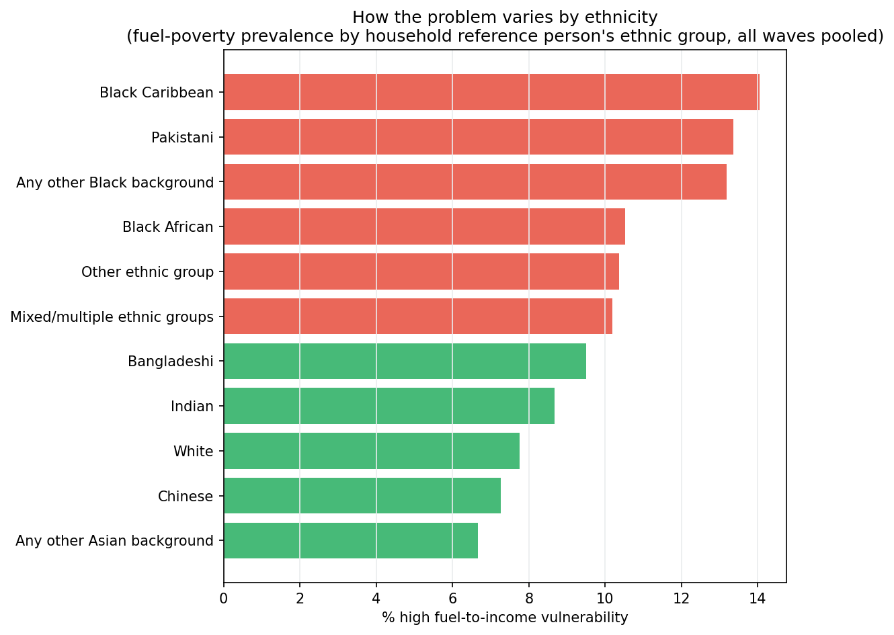<br><sub>Vulnerability prevalence by ethnicity group</sub></td>
<td align="center" width="33%">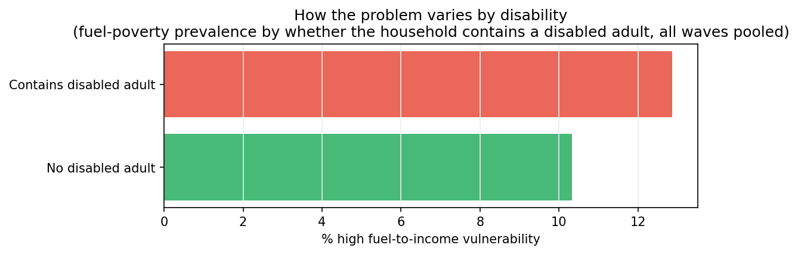<br><sub>Vulnerability prevalence by disability status</sub></td>
<td align="center" width="33%">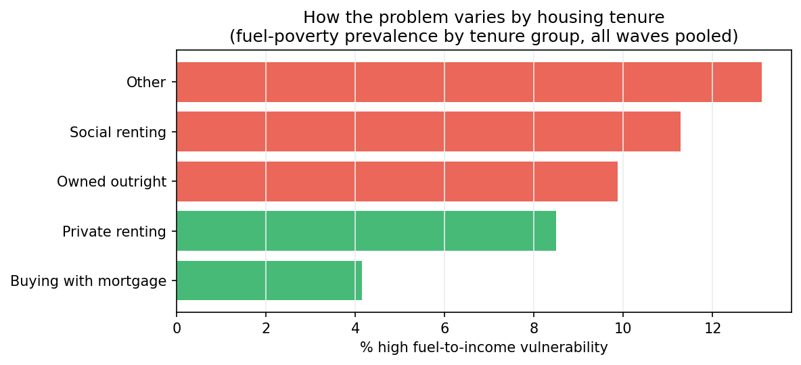<br><sub>Vulnerability prevalence by housing tenure</sub></td>
</tr>
</table>

---

## External Validation Against JRF's UK Poverty 2025

`src/ukhls_external_validation.py` checks this project's own vulnerability outputs against an independent external benchmark: the Joseph Rowntree Foundation's "UK Poverty 2025" report (published January 2025, using DWP Households Below Average Income data) — **deliberately not an apples-to-apples comparison**. Ours measures fuel-to-income vulnerability (pooled UKHLS waves 2009–2024); JRF measures relative income poverty after housing costs (mostly averaged 2021/22–2022/23). Both measure household financial hardship, so groups should broadly rank similarly even though the two constructs have different drivers — agreement is the check, and *divergence is reported as informative, not hidden or treated as failure*.

| Dimension | n | Spearman ρ | Pearson r | Read |
|---|---|---|---|---|
| Region | 12 | 0.33 (0.73 excl. NI) | −0.10 (0.68 excl. NI) | Strong once Northern Ireland's documented fuel-oil driver (below) is set aside |
| Tenure | 4 | **0.80** | **0.68** | Strong agreement despite only 4 categories |
| Ethnicity | 6 | 0.14 | 0.27 | Weak — see divergence below |
| Disability | 2 | — | — | Directionally consistent (ours 10.3%→12.9%, JRF 19%→29%) |

Benchmark values are hardcoded from numbers explicitly **stated in JRF's report text** (Table 6 p.51 for region, p.9/42 for ethnicity, Table 8 p.67 for disability, Table 10 p.95 for tenure) — categories JRF shows only in a chart with no stated number (e.g. Indian, Chinese, Mixed ethnic groups) are left out of the benchmark rather than read off pixels.

**Why Northern Ireland is excluded from the region correlation coefficient, but nowhere else.** NI ranks *highest* on our fuel-specific measure (15.6%) but *lowest* in JRF's income-poverty ranking (17%) — investigated rather than assumed to be noise or a bug. Verified directly against this project's own panel data (`_save_ni_oil_heating_evidence`, `outputs/ukhls_vulnerability/tables/ni_oil_heating_evidence_*.csv`):

- 71.2% of NI households report spending on oil heating, vs 1.5–9.8% in every GB region (mains gas never reached large parts of NI).
- **Within NI alone** (a controlled, same-region comparison): oil-heating households average £2,017/year on fuel and a 20.9% vulnerability rate, vs £1,243/year and 12.3% for non-oil NI households.

That within-region gap is real signal, not an artifact of region-mapping or missing data: heating oil is bought in lump-sum deliveries, is price-volatile, and — unlike gas/electricity — sits outside Ofgem's price cap, a genuine fuel-specific cost exposure with no reason to appear in an income-based poverty measure. NI is therefore excluded **only** from the region correlation coefficient (a like-for-like check of construct agreement); it stays fully in every other regional output (maps, tables, driver analysis), where dropping it would throw away the clearest example of this project's fuel-specific measure doing exactly what it's for.

**Two further divergences flagged, not smoothed over:**
- **Tenure reversal**: owned-outright households rank *above* private renters on our measure (9.9% vs 8.5%), the opposite of JRF's income-poverty ranking (14% vs 35%). Plausible driver: outright owners skew older/pensioner, in older, harder-to-heat housing that's paid off but expensive to run.
- **Ethnicity divergence**: Black Caribbean households rank *highest* on our measure (14.1%) but *lowest* of the minority groups on JRF's income poverty (30%, vs Bangladeshi's 56%); Bangladeshi households, JRF's highest-poverty group, sit close to White on ours (9.5%). A genuine difference in construct, not an error — flagged for further investigation rather than dismissed.

**The wave-level trend** (`plot_wave_trend_vs_jrf_narrative`) is a second, independent check: our fuel-vulnerability rate declines from 11.6% (2009) to a low of 5.1% (2020), then spikes sharply to 10.8%/10.6% in exactly the 2022/2023 waves — reproducing the shape of JRF's own faster cost-of-living tracker (hardship peaking around October 2022) rather than the "broadly flat" shape of JRF's own slower annual relative-poverty measure over the same window (p.19). The metric is sensitive to the right real-world event, checked against an indicator JRF itself uses to make the same point.

<table>
<tr>
<td align="center" width="33%">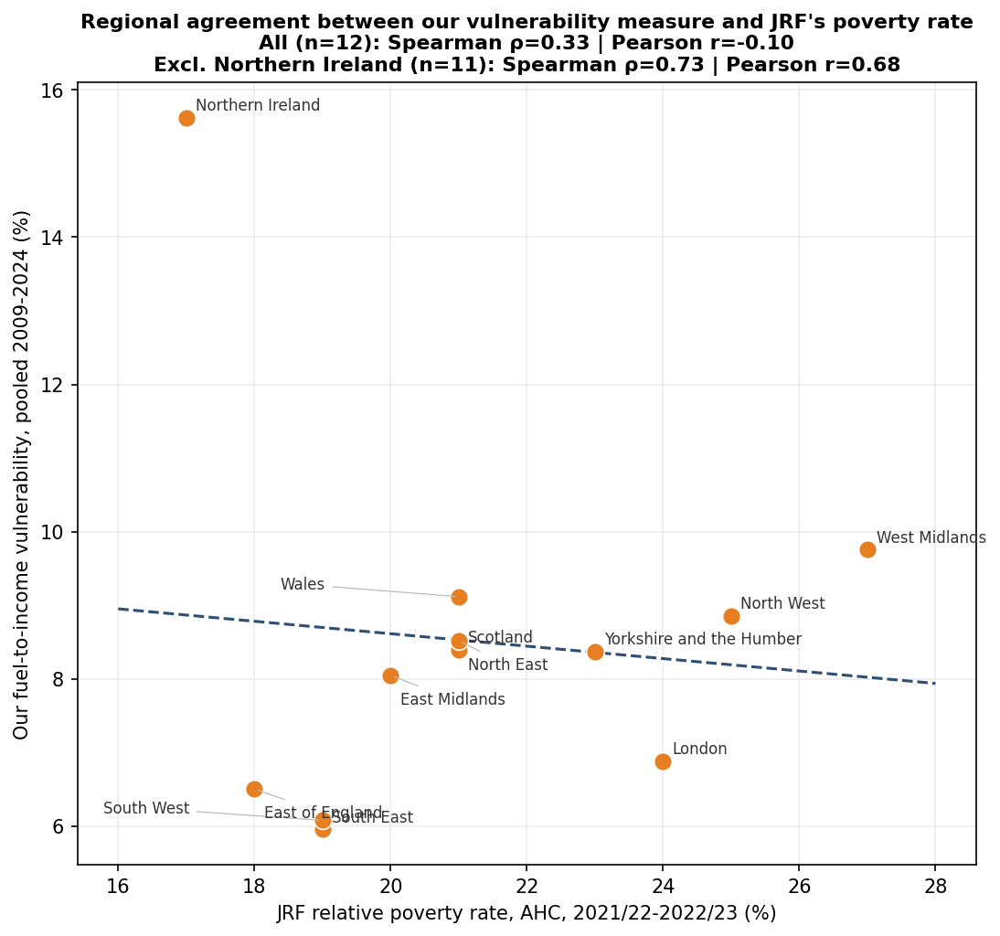<br><sub>Region: ours vs JRF poverty rate</sub></td>
<td align="center" width="33%">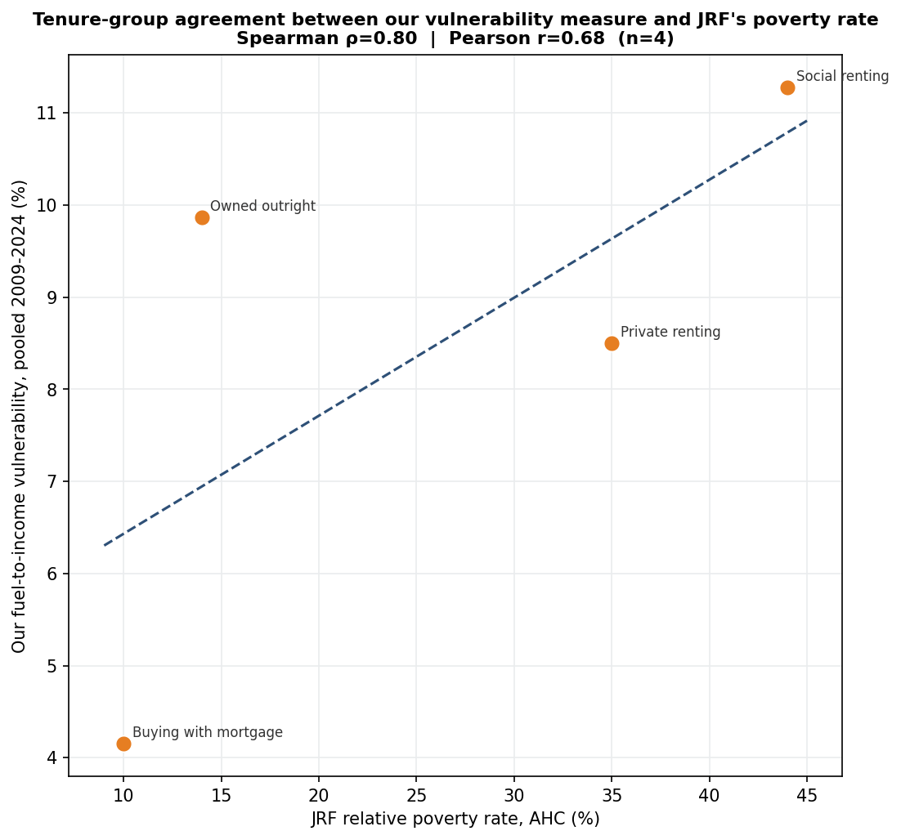<br><sub>Tenure: ours vs JRF poverty rate</sub></td>
<td align="center" width="33%">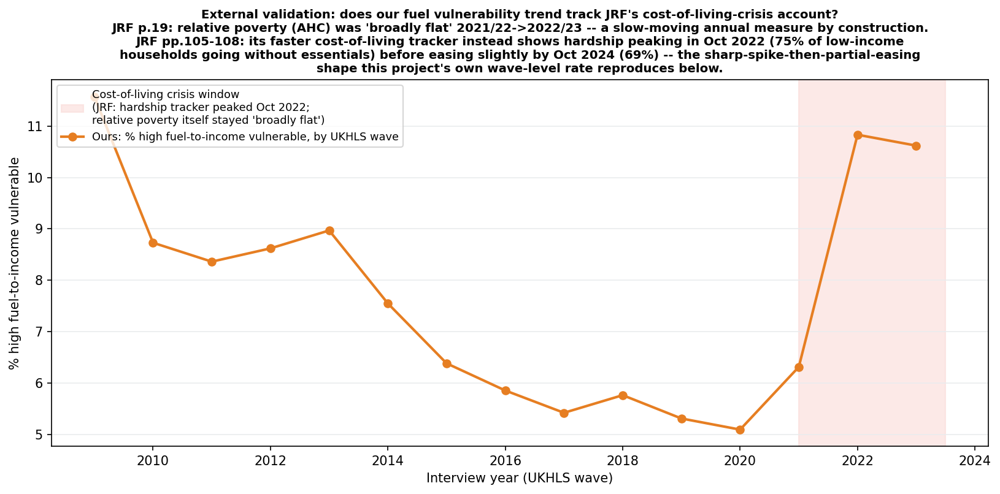<br><sub>Wave-level trend vs JRF's cost-of-living-crisis account</sub></td>
</tr>
</table>

---

## Stage 4 — Policy Geography Maps (`src/ukhls_policy_maps.py`)

Drawn on **real UK region boundaries** (`data/geo/uk_nuts1_regions.geojson` — ONS Open Geography Portal, "NUTS, level 1 (January 2018) Boundaries UK BUC," Open Government Licence v3.0, downloaded once via the portal's public ArcGIS FeatureServer — attribution rendered directly on every map figure). UKHLS (End User Licence) only exposes geography at this 12-region level (9 English regions + Wales + Scotland + Northern Ireland) — the shared helper, `src/ukhls_geo_maps.py`, is reused by Stage 3's variable maps below too.

1. **Resource-to-Stress Hotspot Map** — two side-by-side real maps (mean SEM `baseline_resource_score`; regional `high_fuel_vulnerable` prevalence) plus the 3×3 bivariate policy-tier legend. *Adapted from the original brief's literal bivariate "FES axis" map* — FES here is a single **national** scalar with no regional variation to map, so the second map uses the regional vulnerability-outcome prevalence instead (same underlying policy intent: cash-transfer vs. structural-infrastructure priority zones).
2. **Fuzzy Membership Map** — real choropleth of mean "Vulnerable to Loss" fuzzy membership (the % of households near the 0.5 "about to tip" boundary is in the saved table).
3. **Vulnerability Vector Shift Map** — arrow at each region's real centroid: mean predicted vulnerability under each household's own realised FES vs. under the shared forecast shock (reuses the Stage 2c counterfactual output) — red = rising risk, green = falling. London's arrow/label is nudged into open space with a leader line (a standard cartographic fix — London is geographically tiny and sits inside South East, so a same-length arrow at its true centroid collided with its neighbour's).

<table>
<tr>
<td align="center" width="33%"><br><sub>Map 1 — Resource-to-Stress Hotspot (real boundaries)</sub></td>
<td align="center" width="33%"><br><sub>Map 2 — Fuzzy Membership (real boundaries)</sub></td>
<td align="center" width="33%"><br><sub>Map 3 — Vulnerability Vector Shift (real boundaries)</sub></td>
</tr>
</table>

### Additional real-map and policy-analysis views (Stage 3)

Beyond the headline vulnerability rate, the same real-boundary helper draws maps for other key variables, plus two further policy-analysis angles distinct from the pooled-national figures above:

<table>
<tr>
<td align="center" width="33%"><br><sub>Fuel-poverty prevalence — real map (companion to the ranked bar chart below)</sub></td>
<td align="center" width="33%"><br><sub>Mean Baseline Resource Stock by region</sub></td>
<td align="center" width="33%"><br><sub>Change in prevalence, 2009-13 vs. 2019-24 (diverging)</sub></td>
</tr>
</table>

- **Regional driver heterogeneity** (`run_driver_analysis_by_region`): re-fits the Stage 3 logistic driver analysis separately per region instead of pooled nationally — does *what causes* vulnerability differ by place, not just how much of it there is? (`outputs/ukhls_vulnerability/tables/driver_analysis_by_region.csv` + `driver_analysis_by_region.png`.)
- **Temporal-change map**: vulnerability-prevalence change between waves a–e (2009–2013) and waves k–o (2019–2024) per region, as a diverging real choropleth — complements the existing region×year heatmap (a grid) with a genuinely spatial "where is it getting worse" view. Northern Ireland shows the largest improvement in the most recent run (−10.2 percentage points).

---

## Stage 5 — Forward Vulnerability Prediction (`src/ukhls_forward_prediction.py`)

Every stage above answers "who is vulnerable now, and what explains it" — a **contemporaneous** question. Stage 5 answers a genuinely different, **prospective** one: **who is about to become vulnerable, and roughly when** — using a household's *current* COR-SEM profile plus the price signal already forecast for their own next year, before that next year's survey data exists.

**The linkage problem.** UKHLS's per-wave rows carry no stable household key on their own — `hidp` is reissued whenever household composition changes. The fix: `hrpid` (household reference person's `pidp`), verified present in every wave's raw `hhresp` file and added to the panel via `src.ukhls_mapping.HH_LINK_VARS`. Matching `hrpid_t == hrpid_{t+1}` directly links the same reference person's household across one wave gap — **72–85% of households link per transition** (14 wave-pairs checked, a→b through n→o), a normal UKHLS attrition/HRP-turnover rate, not a bug.

**Training data.** Every linked (wave t, wave t+1) pair becomes one example: features from wave t (COR-SEM object/condition/personal/energy scores, `financial_strain_score`, `dvage`, `heatch`, and — the anticipatory signal — `fes_magnitude`, already the forecast for *that household's own next year*, computed using only data available as of wave t), label from wave t+1 (`high_fuel_vulnerable`). **261,759 linked transition rows** across all 14 wave-pairs, 2009–2024.

**Model and validation.** A logistic regression (transparent odds ratios, same choice Stage 3 already made over a black-box model) is **walk-forward validated** — trained on the 12 earliest transitions (a→b … l→m), held out on the 2 most recent *known* transitions (m→n, n→o) — before being trusted on the genuinely unknown future:

| | |
|---|---|
| Held-out transitions | m→n, n→o |
| n (train / validation) | 177,408 / 21,161 |
| **AUC vs. actual `high_fuel_vulnerable` at t+1** | **0.758** |
| Pearson r vs. actual `fuel_to_income_ratio` at t+1 | 0.265 |

An AUC of 0.76 on data the model never saw during training — genuinely forward-predicted, not fit — is the number that justifies trusting the final model's forward predictions at all.

**Drivers** (final model, refit on all 14 known transitions — deliberately excludes `baseline_resource_score` alongside its own four components, which are correlated at r=0.65–0.77 and produce unstable, compensating coefficients together; the four first-order scores alone give clean per-dimension odds ratios):

| Predictor | Odds ratio | Direction |
|---|---|---|
| `financial_strain_score` | 4.82 | ↑ risk |
| `object_score` | 1.42 | ↑ risk |
| `fes_magnitude` (the forecast signal itself) | 1.03 | ↑ risk |
| `dvage` | 1.02 | ~neutral |
| `heatch` | 0.94 (n.s.) | ~neutral |
| `personal_score` | 0.93 | ↓ risk |
| `condition_score` | 0.77 | ↓ risk |
| `energy_score` | 0.31 | ↓ risk |

**Application.** Refit on all 14 known transitions, then scored every wave-o household (the most recent wave) using their own profile + their own already-forecast `fes_magnitude` — genuinely unobserved. **19,140 of 19,586** wave-o households scored (446 missing ≥1 feature); mean predicted probability 0.066. Each prediction targets that household's *own* next interview year (2024 or 2025, depending on exactly when within wave o they were interviewed) and — since `fes_magnitude` already matches interview month to the same calendar month one year ahead — their own target month too, giving a month-level view of when risk peaks.

<table>
<tr>
<td align="center" width="50%">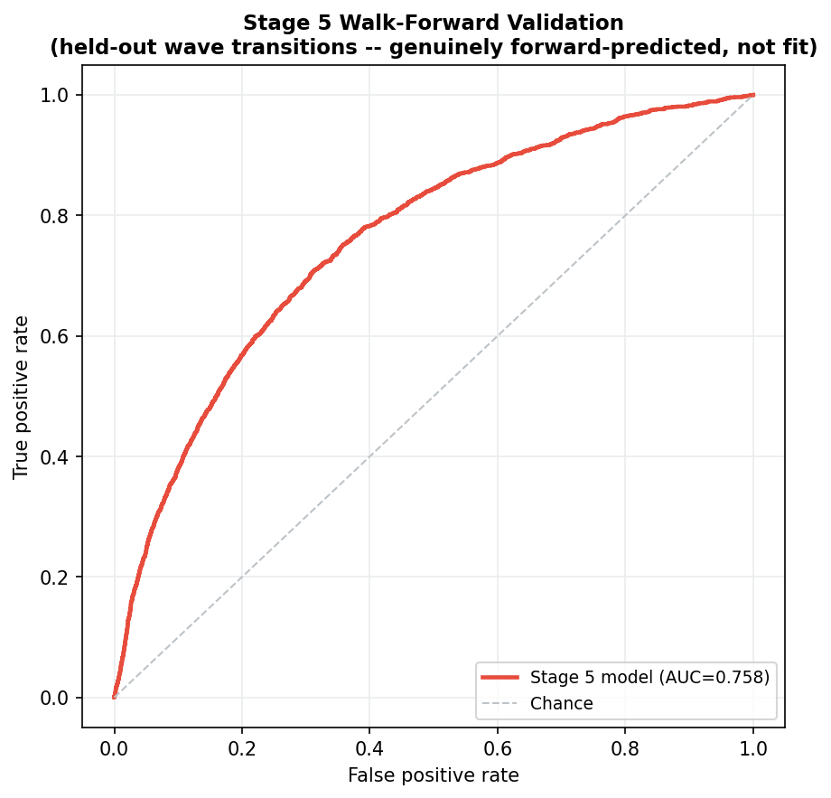<br><sub>Walk-forward validation ROC (held-out m→n/n→o, AUC=0.758)</sub></td>
<td align="center" width="50%">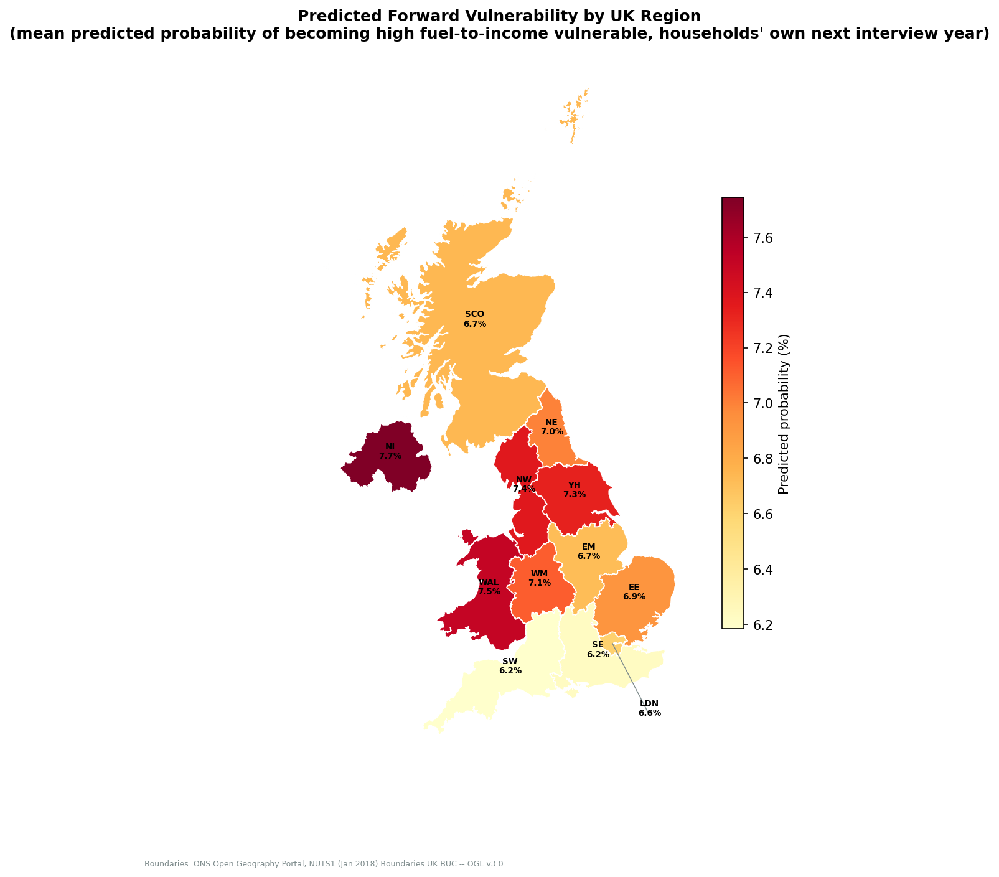<br><sub>Predicted forward vulnerability by UK region</sub></td>
</tr>
<tr>
<td align="center" width="50%" colspan="2">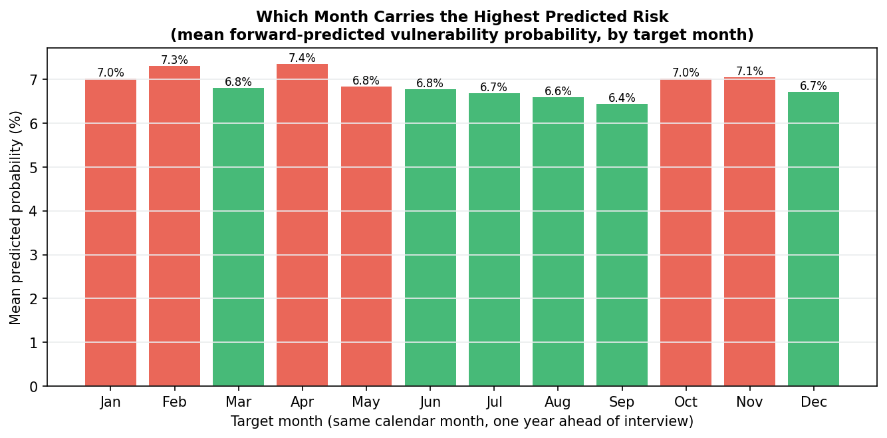<br><sub>Which target month carries the highest predicted risk</sub></td>
</tr>
</table>

---

## Directory Structure

```
anticipatory-energy-stress/
├── main.py                     # orchestrator: --stage forecast|household, --rolling, --skip-cvae, --fast
├── forecast_pipeline.py        # Stage 1: run() single-year, run_rolling() walk-forward
├── household_stream.py         # Stage 2-5: UKHLS panel -> COR-SEM -> COR-CVAE -> vulnerability -> maps -> forward prediction
├── requirements.txt
├── data/
│   ├── raw/                    # gas/electricity/carbon/macro CSVs + raw/ukhls/*.dta (gitignored)
│   ├── processed/              # core_energy_carbon.csv, macro_controls.csv, ...
│   ├── geo/                    # uk_nuts1_regions.geojson (ONS Open Geography Portal, OGL v3.0)
│   └── social_science_data/    # UKHLS zip extract source (gitignored)
├── src/
│   ├── data_loader.py, preprocessing.py, tuning.py, model_evaluation.py, plotting_utils.py
│   ├── fes_calculator.py       # Stage 1 FES construction (single-year + rolling helpers)
│   ├── models/                 # sarima_model.py, prophet_model.py, lstm_model.py, tft_model.py
│   ├── ukhls_mapping.py        # wave/COR-item registry (shared source of truth)
│   ├── ukhls_preprocessing.py  # Stage 2a: panel build + FES Magnitude/Current/Delta
│   ├── ukhls_dataset_overview.py  # Stage 2a-overview: panel composition/missingness/distributions
│   ├── ukhls_cor_sem.py        # Stage 2b: COR-SEM
│   ├── ukhls_cor_cvae.py       # Stage 2c: COR-CVAE
│   ├── ukhls_vulnerability_classification.py   # Stage 3
│   ├── ukhls_geo_maps.py       # shared real-boundary choropleth helper (Stage 3/4/5)
│   ├── ukhls_policy_maps.py    # Stage 4
│   ├── ukhls_forward_prediction.py   # Stage 5: hrpid-linked wave transitions -> forward prediction
│   ├── ukhls_external_validation.py  # region/ethnicity/disability/tenure vs JRF UK Poverty 2025
│   ├── sem_mediation.py        # ols_path (only function reused, by ukhls_cor_sem.py)
│   ├── config.py, paths.py, logging_utils.py, metrics_utils.py, model_utils.py
│   └── __pycache__/
└── outputs/
    ├── forecasts/, forecasts_rolling/{year}/, tables/, tables/rolling/{year}/
    ├── fes/                    # fes_rolling_yearly.csv, fes_rolling_monthly.csv, fes_variant_selection.csv, fes_metrics_selected_variant_by_year.csv, model_selection_by_year.csv, forecast_performance_by_year.csv, rolling/{year}/
    ├── figures/                # fes_rolling_trend, model_selection_polar_*, model_ranking_polar_*, rolling_forecast_performance_{series}
    ├── ukhls_cleaned/          # ukhls_panel.csv (339,201 rows)
    ├── ukhls_dataset_overview/, ukhls_cor_sem/, ukhls_cor_cvae/, ukhls_vulnerability/, ukhls_policy_maps/
    ├── ukhls_forward_prediction/   # Stage 5: transition pairs, validation metrics, forward predictions
    └── logs/pipeline.log
```

---

## Required Outputs Reference

### Stage 1 (`outputs/fes/`, `outputs/tables/`, `outputs/forecasts*/`)
| File | Description |
|---|---|
| `fes_monthly_{target_year}.csv` | 12-row monthly z-score breakdown, single-year **dev path only** (not in reported results); target year defaults to `DEFAULT_TARGET_YEAR` (2025), overridable via `--target-year` |
| `fes_rolling_yearly.csv` | Rolling walk-forward: one row per `(as_of_year, target_year)`, annual mean — **the reported path** |
| `fes_rolling_monthly.csv` | Same walk-forward run at its native resolution: one row per `(as_of_year, target_year, target_month)` |
| `fes_variant_selection.csv` | Which of Core/Macro was chosen, and why (mean RMSE) |
| `fes_metrics_selected_variant_by_year.csv` | The **selected** variant's own RMSE/Pearson r vs. the 3 realised-FES benchmarks, one row per rolling year — replaces the old two-heatmap format |
| `model_selection_by_year.csv` | Which model won each `(as_of_year, series, mode)` — underlies the model-selection polar charts |
| `forecast_performance_by_year.csv` | Winning model's RMSE per `(as_of_year, series, mode)` — underlies the performance-by-year figures |
| `figures/model_selection_polar_{core,macro}.png` | Grouped circular bars: groups=series, bars=rolling years, height=RMSE, colour=winning model |
| `figures/rolling_forecast_performance_{gas,electricity,carbon}.png` | Winning model's RMSE trend, one figure per series, points coloured by winning model |
| `figures/model_ranking_polar_{series}_{mode}.png` | Single-year dev path only: grouped circular bars, one group per model, individual metric bars, selected model's group highlighted |
| `tables/rolling/{year}/model_metrics_comparison.csv` | Per-year per-model/series/mode MAE/RMSE/MAPE + ranking |

### Stage 2a-overview (`outputs/ukhls_dataset_overview/`)
| File | Description |
|---|---|
| `dataset_panel_composition.png` | Sample size by wave + interview-month histogram |
| `dataset_rows_by_year.png` / `.csv` | Sample size by calendar year, and the same totals split by contributing wave |
| `dataset_sample_size_by_region.png` | Real UK map of household-wave rows by region |
| `dataset_missingness.png` / `dataset_missingness_by_variable.csv` | % missing per key variable, all waves pooled |
| `dataset_key_distributions.png` | Histograms: fuel-to-income ratio, financial strain, age, income, fuel spend, FES Delta |

### Stage 2 (`outputs/ukhls_cleaned/`, `outputs/ukhls_cor_sem/`, `outputs/ukhls_cor_cvae/`)
| File | Description |
|---|---|
| `ukhls_cleaned/ukhls_panel.csv` | Full panel + SEM factor scores + CVAE latents (339,201 rows) |
| `ukhls_cor_sem/tables/cor_sem_measurement_loadings.csv` | CFA loadings per item |
| `ukhls_cor_sem/tables/cor_sem_fit_indices.csv`, `structural_fit_indices_baseline.csv` | CFI/TLI/RMSEA/SRMR |
| `ukhls_cor_sem/tables/fes_moderation_path.csv` | BASELINE × FES Delta interaction regression |
| `ukhls_cor_cvae/tables/cvae_latent_scores.csv`, `cvae_sem_alignment.csv` | Latent z + alignment with SEM |
| `ukhls_cor_cvae/tables/cvae_counterfactual_fes_shift.csv` | Per-household current-vs-forecast simulation |
| `ukhls_cor_sem/figures/cor_sem_loadings_polar.png` | Polar view of measurement loadings, slices = COR factors |
| `ukhls_cor_cvae/figures/cvae_alignment_polar.png` | Polar view of latent-dim ↔ SEM-factor alignment, slices = z1-z4 |

### Stage 3 (`outputs/ukhls_vulnerability/`)
| File | Description |
|---|---|
| `stage3_vulnerability_scores.csv` | Fuzzy memberships + one-class anomaly score, per household |
| `stage3_validation_against_objective_ratio.csv` | Correlation/AUC vs. `fuel_to_income_ratio` |
| `driver_analysis_logistic_regression.csv` | Odds ratios for every control + `fes_delta`, pooled nationally |
| `driver_analysis_by_region.csv` + `driver_analysis_by_region.png` | Same driver analysis re-fit per UK region |
| `policy_vulnerability_by_wave.csv`, `by_region.csv`, `region_year_heatmap.csv`, `by_fes_tier.csv` | Spread figures' underlying data |
| `policy_vulnerability_by_ethnicity.csv` / `.png` | Vulnerability rate by household reference person's ethnicity group |
| `policy_vulnerability_by_disability.csv` / `.png` | Vulnerability rate by whether the household contains a disabled adult |
| `policy_vulnerability_by_tenure.csv` / `.png` | Vulnerability rate by housing tenure group |
| `policy_vulnerability_by_region_map.png` | Real-map companion to the ranked `by_region` bar chart |
| `policy_map_baseline_resource_by_region.png`, `policy_map_financial_strain_by_region.png` | Real maps of mean SEM baseline-resource score and financial-strain score by region |
| `policy_temporal_change_map.png` | Diverging real map: vulnerability-prevalence change, waves a-e vs. k-o |

### External Validation (`outputs/ukhls_vulnerability/`)
| File | Description |
|---|---|
| `jrf_poverty_benchmark_{region,ethnicity,disability,tenure}.csv` | Hardcoded JRF UK Poverty 2025 reference values (text-stated only, cited by page) |
| `external_validation_{dim}_comparison.csv` | Our rate merged with JRF's, both rankings, per dimension |
| `external_validation_{dim}_bars.png` / `_scatter.png` | Comparison figures, per dimension |
| `external_validation_wave_trend.png` | Our wave-level trend vs JRF's cost-of-living-crisis account |
| `ni_oil_heating_evidence_by_region.csv` | % of households using oil heating, by region — the evidence behind excluding NI from the region correlation only |
| `ni_oil_heating_evidence_within_ni.csv` | Within-NI oil vs non-oil households: fuel spend and vulnerability rate |

### Stage 4 (`outputs/ukhls_policy_maps/`)
| File | Description |
|---|---|
| `map1_resource_stress_hotspot.csv` | Per-region baseline resource × vulnerability prevalence + bivariate tier |
| `map2_fuzzy_membership.csv` | Per-region mean fuzzy membership + % near 0.5 boundary |
| `map3_vulnerability_vector_shift.csv` | Per-region current/forecast/shift predicted probability |

### Stage 5 (`outputs/ukhls_forward_prediction/`)
| File | Description |
|---|---|
| `stage5_transition_pairs.csv` | Every hrpid-linked (wave t, wave t+1) household pair, all 14 wave-transitions, with features (wave t) and the true label (wave t+1) |
| `stage5_validation_metrics.csv` | Walk-forward AUC / Pearson r on the held-out most-recent-known transitions — the number that says whether the final predictions should be trusted |
| `stage5_validation_roc.png` | ROC curve for the held-out walk-forward validation |
| `stage5_driver_coefficients.csv` | Odds ratios of the final (all-data) forward model — transparent, same convention as Stage 3's driver analysis |
| `stage5_forward_predictions.csv` | Per wave-o household: predicted probability of vulnerability at their own next interview year, region, target month |
| `stage5_forward_prediction_map.png` | Real UK region map of mean predicted forward-vulnerability probability |
| `stage5_forward_prediction_by_month.csv` / `.png` | Mean predicted probability by target month — which month to prioritise |

---

## Methodological Limitations

- **FIML CFI/TLI under semopy 2.3.11** are unreliable (verified against a complete-case MLW comparison) — read loadings and the FES-moderation test as primary evidence for the SEM, not CFI/TLI.
- **Pooled 15-wave CFA** assumes measurement invariance 2009–2024, untested.
- **FES Delta's two components use different z-scoring baselines** (rolling-year train window for Magnitude vs. full-history monthly mean/std for Current, now both at month resolution) and Magnitude sums 4 z-terms while Current sums 3 (no realised analogue of forecast uncertainty) — Delta is a documented, honest approximation of shock size, not an exact matched-scale subtraction.
- **FES Magnitude's monthly resolution matches interview month to the SAME calendar month one year ahead** (e.g. a March interview reads the forecast's March-next-year value), not literally "as of this exact day" — the walk-forward refit itself only happens at annual (December) cutoffs, so this refines *which* of the 12 already-forecast months gets attached rather than adding a new, more frequent refit.
- **FES is a single national scalar** — no regional variation exists to map, which is why Stage 4's Map 1 substitutes regional vulnerability-outcome prevalence for a literal "FES axis."
- **Real-boundary maps require one external dependency** (`data/geo/uk_nuts1_regions.geojson`, fetched once from the ONS Open Geography Portal, `geopandas` added to `requirements.txt`) — no longer self-contained the way the earlier hex-cartogram was, in exchange for exact geographic shape fidelity.
- **CVAE item preparation median-imputes** remaining missing values (the SEM instead uses FIML natively) — a real simplification, not swept under the rug.
- **`sf1_good`'s coverage collapses** from ~99% (waves a–e) to 0.3–11% (waves f–o) — kept in the model after an empirical test showed removing it makes CFI/TLI worse, but this is a real, documented data-quality asymmetry across waves.
- **Rolling walk-forward's earliest feasible years** have thin training windows (as little as ~24 months) — forecast quality for those years is inherently weaker than for later years with a full decade+ of history.
- **Stage 5's household linkage covers only ~70-75% of households per wave transition** (`hrpid_t == hrpid_{t+1}` direct match, verified against the raw wave a/b files) — normal UKHLS attrition and household-reference-person turnover, not a bug, but the model is trained/validated/applied on the linked subset only, and attrition itself may correlate with vulnerability (not corrected for here).
- **Stage 5's features inherit Stage 2b's pooled-CFA limitation**: the COR-SEM/COR-CVAE scores used as "time t" features are fit on the whole 2009–2024 panel, so they carry a mild amount of whole-panel information into every wave's features — a second-order effect on the features, not a leak of the actual t+1 label, but worth restating here since Stage 5's central claim ("genuinely forward") is narrower than Stage 2b/3's.
- **Stage 5 tracks the household reference person, not a fixed dwelling** — if the reference person moves to a different household between waves, `hrpid` still links them; this is "same person," not "same address."
- **Ethnicity is attributed via the household reference person only**, not every household member — a household with a mixed-ethnicity composition is represented by one person's group. **Disability is observed only for responding adults** (indresp), so the disability breakdown compares against JRF's "disabled adults only" row specifically, not its broader family-composition categories that include children.
- **The external validation is by construction not apples-to-apples** — fuel-to-income vulnerability (ours) and relative income poverty AHC (JRF's) are different constructs with different drivers; divergence at a given stratum (e.g. Northern Ireland on region, Black Caribbean/Bangladeshi on ethnicity, owned-outright/private-renting on tenure) is reported as informative, not treated as evidence either measure is wrong. Two of the four dimensions (disability n=2, ethnicity n=6) have few enough categories that the correlation coefficient itself is a weak summary — the per-category bar charts matter more than the headline ρ/r for those.
- **Ethnicity/disability were deliberately not added as SEM/CVAE latent variables or driver-analysis covariates** — see [Stage 3](#ethnicity-disability-and-tenure-breakdowns) above for why.

---

## Migration Note (from the ENABLE Architecture)

An earlier version of this project used a single UK cross-section (ENABLE.EU, 2017 only) split into three parallel "COR estimation routes" (a formative composite, a reflective SEM, and a VAE) compared against each other, feeding a CatBoost classifier + SHAP explainability stage. That entire architecture — `src/enable_preprocessing.py`, `src/cor_sem.py`, `src/cor_vae.py`, `src/construct_validation.py`, `src/construct_mapping.py`, `src/unsupervised_latent.py`, `src/route_comparison.py`, `src/route_utils.py`, `src/ml_classification.py`, `src/shap_explainability.py`, `ml_pipeline.py` (root), `src/ts_shap.py`, and `src/fes_scenarios.py` — has been **removed from the repository entirely** (not merely disconnected) now that the UKHLS panel supersedes it on every dimension that motivated the original three-route comparison. All of it remains recoverable from git history if ever needed for comparison.

`src/sem_mediation.py` is the one partial exception: it was trimmed rather than deleted, since one function (`ols_path`, a generic OLS path-estimation helper) is still reused by `src.ukhls_cor_sem`'s FES-moderation test — the rest of that module (the Route-1-specific `run()`, `bootstrap_mediation()`, path-diagram/mediation figures) was ENABLE-specific dead code and has been removed.

---

## Dependencies

See `requirements.txt`. Notable: `semopy` (COR-SEM CFA), `tensorflow` (COR-CVAE; the forecast stream itself uses PyTorch — `torch`, `pytorch-forecasting`, `lightning`), `scikit-fuzzy` (Stage 3 fuzzy c-means), `geopandas` (Stage 3/4 real UK region choropleths, `src/ukhls_geo_maps.py`), `pmdarima`/`prophet`/`statsmodels` (Stage 1 statistical models), `openpyxl` (reading `data/raw/cpih08_188.xlsx`).

`pytorch-forecasting>=1.0` depends on the `lightning` package (its `TemporalFusionTransformer` subclasses `lightning.pytorch.LightningModule`), not the older standalone `pytorch-lightning` package — verified against `pytorch-forecasting` 1.8.0 / `lightning` 2.6.5.

---

## Citation / Project Context

Research project on anticipatory energy-carbon stress forecasting and household fuel vulnerability, UK Data Service Study 6614 (Understanding Society) under standard End User Licence terms — raw UKHLS data is not redistributed with this repository (see `.gitignore`); obtain your own extract via the UK Data Service.
