# Forecasting Anticipatory Energy–Carbon Stress and Household Fuel Vulnerability in the UK

**A Conservation of Resources (COR) Theory and Time-Series Forecasting Framework — UKHLS Household Panel Edition**

---

## Research Objective

To forecast UK energy and carbon price stress (FES — Forecasted Energy Stress) via a walk-forward time-series pipeline, and to identify household-level fuel vulnerability across a real 15-wave household panel (UKHLS, Understanding Society, Study 6614, 2009–2024) by operationalising Hobfoll's Conservation of Resources theory: four resource dimensions (Object, Condition, Personal, Energy) extracted two ways — a classical Structural Equation Model (COR-SEM) and an FES-conditioned Conditional Variational Autoencoder (COR-CVAE) — feeding a soft, continuous vulnerability identification stage and a set of policy geography maps.

This is the **second major architecture** of this project. The first used a single-year UK cross-section (ENABLE.EU, 2017 only) split into three parallel "COR estimation routes" compared against each other. That architecture is fully removed from this repo (see [Migration note](#migration-note-from-the-enable-architecture) below) — every household in that dataset shared one FES value, so forecasted prices could only ever be background context, never a real predictor. UKHLS's panel structure fixes that: each household's interview year differs, so realised *and* forecasted price stress vary genuinely row-by-row.

---

## Conceptual Logic

```
Stage 1 — Forecasting (forecast_pipeline.py)
  Raw UK gas/electricity/carbon + macro series
             ↓
  4 models (SARIMA, Prophet, LSTM, TFT) × 2 modes (core, macro) × 3 series
             ↓
  Equal-weighted FES index (sum of z-scored components)
             ↓
  Single-year (train→2016, forecast 2017) OR
  Rolling walk-forward (train through year Y, forecast Y+1, for every feasible Y)
             ↓
  FES variant selection: Equal_Core vs Equal_Macro, lowest mean RMSE vs realised FES wins

Stage 2 — Latent extraction (household_stream.py, UKHLS Study 6614 panel)
  15-wave household panel (waves a–o, interview years 2009–2024)
             ↓
  FES Magnitude (walk-forward forecast, joined by interview_year)
  FES Current  (realised, own interview year)  →  FES Delta = Magnitude − Current
             ↓
  COR-SEM (Stage 2b): 4-factor CFA → BASELINE resource-stock factor
                       → FES-moderation regression
  COR-CVAE (Stage 2c): 4-dim latent space aligned to COR-SEM, FES-conditioned
                       encoder + decoder → counterfactual FES-shift simulation

Stage 3 — Vulnerability identification (fuzzy c-means + one-class SVM +
           logistic driver analysis), validated against the objective
           fuel-to-income ratio (UK's 10% fuel-poverty threshold)

Stage 4 — Policy geography maps (real UK region boundaries, ONS Open
           Geography Portal, 12 regions): resource-to-stress hotspot /
           fuzzy-membership / vulnerability vector-shift
```

The framework does **not** claim FES *causes* household outcomes in a strict experimental sense. FES enters the household-level analysis in exactly two disciplined ways: (1) as `fes_delta` — a direct regression predictor and an interaction term with the SEM's `baseline_score`, testing Hobfoll's claim that low-resource households absorb a price shock worse than high-resource households — and (2) as a genuine conditioning variable in the CVAE's encoder and decoder, enabling a counterfactual "this household's own realised exposure vs. the shared forecasted shock" simulation. Both are the *actual mechanisms*, not a hand-wave: see [Stage 2](#stage-2--ukhls-household-panel-cor-sem-and-cor-cvae) below for exactly how.

---

## How to Run

```bash
pip install -r requirements.txt

# Stage 1, rolling walk-forward FES (train through year Y, forecast Y+1,
# for every feasible Y — ~15-18 years x 24 model fits; 45-90min in --fast
# mode, multi-hour without). This is the reported path -- run it once
# before Stage 2 so FES Magnitude/Delta vary by household interview year
# AND month instead of falling back to a single constant.
python forecast_pipeline.py --rolling --fast

# Stage 2-4 (requires Stage 1 to have produced at least the rolling FES
# table above; falls back to a single constant with a logged warning if not)
python main.py --stage household
python household_stream.py                     # equivalent, run directly
python household_stream.py --skip-cvae          # skip Stage 2c (most expensive)

# Full pipeline: Stage 1 single-year dev path (fast, NOT the reported
# results -- see Stage 1 below) then Stage 2-4
python main.py

# Stage 1 single-year only (dev/diagnostics iteration, not tracked)
python main.py --stage forecast
python forecast_pipeline.py                    # equivalent, run directly

# Development mode: fewer LSTM/TFT epochs
python main.py --fast
```

---

## Stage 1 — Macro Forecasting and the Forecasted Energy Stress (FES) Index

**Data.** UK gas, electricity, and carbon (EUA futures) monthly YoY growth series (`data/raw/`), plus a macro control set (CPIH inflation, GDP, temperature volatility, gas futures, electricity demand — `src/data_loader.py`). The usable history is auto-detected from the raw files at runtime (currently ~2006–2026), not hardcoded.

**Models.** SARIMA(X), Prophet, LSTM (Monte-Carlo dropout for prediction intervals), and a Transformer/TFT-family model, each in **core** mode (target series only) and **macro** mode (+ exogenous macro regressors) — 24 model fits per forecast year (4 models × 2 modes × 3 series).

**FES formula** (`src/fes_calculator.py`):

```
FES_t = z(GasGrowth_t) + z(ElecGrowth_t) + z(CarbonGrowth_t) + z(Uncertainty_t)
```

z-scored against the training-period mean/std. Only the **equal-weighted** variant is computed (volatility-weighted and Bayesian-Kalman-filtered variants, and a 9-scenario macro simulation layer, were dropped as unused overhead — see [Migration note](#migration-note-from-the-enable-architecture)).

**Two ways to run Stage 1:**

- **Single-year** (`compute_fes`, `python forecast_pipeline.py` without `--rolling`): train on one fixed window, forecast one target year (2017 by default) — a fast dev/diagnostics iteration path only. Its figures (`forecast_2017_*`, `forecast_vs_actual_*`, `fes_monthly_2017`, `prediction_intervals_2017`, `model_ranking_polar_*`) are **not part of the reported results** and are not tracked in this repo — a fixed 2017 snapshot doesn't reflect how the pipeline is actually used (see below), so it isn't presented as if it did.
- **Rolling walk-forward** (`run_rolling`, `--rolling` flag) — **this is the reported path**: for every feasible year Y (enough training history before Y, real data through Y available), retrain all 24 models on data through Y and forecast Y+1, selecting the best model **fresh each year** per (series, mode) rather than fixing one model across the whole timeline. `compute_fes` already produces this at 12-month resolution internally; `run_rolling` saves both the annual mean (`outputs/fes/fes_rolling_yearly.csv`) and the full month-level detail (`outputs/fes/fes_rolling_monthly.csv`) instead of discarding it — this is what makes FES Magnitude genuinely vary by household interview year **and month** in Stage 2, instead of being one fixed constant.

**FES variant selection.** After a rolling run, `_select_best_fes_variant()` compares Equal_Core vs Equal_Macro's RMSE against three realised-FES benchmarks, averaged across every rolling year, and picks one winner to use exclusively downstream (`outputs/fes/fes_variant_selection.csv`). In the most recent run (17 years, 2009–2025): **Equal_Macro wins** (mean RMSE 2.29 vs. Equal_Core's 3.53) — the macro-augmented models' exogenous regressors measurably improve forecast accuracy over core-only models.

Sanity check on the rolling table: the year with the single highest forecasted shock across 2009–2025 is **as_of_year=2021 → target_year=2022** (`fes_core=5.86`) — correctly identifying the actual European energy-price crisis before it fully materialised in the realised data. The FES-robustness heatmaps below independently confirm this: 2021 is the one as-of year where RMSE against every realised-FES benchmark spikes an order of magnitude above every other year, for both variants.

<table>
<tr>
<td align="center" width="33%">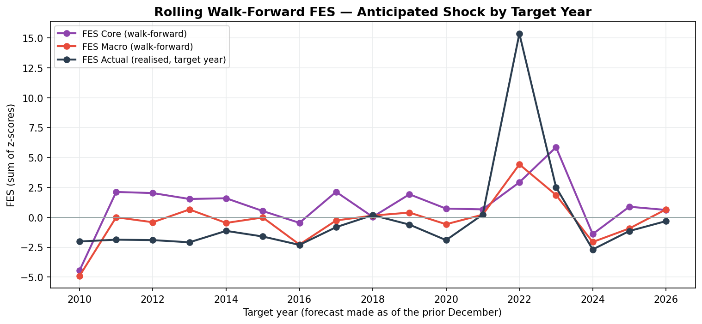<br><sub>Rolling walk-forward FES by target year</sub></td>
<td align="center" width="33%">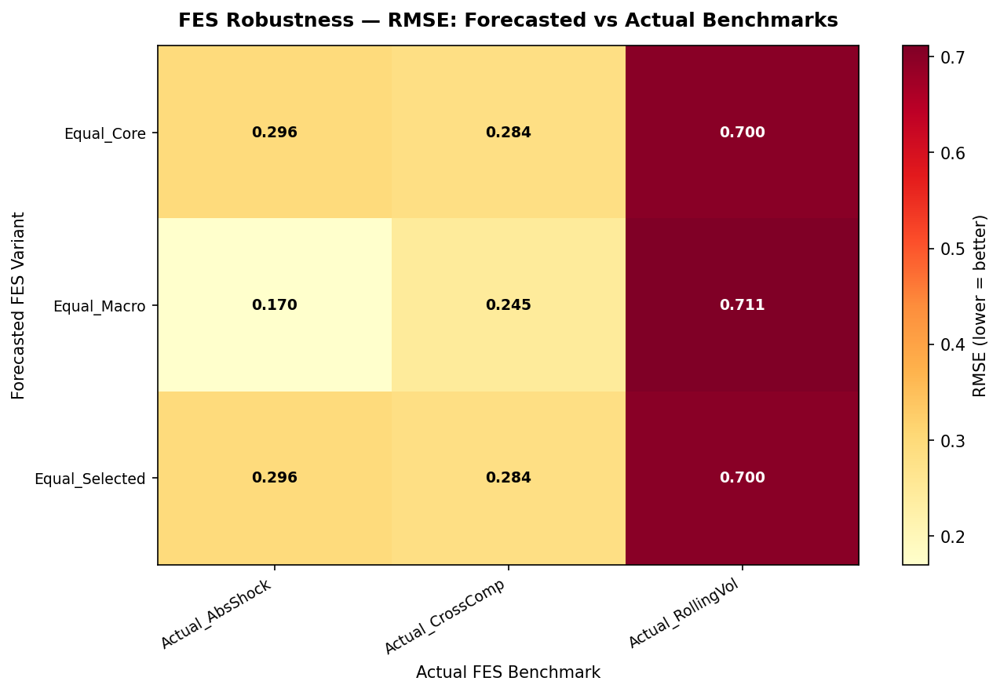<br><sub>FES robustness by year — RMSE</sub></td>
<td align="center" width="33%">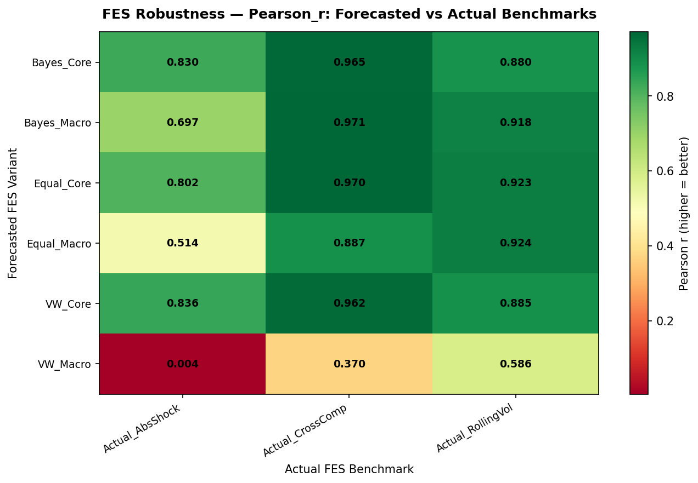<br><sub>FES robustness by year — Pearson r</sub></td>
</tr>
<tr>
<td align="center" width="33%">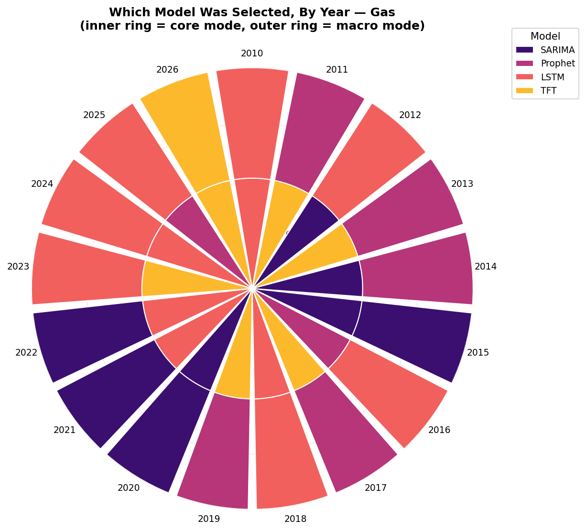<br><sub>Which model won, by year — gas</sub></td>
<td align="center" width="33%">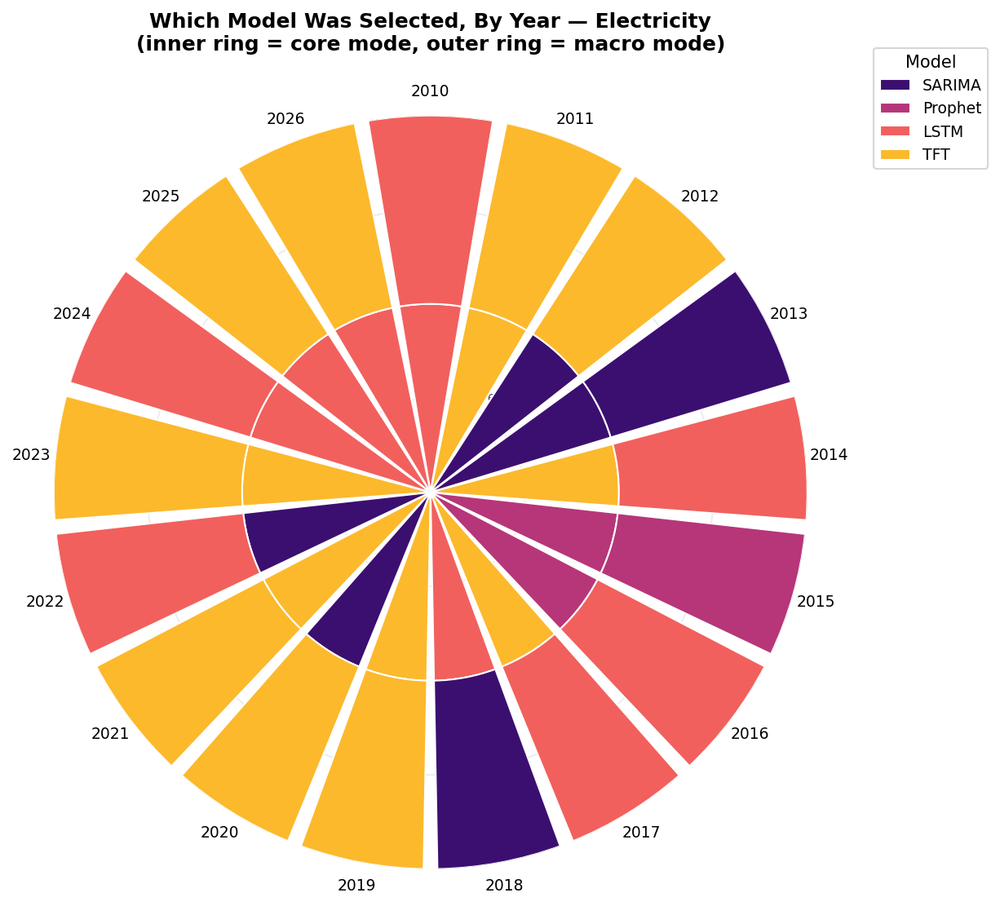<br><sub>Which model won, by year — electricity</sub></td>
<td align="center" width="33%">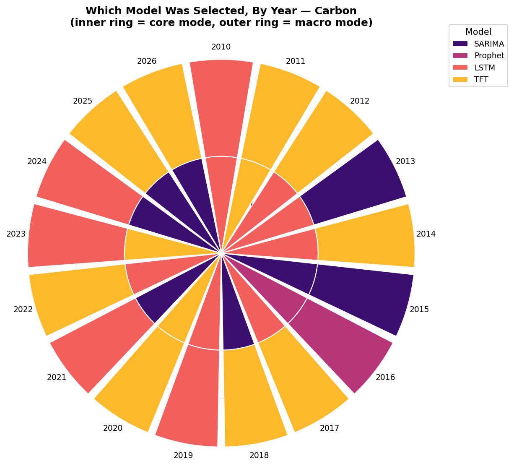<br><sub>Which model won, by year — carbon</sub></td>
</tr>
<tr>
<td align="center" width="66%" colspan="2">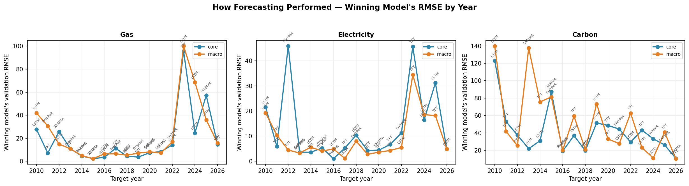<br><sub>How forecasting performed — winning model's RMSE by year, all 3 series</sub></td>
<td align="center" width="33%"></td>
</tr>
</table>

The **model-selection polar charts** are a different reading of the polar-chart technique from the metric-composition style below: slices = target year, colour = which of the 4 models won that year (inner ring = core mode, outer ring = macro mode) — no single model dominates across the whole 2010–2026 window, which is exactly why the pipeline re-selects per year rather than fixing one model.

Stacked polar bar charts (used by the single-year dev path's `model_ranking_polar_*` figures, not tracked here) show one bar per model, 8 normalised evaluation metrics stacked from the centre outward in an "inferno" gradient (dark purple → magenta → orange → gold) — shorter total bar height = better model.

---

## Stage 2 — UKHLS Household Panel, COR-SEM, and COR-CVAE

**Data.** Understanding Society (UKHLS), UK Data Service Study 6614, waves a–o (`data/raw/ukhls/*.dta`, not committed — see `.gitignore`; obtain your own UKDS-registered extract). Column-selective Stata reads (`src/ukhls_preprocessing.py`) build a **339,201-row household-wave panel** spanning interview years 2009–2024.

**Target.** `fuel_to_income_ratio` (total fuel spend ÷ net household income) and `high_fuel_vulnerable` = 1 if ratio ≥ 10% — the UK's standard fuel-poverty threshold. This is an **objective, government-standard** target, not a survey-derived composite.

**Introducing the dataset** (`src/ukhls_dataset_overview.py`, Stage 2a-overview) — descriptive figures with no modeling, run right after the panel is built: sample size by wave (with the calendar year each wave was fielded), interview timing by calendar month (near-uniform, which is exactly why month-resolution FES matching below is viable), a real-map view of sample size by UK region, missingness by key variable, and histograms of the core outcome/control variables.

<table>
<tr>
<td align="center" width="50%">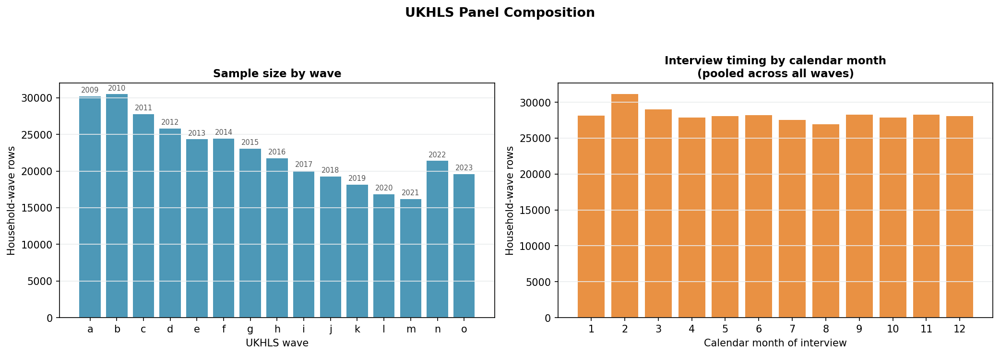<br><sub>Sample size by wave + interview-month timing</sub></td>
<td align="center" width="50%">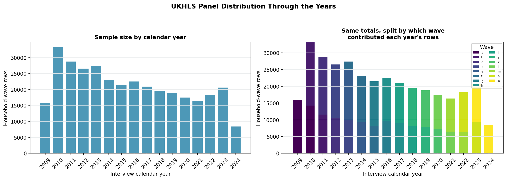<br><sub>Sample size by calendar year, split by contributing wave</sub></td>
</tr>
<tr>
<td align="center" width="50%">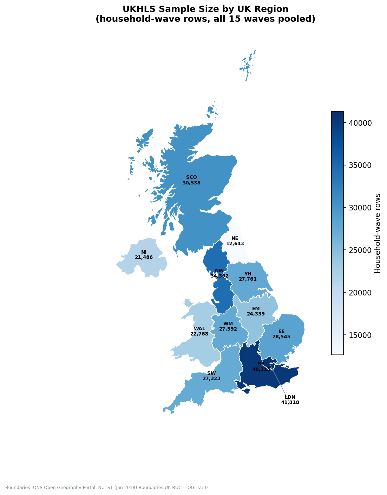<br><sub>Sample size by UK region (real map)</sub></td>
<td align="center" width="50%">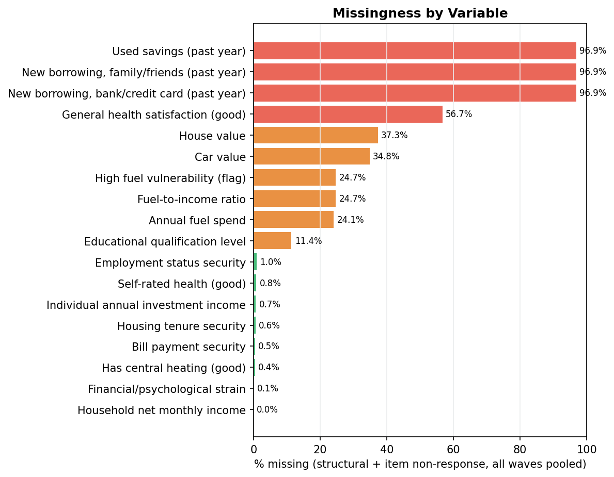<br><sub>Missingness by key variable</sub></td>
</tr>
<tr>
<td align="center" width="50%" colspan="2">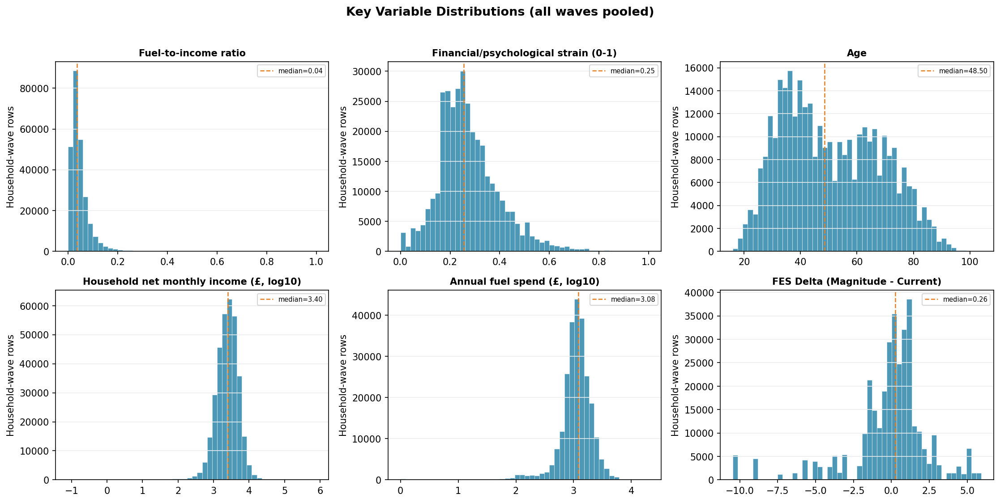<br><sub>Key variable distributions</sub></td>
</tr>
</table>

**FES Magnitude / Current / Delta** (`attach_price_context` + `attach_fes_delta`, the mechanism connecting Stage 1 to Stage 2) — **month-resolution, not just year-resolution**, since UKHLS's own `month` fieldwork-timing variable gives ~100% `interview_month` coverage across all 15 waves and both the core price series and the rolling FES table are themselves genuinely monthly:

- **FES Current** — sum of z-scores of the household's own realised gas/electricity/carbon growth for its *exact* `(interview_year, interview_month)`, standardized against each series' full-history **monthly** mean/std. Falls back to that year's annual mean for any row whose exact month doesn't match (in practice, essentially none).
- **FES Magnitude** — from the Stage 1 rolling table, joined by `(interview_year, interview_month) == (as_of_year, target_month)`: "what was forecast for *this household's own interview month*, one year ahead, using only data available as of their interview year." Falls back to that year's annual mean, then to a single constant (mean of the single-year path's `fes_core`), if the finer tables haven't been computed yet — each fallback stage logged so the active resolution is never just assumed.
- **FES Delta = Magnitude − Current** — the genuinely anticipatory, ex-ante "shock coming" signal, now varying by household-wave at month resolution (e.g. 2009 alone spans −4.94 to −4.85 across its 12 interview months, not one flat value).

### COR resource dimensions (`src/ukhls_mapping.py`)

| Factor | Items (final, post-recode) | Notes |
|---|---|---|
| **OBJECT** | `hsrooms`, `hsbeds`, `ncars`, `carval`, `hsval` | `hsval`/`carval` structurally missing for non-owners — CFA uses FIML, not row-drop |
| **CONDITION** | `tenure_security`, `jbstat_security`, `bill_security` | 3rd item (`bill_security`, from "problems paying bills") added and empirically validated this iteration — see below |
| **PERSONAL** | `health_good`, `sf1_good`, `qfhigh_band` | `dvage` deliberately excluded (loads with the *opposite* sign — kept as a plain control instead) |
| **ENERGY** | `fihhmnnet1_dv`, `fiyrinvinc_dv` | `inoutflows2/3/4` excluded (waves m/o only, ~7% coverage — caused a degenerate FIML fit) |

Two candidate revisions to CONDITION/PERSONAL were **empirically tested and rejected** — kept as documented negative results rather than silently discarded:
- Adding `heatch` (has central heating) to CONDITION → standardized loading **0.012** (central heating is near-universal in the UK sample, almost no variance to correlate with anything). Reverted.
- Excluding `sf1_good` from PERSONAL (its coverage collapses from ~99% in waves a–e to 0.3–11% in waves f–o, the same sparse-item pathology documented for `inoutflows2/3/4`) → CFI/TLI got **worse**, not better (0.17→−2.37, −0.14→−3.63), while SRMR only marginally improved. Reverted; item kept.
- `bill_security` **was kept**: loading 0.226 (real, not near-zero), and it *strengthened* the other two CONDITION items too (`tenure_security` 0.254→0.372, `jbstat_security` 0.314→0.449).

### Stage 2b — COR-SEM (`src/ukhls_cor_sem.py`)

4-factor CFA (FIML, `semopy`) → second-order `BASELINE =~ OBJECT + CONDITION + PERSONAL + ENERGY` → FES-moderation OLS:

```
fuel_to_income_ratio ~ baseline_score + fes_delta + baseline_score × fes_delta
```

**Latest measurement loadings** (all correctly signed, all p<0.001):

| Factor | Item | Std. loading |
|---|---|---|
| OBJECT | hsbeds / ncars / hsval / hsrooms / carval | 0.67 / 0.67 / 0.55 / 0.58 / 0.43 |
| CONDITION | jbstat_security / tenure_security / bill_security | 0.45 / 0.37 / 0.23 |
| PERSONAL | sf1_good / health_good / qfhigh_band | 0.85 / 0.59 / 0.38 |
| ENERGY | fihhmnnet1_dv / fiyrinvinc_dv | 0.58 / 0.37 |

**FES-moderation result:** `baseline_score` (−0.026) and `fes_delta` (−0.001) both negative and significant, as expected; the interaction `baseline_x_fes` is **positive** (+0.00024, p<0.001) — i.e. this run's data does **not** support the COR-consistent hypothesis that high-baseline households are shielded from an FES shock. Reported transparently, not hidden.

**A known tool limitation** (documented in `src/ukhls_cor_sem.py`, verified empirically against a complete-case MLW comparison): under FIML, `semopy` 2.3.11 produces CFI/TLI outside [0,1] and an implausibly small chi² regardless of specification changes — this is a fit-*statistic-computation* limitation, not evidence the measurement model itself is misspecified. Read the loadings and the FES-moderation test as the primary evidence; RMSEA/SRMR are reported alongside as a partial cross-check. The pooled 15-wave CFA also assumes measurement invariance over 2009–2024, untested here.

### Stage 2c — COR-CVAE (`src/ukhls_cor_cvae.py`)

```
encoder(items, FES Delta) → μ, logσ²     (4-dim latent, aligned to COR-SEM factor scores)
z = μ + σ·ε
decoder(z, FES Delta) → reconstruction
predictor(z) → high_fuel_vulnerable (sigmoid)

Loss = recon_MSE + β·KL + λ·align(μ, SEM scores) + γ·BCE(predictor(z), label)
```

`fes_magnitude` (constant per run before a rolling table exists) is never scaled/fed into the conditioning path — only `fes_delta` is, avoiding a std=0 StandardScaler blow-up. The **counterfactual FES-shift query** re-encodes each household's real item vector under its own realised `fes_current` vs. the shared forecast `fes_magnitude`, reporting the predicted-vulnerability probability shift — a labelled *simulation*, never presented as an observed outcome.

<table>
<tr>
<td align="center" width="33%">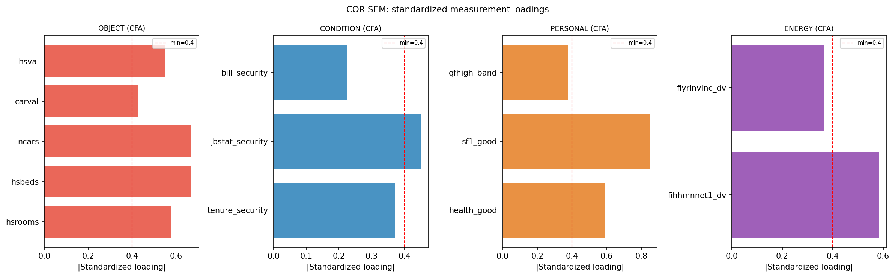<br><sub>COR-SEM measurement loadings by factor</sub></td>
<td align="center" width="33%">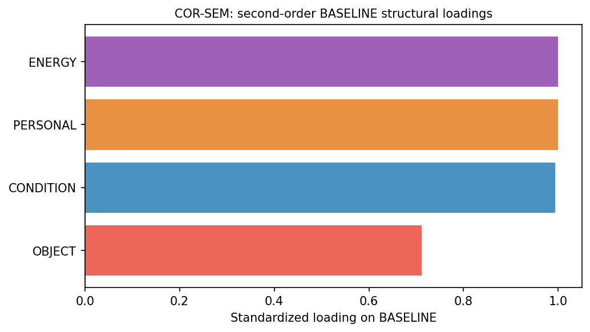<br><sub>BASELINE second-order structural paths</sub></td>
<td align="center" width="33%">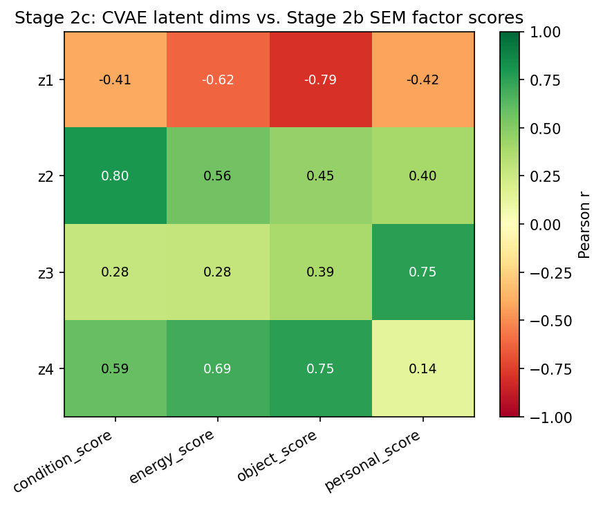<br><sub>CVAE latent ↔ COR-SEM factor-score alignment</sub></td>
</tr>
<tr>
<td align="center" width="33%">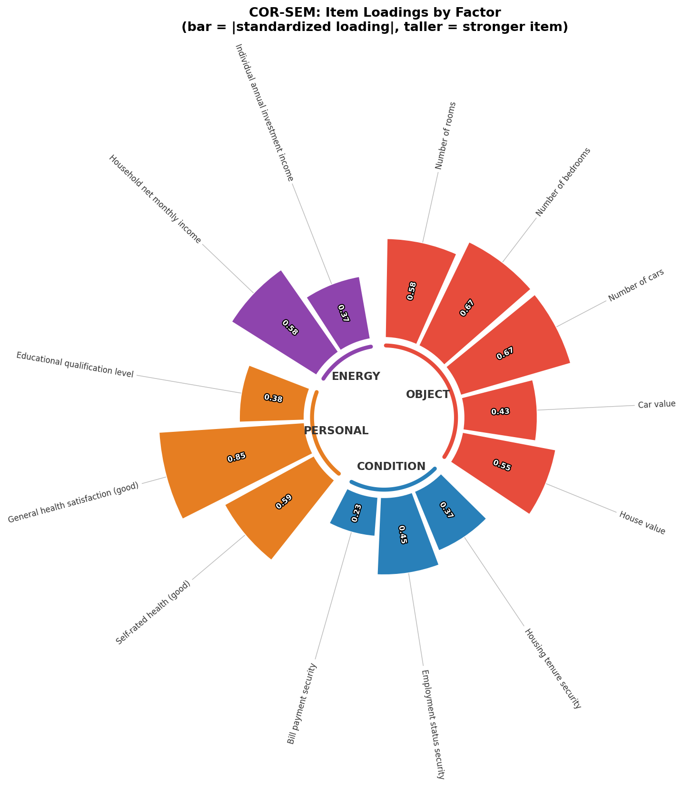<br><sub>COR-SEM loadings, polar view (slices = factors, stacked = item loadings)</sub></td>
<td align="center" width="33%">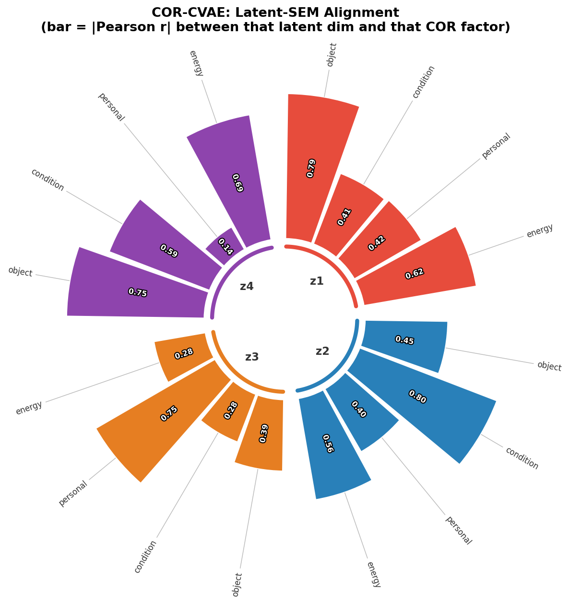<br><sub>CVAE alignment, polar view (slices = latent dims, stacked = |r| per SEM factor)</sub></td>
<td align="center" width="33%"></td>
</tr>
</table>

---

## Stage 3 — Vulnerability Identification (`src/ukhls_vulnerability_classification.py`)

Two soft, continuous outputs — deliberately **not** a hard binary classifier — both validated against the objective `fuel_to_income_ratio`:

| Method | Pearson r vs. ratio | Spearman r | AUC vs. `high_fuel_vulnerable` |
|---|---|---|---|
| Fuzzy c-means ("Resource Depleted" membership) | 0.254 | 0.367 | 0.740 |
| One-class SVM (anomaly score, resilient reference group) | 0.165 | 0.126 | 0.619 |

Plus a transparent **logistic driver analysis** (odds ratios, not a black-box feature-importance score) — `financial_strain_score` (OR 6.90), `tenure_security` (OR 1.40), and `health_good` (OR 1.27) are the strongest positive drivers of vulnerability; `jbstat_security` (OR 0.13) and `qfhigh_band` (OR 0.59) the strongest protective factors; `fes_delta` itself is significant (OR 0.97, p<0.001).

Policy figures (prevalence by wave, by region, region×year heatmap, vulnerability rate by FES-severity tercile):

<table>
<tr>
<td align="center" width="33%">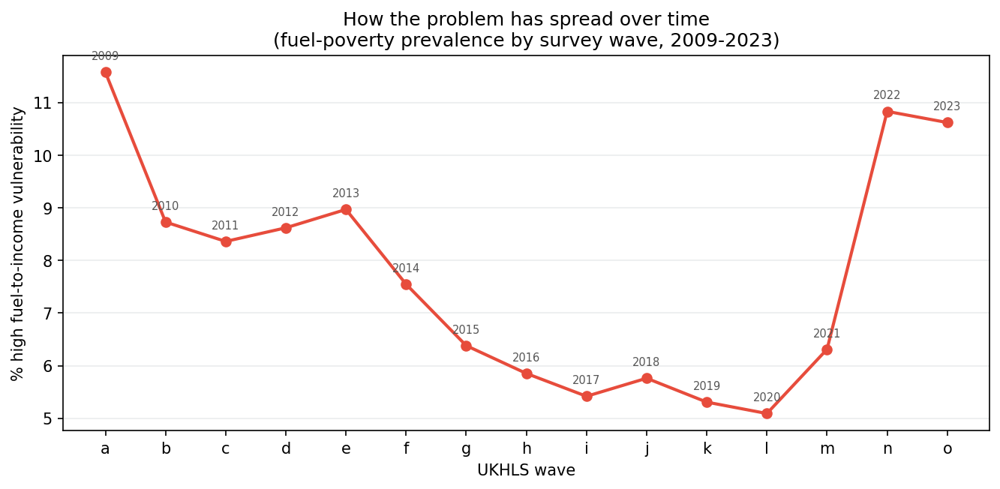<br><sub>Vulnerability prevalence by wave/year</sub></td>
<td align="center" width="33%">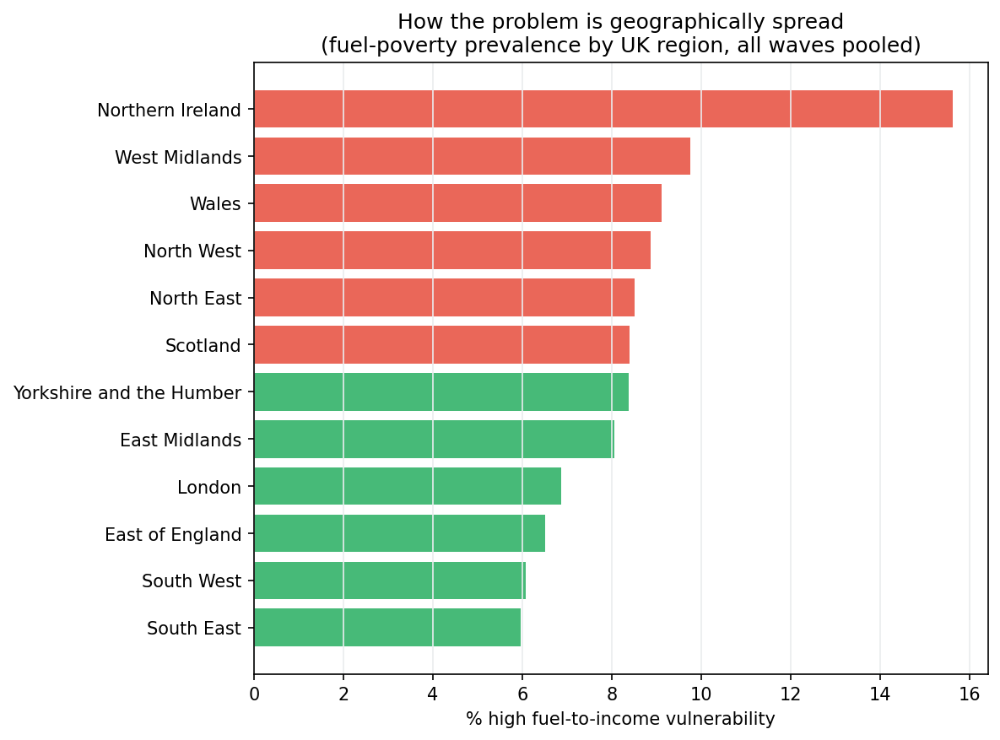<br><sub>Vulnerability prevalence by UK region</sub></td>
<td align="center" width="33%">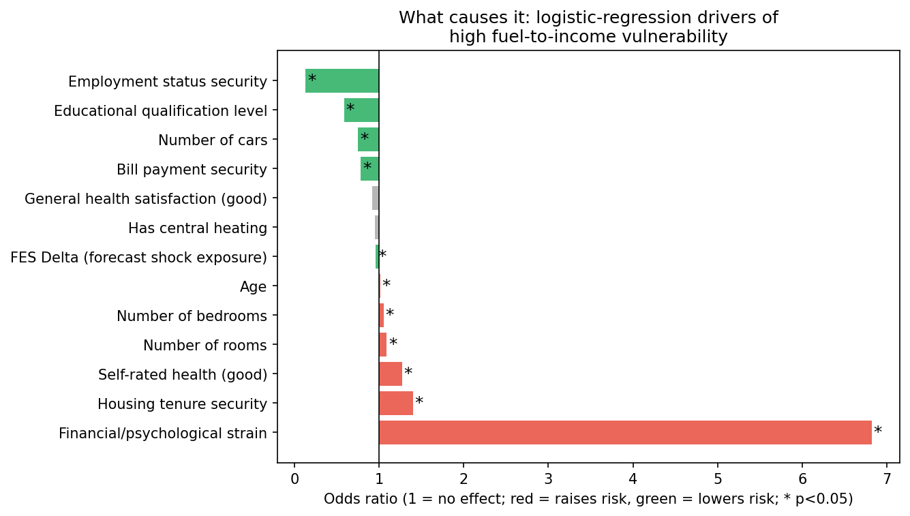<br><sub>Driver analysis — odds ratios</sub></td>
</tr>
</table>

---

## Stage 4 — Policy Geography Maps (`src/ukhls_policy_maps.py`)

Drawn on **real UK region boundaries** (`data/geo/uk_nuts1_regions.geojson` — ONS Open Geography Portal, "NUTS, level 1 (January 2018) Boundaries UK BUC," Open Government Licence v3.0, downloaded once via the portal's public ArcGIS FeatureServer — attribution rendered directly on every map figure). UKHLS (End User Licence) only exposes geography at this 12-region level (9 English regions + Wales + Scotland + Northern Ireland) — the shared helper, `src/ukhls_geo_maps.py`, is reused by Stage 3's variable maps below too.

1. **Resource-to-Stress Hotspot Map** — two side-by-side real maps (mean SEM `baseline_resource_score`; regional `high_fuel_vulnerable` prevalence) plus the 3×3 bivariate policy-tier legend. *Adapted from the original brief's literal bivariate "FES axis" map* — FES here is a single **national** scalar with no regional variation to map, so the second map uses the regional vulnerability-outcome prevalence instead (same underlying policy intent: cash-transfer vs. structural-infrastructure priority zones).
2. **Fuzzy Membership Map** — real choropleth of mean "Vulnerable to Loss" fuzzy membership (the % of households near the 0.5 "about to tip" boundary is in the saved table).
3. **Vulnerability Vector Shift Map** — arrow at each region's real centroid: mean predicted vulnerability under each household's own realised FES vs. under the shared forecast shock (reuses the Stage 2c counterfactual output) — red = rising risk, green = falling. London's arrow/label is nudged into open space with a leader line (a standard cartographic fix — London is geographically tiny and sits inside South East, so a same-length arrow at its true centroid collided with its neighbour's).

<table>
<tr>
<td align="center" width="33%">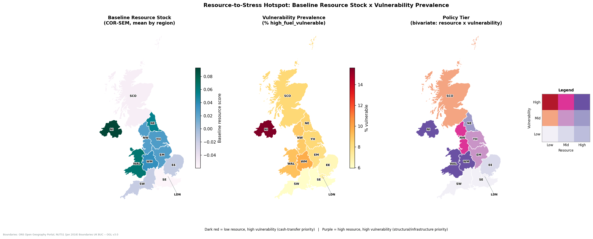<br><sub>Map 1 — Resource-to-Stress Hotspot (real boundaries)</sub></td>
<td align="center" width="33%">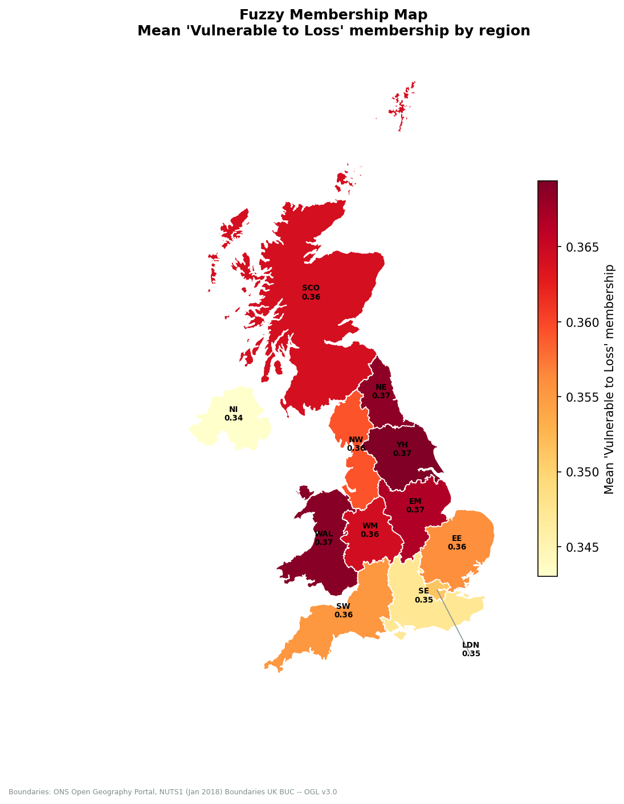<br><sub>Map 2 — Fuzzy Membership (real boundaries)</sub></td>
<td align="center" width="33%">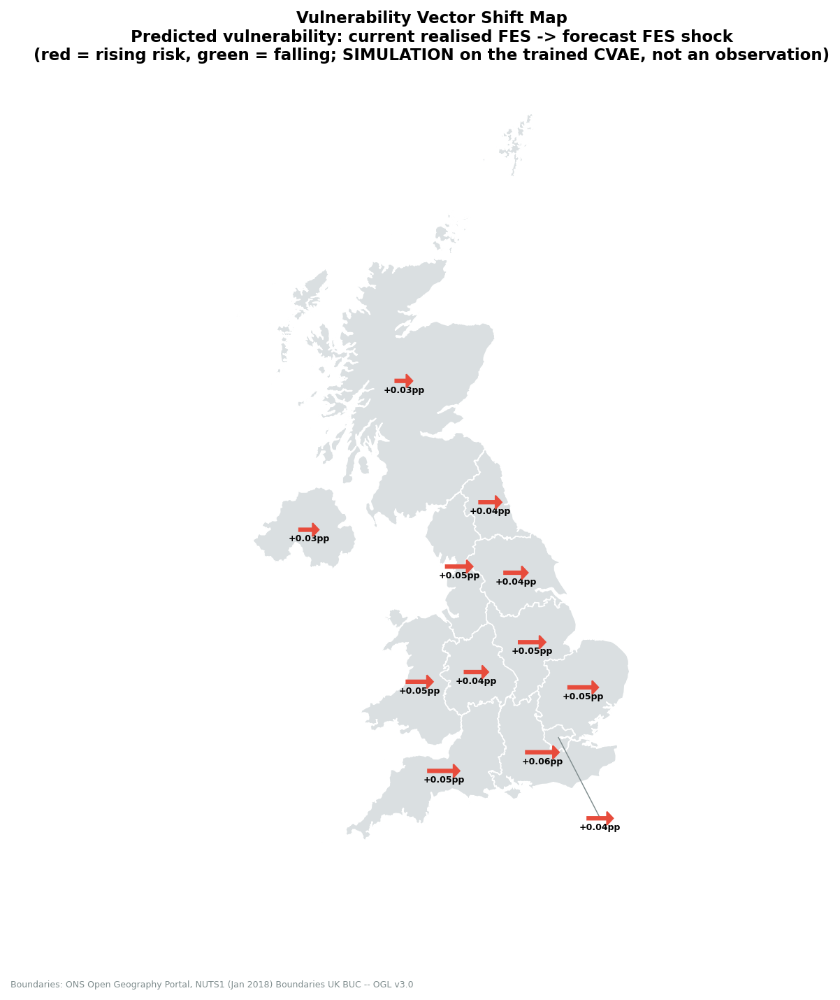<br><sub>Map 3 — Vulnerability Vector Shift (real boundaries)</sub></td>
</tr>
</table>

### Additional real-map and policy-analysis views (Stage 3)

Beyond the headline vulnerability rate, the same real-boundary helper draws maps for other key variables, plus two further policy-analysis angles distinct from the pooled-national figures above:

<table>
<tr>
<td align="center" width="33%">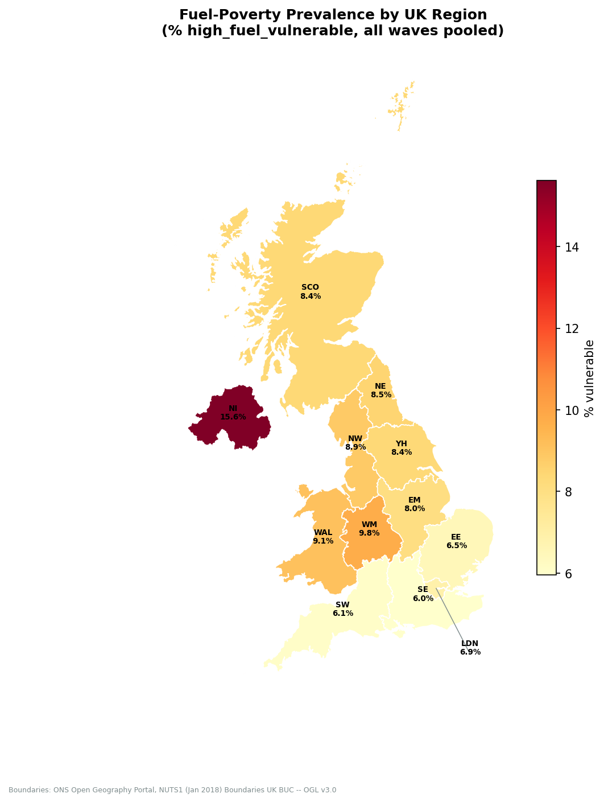<br><sub>Fuel-poverty prevalence — real map (companion to the ranked bar chart below)</sub></td>
<td align="center" width="33%">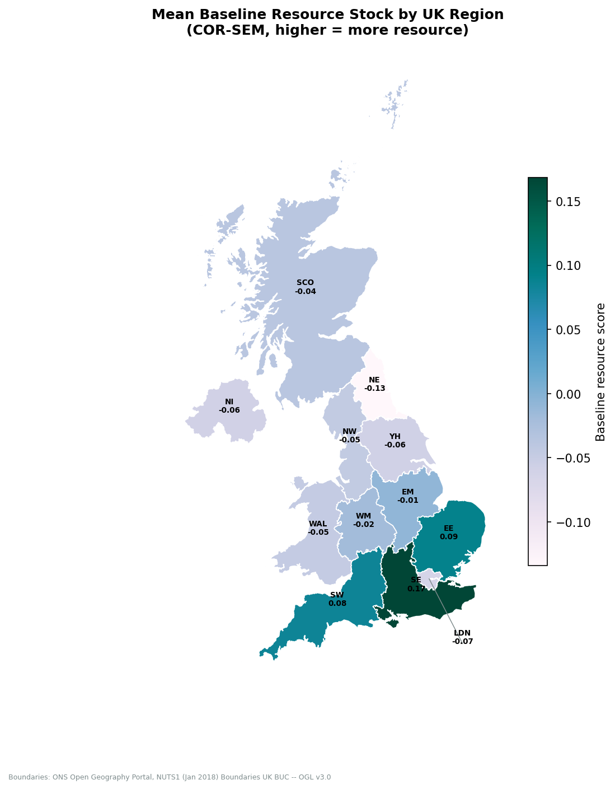<br><sub>Mean Baseline Resource Stock by region</sub></td>
<td align="center" width="33%">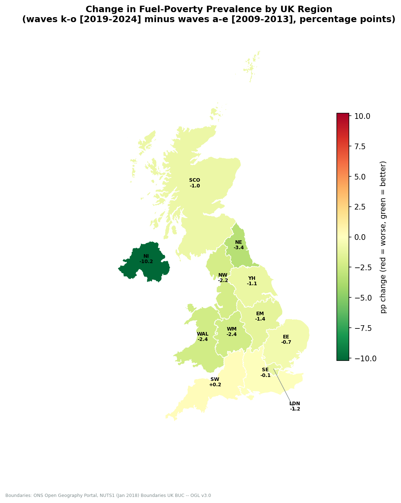<br><sub>Change in prevalence, 2009-13 vs. 2019-24 (diverging)</sub></td>
</tr>
</table>

- **Regional driver heterogeneity** (`run_driver_analysis_by_region`): re-fits the Stage 3 logistic driver analysis separately per region instead of pooled nationally — does *what causes* vulnerability differ by place, not just how much of it there is? (`outputs/ukhls_vulnerability/tables/driver_analysis_by_region.csv` + `driver_analysis_by_region.png`.)
- **Temporal-change map**: vulnerability-prevalence change between waves a–e (2009–2013) and waves k–o (2019–2024) per region, as a diverging real choropleth — complements the existing region×year heatmap (a grid) with a genuinely spatial "where is it getting worse" view. Northern Ireland shows the largest improvement in the most recent run (−10.2 percentage points).

---

## Directory Structure

```
anticipatory-energy-stress/
├── main.py                     # orchestrator: --stage forecast|household, --rolling, --skip-cvae, --fast
├── forecast_pipeline.py        # Stage 1: run() single-year, run_rolling() walk-forward
├── household_stream.py         # Stage 2-4: UKHLS panel -> COR-SEM -> COR-CVAE -> vulnerability -> maps
├── requirements.txt
├── data/
│   ├── raw/                    # gas/electricity/carbon/macro CSVs + raw/ukhls/*.dta (gitignored)
│   ├── processed/              # core_energy_carbon.csv, macro_controls.csv, ...
│   ├── geo/                    # uk_nuts1_regions.geojson (ONS Open Geography Portal, OGL v3.0)
│   └── social_science_data/    # UKHLS zip extract source (gitignored)
├── src/
│   ├── data_loader.py, preprocessing.py, tuning.py, model_evaluation.py, plotting_utils.py
│   ├── fes_calculator.py       # Stage 1 FES construction (single-year + rolling helpers)
│   ├── models/                 # sarima_model.py, prophet_model.py, lstm_model.py, tft_model.py
│   ├── ukhls_mapping.py        # wave/COR-item registry (shared source of truth)
│   ├── ukhls_preprocessing.py  # Stage 2a: panel build + FES Magnitude/Current/Delta
│   ├── ukhls_dataset_overview.py  # Stage 2a-overview: panel composition/missingness/distributions
│   ├── ukhls_cor_sem.py        # Stage 2b: COR-SEM
│   ├── ukhls_cor_cvae.py       # Stage 2c: COR-CVAE
│   ├── ukhls_vulnerability_classification.py   # Stage 3
│   ├── ukhls_geo_maps.py       # shared real-boundary choropleth helper (Stage 3/4)
│   ├── ukhls_policy_maps.py    # Stage 4
│   ├── sem_mediation.py        # ols_path (only function reused, by ukhls_cor_sem.py)
│   ├── config.py, paths.py, logging_utils.py, metrics_utils.py, model_utils.py
│   └── __pycache__/
└── outputs/
    ├── forecasts/, macro_forecasts/, forecasts_rolling/{year}/, tables/, tables/rolling/{year}/
    ├── fes/                    # fes_rolling_yearly.csv, fes_rolling_monthly.csv, fes_variant_selection.csv, model_selection_by_year.csv, forecast_performance_by_year.csv, rolling/{year}/
    ├── figures/                # fes_rolling_trend, fes_metrics_*_heatmap, model_selection_polar_*, rolling_forecast_performance_by_year
    ├── ukhls_cleaned/          # ukhls_panel.csv (339,201 rows)
    ├── ukhls_dataset_overview/, ukhls_cor_sem/, ukhls_cor_cvae/, ukhls_vulnerability/, ukhls_policy_maps/
    └── logs/pipeline.log
```

---

## Required Outputs Reference

### Stage 1 (`outputs/fes/`, `outputs/tables/`, `outputs/forecasts*/`)
| File | Description |
|---|---|
| `fes_monthly_2017.csv` | 12-row monthly z-score breakdown, single-year **dev path only** (not in reported results) |
| `fes_rolling_yearly.csv` | Rolling walk-forward: one row per `(as_of_year, target_year)`, annual mean — **the reported path** |
| `fes_rolling_monthly.csv` | Same walk-forward run at its native resolution: one row per `(as_of_year, target_year, target_month)` |
| `fes_variant_selection.csv` | Which of Core/Macro was chosen, and why (mean RMSE) |
| `model_selection_by_year.csv` | Which model won each `(as_of_year, series, mode)` — underlies the model-selection polar charts |
| `forecast_performance_by_year.csv` | Winning model's RMSE per `(as_of_year, series, mode)` — underlies the performance-by-year figure |
| `figures/fes_metrics_rmse_heatmap.png`, `fes_metrics_pearson_r_heatmap.png` | FES robustness, one row per rolling year |
| `figures/model_selection_polar_{gas,electricity,carbon}.png` | Which model won, by year, per series |
| `figures/rolling_forecast_performance_by_year.png` | Winning model's RMSE trend, all 3 series |
| `tables/rolling/{year}/model_metrics_comparison.csv` | Per-year per-model/series/mode MAE/RMSE/MAPE + ranking |

### Stage 2a-overview (`outputs/ukhls_dataset_overview/`)
| File | Description |
|---|---|
| `dataset_panel_composition.png` | Sample size by wave + interview-month histogram |
| `dataset_rows_by_year.png` / `.csv` | Sample size by calendar year, and the same totals split by contributing wave |
| `dataset_sample_size_by_region.png` | Real UK map of household-wave rows by region |
| `dataset_missingness.png` / `dataset_missingness_by_variable.csv` | % missing per key variable, all waves pooled |
| `dataset_key_distributions.png` | Histograms: fuel-to-income ratio, financial strain, age, income, fuel spend, FES Delta |

### Stage 2 (`outputs/ukhls_cleaned/`, `outputs/ukhls_cor_sem/`, `outputs/ukhls_cor_cvae/`)
| File | Description |
|---|---|
| `ukhls_cleaned/ukhls_panel.csv` | Full panel + SEM factor scores + CVAE latents (339,201 rows) |
| `ukhls_cor_sem/tables/cor_sem_measurement_loadings.csv` | CFA loadings per item |
| `ukhls_cor_sem/tables/cor_sem_fit_indices.csv`, `structural_fit_indices_baseline.csv` | CFI/TLI/RMSEA/SRMR |
| `ukhls_cor_sem/tables/fes_moderation_path.csv` | BASELINE × FES Delta interaction regression |
| `ukhls_cor_cvae/tables/cvae_latent_scores.csv`, `cvae_sem_alignment.csv` | Latent z + alignment with SEM |
| `ukhls_cor_cvae/tables/cvae_counterfactual_fes_shift.csv` | Per-household current-vs-forecast simulation |
| `ukhls_cor_sem/figures/cor_sem_loadings_polar.png` | Polar view of measurement loadings, slices = COR factors |
| `ukhls_cor_cvae/figures/cvae_alignment_polar.png` | Polar view of latent-dim ↔ SEM-factor alignment, slices = z1-z4 |

### Stage 3 (`outputs/ukhls_vulnerability/`)
| File | Description |
|---|---|
| `stage3_vulnerability_scores.csv` | Fuzzy memberships + one-class anomaly score, per household |
| `stage3_validation_against_objective_ratio.csv` | Correlation/AUC vs. `fuel_to_income_ratio` |
| `driver_analysis_logistic_regression.csv` | Odds ratios for every control + `fes_delta`, pooled nationally |
| `driver_analysis_by_region.csv` + `driver_analysis_by_region.png` | Same driver analysis re-fit per UK region |
| `policy_vulnerability_by_wave.csv`, `by_region.csv`, `region_year_heatmap.csv`, `by_fes_tier.csv` | Spread figures' underlying data |
| `policy_vulnerability_by_region_map.png` | Real-map companion to the ranked `by_region` bar chart |
| `policy_map_baseline_resource_by_region.png`, `policy_map_financial_strain_by_region.png` | Real maps of mean SEM baseline-resource score and financial-strain score by region |
| `policy_temporal_change_map.png` | Diverging real map: vulnerability-prevalence change, waves a-e vs. k-o |

### Stage 4 (`outputs/ukhls_policy_maps/`)
| File | Description |
|---|---|
| `map1_resource_stress_hotspot.csv` | Per-region baseline resource × vulnerability prevalence + bivariate tier |
| `map2_fuzzy_membership.csv` | Per-region mean fuzzy membership + % near 0.5 boundary |
| `map3_vulnerability_vector_shift.csv` | Per-region current/forecast/shift predicted probability |

---

## Methodological Limitations

- **FIML CFI/TLI under semopy 2.3.11** are unreliable (verified against a complete-case MLW comparison) — read loadings and the FES-moderation test as primary evidence for the SEM, not CFI/TLI.
- **Pooled 15-wave CFA** assumes measurement invariance 2009–2024, untested.
- **FES Delta's two components use different z-scoring baselines** (rolling-year train window for Magnitude vs. full-history monthly mean/std for Current, now both at month resolution) and Magnitude sums 4 z-terms while Current sums 3 (no realised analogue of forecast uncertainty) — Delta is a documented, honest approximation of shock size, not an exact matched-scale subtraction.
- **FES Magnitude's monthly resolution matches interview month to the SAME calendar month one year ahead** (e.g. a March interview reads the forecast's March-next-year value), not literally "as of this exact day" — the walk-forward refit itself only happens at annual (December) cutoffs, so this refines *which* of the 12 already-forecast months gets attached rather than adding a new, more frequent refit.
- **FES is a single national scalar** — no regional variation exists to map, which is why Stage 4's Map 1 substitutes regional vulnerability-outcome prevalence for a literal "FES axis."
- **Real-boundary maps require one external dependency** (`data/geo/uk_nuts1_regions.geojson`, fetched once from the ONS Open Geography Portal, `geopandas` added to `requirements.txt`) — no longer self-contained the way the earlier hex-cartogram was, in exchange for exact geographic shape fidelity.
- **CVAE item preparation median-imputes** remaining missing values (the SEM instead uses FIML natively) — a real simplification, not swept under the rug.
- **`sf1_good`'s coverage collapses** from ~99% (waves a–e) to 0.3–11% (waves f–o) — kept in the model after an empirical test showed removing it makes CFI/TLI worse, but this is a real, documented data-quality asymmetry across waves.
- **Rolling walk-forward's earliest feasible years** have thin training windows (as little as ~24 months) — forecast quality for those years is inherently weaker than for later years with a full decade+ of history.

---

## Migration Note (from the ENABLE Architecture)

An earlier version of this project used a single UK cross-section (ENABLE.EU, 2017 only) split into three parallel "COR estimation routes" (a formative composite, a reflective SEM, and a VAE) compared against each other, feeding a CatBoost classifier + SHAP explainability stage. That entire architecture — `src/enable_preprocessing.py`, `src/cor_sem.py`, `src/cor_vae.py`, `src/construct_validation.py`, `src/construct_mapping.py`, `src/unsupervised_latent.py`, `src/route_comparison.py`, `src/route_utils.py`, `src/ml_classification.py`, `src/shap_explainability.py`, `ml_pipeline.py` (root), `src/ts_shap.py`, and `src/fes_scenarios.py` — has been **removed from the repository entirely** (not merely disconnected) now that the UKHLS panel supersedes it on every dimension that motivated the original three-route comparison. All of it remains recoverable from git history if ever needed for comparison.

---

## Dependencies

See `requirements.txt`. Notable: `semopy` (COR-SEM CFA), `tensorflow` (COR-CVAE; the forecast stream itself uses PyTorch — `torch`, `pytorch-forecasting`, `pytorch-lightning`), `scikit-fuzzy` (Stage 3 fuzzy c-means), `geopandas` (Stage 3/4 real UK region choropleths, `src/ukhls_geo_maps.py`), `pmdarima`/`prophet`/`statsmodels` (Stage 1 statistical models), `openpyxl` (reading `data/raw/cpih08_188.xlsx`).

---

## Citation / Project Context

Research project on anticipatory energy-carbon stress forecasting and household fuel vulnerability, UK Data Service Study 6614 (Understanding Society) under standard End User Licence terms — raw UKHLS data is not redistributed with this repository (see `.gitignore`); obtain your own extract via the UK Data Service.
