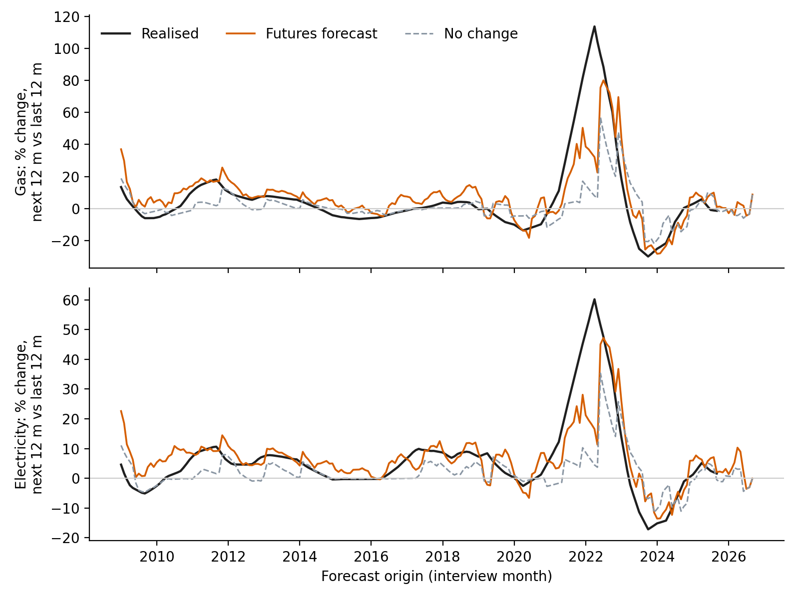
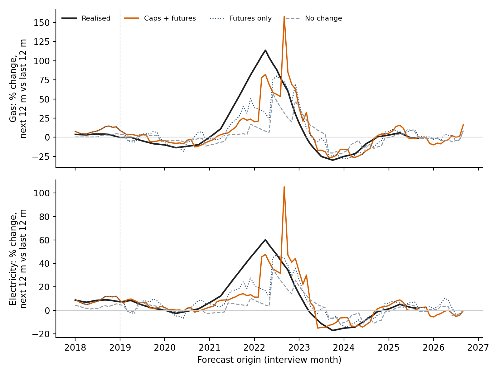
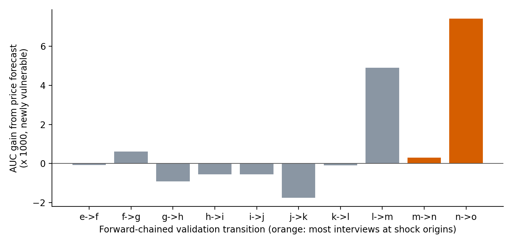

# Stage 8 (exploratory): anticipatory burden projection

*Generated by `scripts/stage8_draft.py`; every number comes from `outputs_v3/`. Draft for the author's rewrite.*

> **Status.** Stage 8 is **exploratory and post hoc**. It was designed after the pre-specified v2 results
> (Stages 2–6) were seen. Each round was fixed in writing before its code ran: amendments A7, A8 and A9 in
> `analysis_plan_rerun.md`, each with its own decision rule. Stage 8 does **not** replace any pre-specified
> result. The v2 verdicts (H2, H5, and the rest) stand as reported.

## 1. Why the pre-specified FES could not detect anticipation

The v2 FES added nothing to next-wave prediction (Stage 6: ΔAUC −0.0006). Diagnostics
(`outputs_v3/diagnostics/`) show that this follows from the design rather than from noise.

1. **Timing.** The outcome is fuel spend over the 12 months *before* the interview. The FES forecasts
   the months *after* it. The monthly vulnerability rate correlates most strongly with retail gas price
   growth 9–12 months earlier (r = 0.66 at 9 months, 0.65 at 12). It
   correlates negatively with growth 6 months later (r = -0.15). Electricity shows the
   same pattern (0.56 at 12 months, -0.27 at −6).
2. **Growth vs level.** The FES measures price *growth*. Burden depends on the price *level*. After
   the 2022 peak, growth turned negative while bills stayed high, so the FES signalled relief while
   vulnerability was at its highest.
3. **A national monthly signal cannot rank households.** The FES is one value per month, the same for
   every household interviewed that month. In the validation waves (n, o), even the *true* monthly
   vulnerability rate used as the only predictor reaches AUC 0.581. The FES itself reaches
   0.478.
4. **The forecasts added no forward information.** The selected v2 models were worse than no-change at
   1–3 months ahead (relative RMSE 2.86–4.58 for gas and
   3.76–4.41 for electricity). At longer horizons they
   won mainly by pulling towards the historical mean after the 2022 spike.

## 2. Design

The forecast's role changes: it is no longer a national predictor but is used to **project each
household's own next burden**, using only information available at its wave-t interview month T.

| Step | Content (information set at T) |
|---|---|
| 1. Price level | Log retail CPI level for gas (D7DU), electricity (D7DT) and liquid fuels (D7DV). Direct per-horizon OLS on NBP gas futures (Brent for oil), expanding window. CPI known to T−2, markets to T−1. The Energy Price Guarantee is applied once announced. A9 adds Ofgem's cap levels, counted as known from the month before each cap starts (never earlier than the announcement). |
| 2. Fuel mix | Wave-t spend is split into gas, electricity, oil and other fuel. Price multiplier = share-weighted ratio of mean price over the next 12 months to mean price over the last 12. |
| 3. Income | Labour income × the latest average-earnings growth. Benefit and pension income × the statutory CPI uprating known at T. Support-scheme payments are a sensitivity. |
| 4. Projection | Projected burden b̂ = spend × multiplier ÷ projected income, with the A1 guards. The structural probability P(b̂ ≥ 10%) is reported. |
| 5. Evaluation | A6 linking and split: training a→b … l→m (170,420 transitions), validation m→n and n→o (19,872; of which 18,122 were not vulnerable at t). A8/A9 add forward-chaining: each transition from e→f to n→o is predicted by models fitted only on earlier transitions. PSU bootstrap (2,000 replicates); Holm correction within each amendment. |

**Key contrast.** A_fut (projection with the price forecast) vs A_naive (the same projection with prices held
at their last known level). The difference isolates the value of the *price forecast*. Most tests use
**newly vulnerable** households (not vulnerable at t), where anticipation matters most.

## 3. Results

### 3.1 Price forecasts (step 1)

| Comparison (window-ratio RMSE) | Gas | Electricity |
|---|---|---|
| Futures vs no-change, all origins 2009+ (A7) | 0.707 (p = 0.163, two-sided) | 0.733 (p = 0.159, two-sided) |
| Futures vs no-change, 2009–2020 origins | 1.261 | 1.067 |
| Futures vs no-change, 2021+ origins | 0.625 (p = 0.043) | 0.660 (p = 0.063) |
| Caps + futures vs no-change, 2019+ (A9) | 0.656 | 0.747 |
| Caps + futures vs caps then flat, 2019+ (A9) | 0.901 | 0.951 |

- **By horizon (A7):** the futures forecast beats no-change at every horizon from 1 to 13 months. Gas
  relative RMSE is 0.96 at 1 month and 0.71 at 6. The v2 models were
  3–4× *worse* than no-change at 1–3 months.
- **Announced caps (A9):** these make short horizons nearly exact. Gas relative RMSE vs no-change is
  0.19 at 1 month and 0.34
  at 3; electricity is 0.33 and
  0.63. Over the full 12-month bill window, the caps add
  little beyond the futures.
- **Across all 10 tested comparisons with no-change:** relative RMSE ranges from
  0.65 to 0.79, always in favour of the forecast. One-sided p ranges
  from 0.032 to 0.110. **None survives multiple-testing correction.** Monthly
  origins overlap, so the cap era (79 origins) carries roughly 6–7 independent years of information.
  That is too little to establish an improvement of about 30% at conventional significance.



*Figure 8-1. Price change over the next 12 months vs the last 12: realised, futures forecast, and no-change,
by forecast origin.*



*Figure 8-2. As Figure 8-1 from 2018, adding the forecast that uses announced caps.*

### 3.2 Household identification: A7 (A6 split)

| Model (validation, newly vulnerable) | AUC [95% CI] |
|---|---|
| P0: current burden (A6 benchmark) | 0.715 [0.699, 0.731] |
| P3 = P0 + P1 | 0.715 [0.700, 0.729] |
| A_naive: projection, no-change prices | 0.719 [0.703, 0.735] |
| A_fut: projection, forecast prices | 0.724 [0.708, 0.739] |
| A_full = A_fut + P1 | 0.738 [0.723, 0.753] |
| A_oracle: realised prices (upper bound) | 0.730 |

- **Value of the price forecast** (A_fut − A_naive): +0.0043 [+0.0022, +0.0064] for newly
  vulnerable households; +0.0027 [+0.0014, +0.0040] for all households.
- **Against the best v2 model** (A_full − P3): +0.0235 [+0.0130, +0.0335] for
  newly vulnerable households.
- **Upper bound:** perfect price foresight (A_oracle − A_naive) gives
  +0.0107 [+0.0049, +0.0166]. The forecast realises about
  40%
  of that.
- **Support schemes** (sensitivity): subtracting the Energy Bills Support Scheme and adding the pensioner
  payment *lowers* AUC (-0.0078 [-0.0119, -0.0041]). Reported spend probably does not net
  out the rebate.
- **A7 decision rule: not met.** Criterion (ii), the household gain, was met. Criterion (i), futures
  significantly beating no-change over 2009+, was not.

### 3.3 Is the gain concentrated where anticipation should matter? A8 (forward-chained)

| Test | Estimate | 95% CI | p (one-sided) | p (Holm) | Survives Holm |
|---|---|---|---|---|---|
| H8.1 forward-chained, shock origins, incident: AUC A_fut - A_naive | +0.0048 | [+0.0032, +0.0063] | <0.001 | 0.003 | **yes** |
| H8.2a step-1 gas, shock origins: forecast beats no-change (DM) | rel. RMSE 0.649 | – | 0.066 | 0.198 | no |
| H8.2b step-1 electricity, shock origins: forecast beats no-change (DM) | rel. RMSE 0.696 | – | 0.071 | 0.198 | no |
| H8.3 A6 split, incident: AUC A_sep_fut - A_sep_naive | +0.0056 | [+0.0045, +0.0067] | <0.001 | 0.003 | **yes** |
| H8.4 A6 split: top-10% sensitivity among incident, A_fut - A_naive | +0.0007 | [-0.0075, +0.0116] | 0.470 | 0.470 | no |

| Forward-chained, newly vulnerable | n | AUC A_naive | AUC A_fut | Δ (A_fut − A_naive) [95% CI] |
|---|---|---|---|---|
| Shock origins (forecast bill change ≥ 10%) | 32,052 | 0.7323 | 0.7371 | +0.0048 [+0.0032, +0.0063] |
| Calm origins | 81,089 | 0.7315 | 0.7320 | +0.0005 [+0.0000, +0.0011] |

- **Shock vs calm:** the gain is about 9×
  larger at shock origins than at calm ones, as the anticipation hypothesis predicts.
- **By transition:** the largest gains are l→m (+0.0049)
  and n→o (+0.0074). Transitions with few
  shock interviews show about zero.
- **Exception:** m→n is mostly shock interviews but gains only
  +0.0003.
- **Screening all households (H8.4):** when the top 10% of all households are flagged, the already
  vulnerable dominate the list. The forecast finds 79 of
  1,363 newly vulnerable households, against
  74 for P0. The difference is not significant.
- **Separate terms (H8.3):** entering current burden, price multiplier and income change separately
  improves calibration most. The calibration intercept is +0.06
  against +0.39 for P0. Mean absolute error of yearly prevalence (forward-chained)
  is 1.3 percentage points against
  1.8 for P0. Predicted 2023 prevalence is
  10.9%, against 12.8% actual and
  7.8% from P0. Ranking, however, is worse than the single projected burden.
- **A8 decision rule: not met.** H8.1 survives; the price tests H8.2a/b do not.



*Figure 8-3. AUC gain from the price forecast among newly vulnerable households, by forward-chained
validation transition (orange: most wave-t interviews at shock origins).*

### 3.4 Adding announced caps: A9

| Test | Estimate | 95% CI | p (one-sided) | p (Holm) | Survives Holm |
|---|---|---|---|---|---|
| H9.1a gas, T >= 2019-03: F_cap vs no-change (DM) | rel. RMSE 0.656 | – | 0.032 | 0.130 | no |
| H9.2a gas, T >= 2019-03: F_cap vs F_capflat (DM) | rel. RMSE 0.901 | – | 0.034 | 0.130 | no |
| H9.1b electricity, T >= 2019-03: F_cap vs no-change (DM) | rel. RMSE 0.747 | – | 0.083 | 0.167 | no |
| H9.2b electricity, T >= 2019-03: F_cap vs F_capflat (DM) | rel. RMSE 0.951 | – | 0.159 | 0.167 | no |
| H9.3 forward-chained, T >= 2019-03, incident: AUC A_cap - A_naive | +0.0056 | [+0.0031, +0.0081] | <0.001 | 0.003 | **yes** |

- **Household gain (H9.3):** in the cap era the household gain is
  +0.0056 [0.0031, 0.0081]. Before 2019 it is
  +0.0001.
- **Caps vs futures alone:** caps add little over the futures-only projection
  (+0.0006 [-0.0013, 0.0025]).
- **Calibration:** the cap projection has the best calibration-in-the-large of any model:
  +0.22, against +0.36 for P0 on the same sample.
- **A9 decision rule: not met.** H9.3 survives; H9.1a/b do not.

## 4. Verdict

| Claim | Evidence | Status |
|---|---|---|
| Projected anticipatory price information improves identification of *newly* vulnerable households | Significant in A7 (split), A8 (forward-chained, shock origins) and A9 (cap era); Holm-corrected where pre-specified | **Supported (exploratory, replicated in three designs)** |
| The gain is concentrated in periods of forecast price change | Shock vs calm contrast in A8; cap era vs pre-cap in A9 | **Supported (exploratory)** |
| Projection improves predicted prevalence in the crisis | Calibration intercept and yearly prevalence error (A7–A9) | **Supported (descriptive, not tested)** |
| The price forecast is significantly more accurate than no-change | Relative RMSE 0.65–0.79 in all comparisons; none survives correction | **Not established (direction consistent, underpowered)** |
| Anticipation changes who a screen of all households reaches | H8.4 | **Not supported** |
| Pre-specified decision rules A7, A8, A9 | Each failed on its price-accuracy criterion | **Not met** |

**Suggested wording for the thesis.**

> Anticipatory price information (wholesale futures and announced price caps) is available before
> households are billed. Projected onto each household's own fuel mix and income, it gives a small but
> statistically robust improvement in identifying households that newly become vulnerable. This was
> replicated across three designs, and the gain is concentrated in periods of price change, as the
> anticipation hypothesis predicts. The projection also brings predicted crisis prevalence much closer to
> the observed rate. The price forecasts had 21–35% lower error than a no-change forecast in every
> comparison. With only about seven independent years of data since the 2019 cap, this superiority could not
> be established at conventional significance after multiple-testing correction. All Stage 8 analyses are
> exploratory and were specified after the pre-registered results were seen.

## 5. Limitations

- **Post hoc.** Three rounds of amendments after the v2 results were seen. Each was fixed before its code
  ran, but the family of analyses is exploratory. A confirmatory test needs new data (a new UKHLS wave
  and further cap periods) under this fixed design.
- **Small effects.** AUC gains are about 0.004–0.006. Current burden remains the dominant predictor.
- **Measured outcome.** Spend is self-reported over the previous 12 months, and whether reported bills
  are net of rebates is unknown (the support-scheme sensitivity lowered AUC).
- **Approximations.**
  - The Price Guarantee is scaled by typical-bill ratios.
  - The 2013–15 benefit cap and the 2016–19 freeze are not modelled.
  - Means-tested cost-of-living payments are not modelled.
  - The t+1 interview is assumed at T+12.
- **Cap timing rule.** The conservative rule (cap known from the month before it starts) sometimes misses
  policy announced earlier in that month (Energy Price Guarantee, September 2022; Budget extension,
  March 2023).
- **Structural probability.** P(b̂ ≥ 10%) ranks as well as the fitted models but over-predicts
  prevalence (calibration intercept -1.01).

## 6. Reproduce

```
python scripts/stage8_diagnostics.py      # section 1
python scripts/stage8_price_forecast.py   # A7 step 1
python scripts/stage8_anticipation.py     # A7 steps 2-5 (~15 min)
python scripts/stage8b_conditional.py     # A8 (~30 min)
python scripts/stage8c_cap.py             # A9 (~30 min)
python scripts/suppress_small_cells.py    # disclosure control, then --check
python scripts/stage8_draft.py            # this draft
```

External inputs (`data/raw/anticipation/`, not tracked):
- ONS MM23 CPI indices D7DU, D7DT, D7DV, D7DW, D7BT;
- ONS AWE KAB9;
- FRED MCOILBRENTEU;
- Ofgem *Default tariff cap level* v1.31;
- the existing NBP futures file in `data/raw/`.
