# Outputs Catalog: File-by-File (rerun v2)

**Scope.** Every output file of the v2 rerun under `outputs_v2/`: what it holds, which script writes it, whether it is tracked in git, and where it is rendered. v1 outputs (`outputs/`) are listed at the end as read-only reference.
**Status.** Branch `rerun-v2`, analysis frozen 2026-09-26. Row counts exclude the header.
**Rendering.** Every thesis table is rendered in [`02_findings_report.md`](02_findings_report.md) (Chapter 4 and appendix), in [`05_data_description.md`](05_data_description.md) (Chapter 3) and in the [README](../README.md). Every figure appears as a thumbnail below.

**Tracking rules.** Aggregate tables are tracked (force-added past the global `*.csv` ignore) after `scripts/suppress_small_cells.py --check` passes. Row-level files (`ukhls_panel.csv`, `resource_scores.csv`) are never committed. Per-origin forecast and tuning files, and the thesis bundle, are local build products and are ignored.

---

## 1. Thesis asset bundle — `outputs_v2/thesis_assets_v2/` (local build, ignored)

Written by `scripts/build_thesis_assets.py` at commit `6050861`. It holds 29 figures (PNG, 300 dpi, 16 cm wide), 30 tables (CSV), 7 documents and `MANIFEST.md`, and is zipped to `outputs_v2/thesis_assets_v2.zip`. `MANIFEST.md` records each file's thesis number, source script, source files and their commits.

### 1.1 Figures

| File | Thesis no. | Content | Source |
|---|---|---|---|
| `fig3-1_pipeline_v2.png` | 3-1 | Analysis pipeline, rerun v2 | drawn in the build script |
| `fig3-2_interview_timing.png` | 3-2 | Interview timing from actual interview dates (cells < 10 masked) | row-level panel, aggregated in the script |
| `fig3-3_missing_spend_wave_mode.png` | 3-3 | Fuel-spend item non-response by interview mode and wave | `audit/missing_by_mode_wave.csv` |
| `fig3-4_distributions_outcome_fes.png` | 3-4 | Distribution of the fuel-to-income ratio and of attached FES (bins < 10 dropped) | row-level panel |
| `fig3-5_regional_counts.png` | 3-5 | Household-waves by region | row-level panel |
| `fig3-6_core_forecast_vars.png` | 3-6 | Core forecasting series, May 2006–March 2026 | `data/processed/core_energy_carbon.csv` |
| `fig4-1_relrmse_by_year.png` | 4-1 | Relative RMSE vs naive and seasonal naive, by target year | `fes_eval/thesis_table_relrmse_by_year.csv` |
| `fig4-2_fes_growth3_forecast_vs_realised.png` | 4-2 | Growth-only FES, forecast vs realised by target month | `fes/fes_rolling_monthly.csv` |
| `fig4-3_trend_wave_s1band.png` | 4-3 | National trend by wave with S1 lower bound | `descriptives/prevalence_by_wave.csv` |
| `fig4-4_trend_vs_jrf_tracker.png` | 4-4 | Trend by interview year with JRF crisis window | `descriptives/prevalence_by_interview_year.csv` |
| `fig4-5_region_map_weighted.png` | 4-5 | Regional prevalence map, weighted | `descriptives/prevalence_by_group.csv` |
| `fig4-6_region_year_heatmap_masked.png` | 4-6 | Region × interview year (n < 100 masked) | `descriptives/prevalence_region_by_year.csv` |
| `fig4-7_region_change_map.png` | 4-7 | Change in regional prevalence, a–e to k–o | `stage7/regional_change_early_late.csv` |
| `fig4-8_resource_and_findifficulty_by_region.png` | 4-8 | Resource composite and financial difficulty by region | `resources/resource_by_region.csv` + panel |
| `fig4-9_social_groups_panel_ci.png` | 4-9 | Social-group prevalence with 95% CIs | row-level panel |
| `fig4-10_prepayment.png` | 4-10 | Prepayment-meter use by vulnerability status | `stage7/prepayment_by_vulnerability.csv` |
| `fig4-11_driver_forest.png` | 4-11 | Primary driver model odds ratios | `stage3/coefficients.csv` |
| `fig4-12_h1_delta_slopes.png` | 4-12 | H1 Delta slopes at R p10/p50/p90 | `stage4/h1_slopes.csv`, `h1_logit_prob_slopes.csv`, `h1_buffering_bound.csv` |
| `fig4-13_jrf_regions.png` | 4-13 | Regions vs JRF income poverty | `stage5/thesis_T5_2_comparison.csv`, `thesis_T5_3_agreement.csv` |
| `fig4-14_jrf_other_dims.png` | 4-14 | Other JRF dimensions with CIs | `stage5/thesis_T5_2_comparison.csv` |
| `fig4-15_ni_oil.png` | 4-15 | NI rates by heating fuel; NI gap across models | `stage5/thesis_T5_4_northern_ireland.csv`, `stage3/ni_oil_ame.csv` |
| `fig4-16_roc_p0_p3.png` | 4-16 | ROC curves P0–P3, validation transitions | `stage6/metrics.csv`, `posthoc_p3_metrics.csv` (models refitted in the script) |
| `fig4-17_calibration.png` | 4-17 | Calibration by decile, validation transitions | `stage6/calibration.csv` |
| `fig4-18_equivalisation_sensitivity.png` | 4-18 | Sensitivity to equivalising income only | `stage7/sensitivity_equivalised_income_only.csv` |
| `fig4-19_fes_tercile.png` | 4-19 | Prevalence by FES tercile | `stage7/prevalence_by_fes_tercile.csv` |
| `figA_radial_winners.png` | A-1 | Winning core model by series and year | `fes/forecast_performance_by_year.csv` |
| `figA_macro_covariates.png` | A-2 | Macro covariates (descriptive) | `data/processed/macro_controls.csv` |
| `figA_trend_interview_year.png` | A-3 | Trend by interview year (supplementary) | `descriptives/prevalence_by_interview_year.csv` |
| `figA_v1_exploratory.png` | A-4 | v1 CVAE, fuzzy c-means, one-class SVM (labelled v1) | `outputs/ukhls_cor_cvae/`, `outputs/ukhls_policy_maps/`, `outputs/ukhls_vulnerability/` |

<table>
<tr>
<td align="center"> 3-1</td>
<td align="center"> 3-2</td>
<td align="center"> 3-3</td>
</tr>
<tr>
<td align="center"> 3-4</td>
<td align="center"> 3-5</td>
<td align="center"> 3-6</td>
</tr>
<tr>
<td align="center"> 4-1</td>
<td align="center"> 4-2</td>
<td align="center"> 4-3</td>
</tr>
<tr>
<td align="center"> 4-4</td>
<td align="center"> 4-5</td>
<td align="center"> 4-6</td>
</tr>
<tr>
<td align="center"> 4-7</td>
<td align="center"> 4-8</td>
<td align="center"> 4-9</td>
</tr>
<tr>
<td align="center"> 4-10</td>
<td align="center"> 4-11</td>
<td align="center"> 4-12</td>
</tr>
<tr>
<td align="center"> 4-13</td>
<td align="center"> 4-14</td>
<td align="center"> 4-15</td>
</tr>
<tr>
<td align="center"> 4-16</td>
<td align="center"> 4-17</td>
<td align="center"> 4-18</td>
</tr>
<tr>
<td align="center"> 4-19</td>
<td align="center"> A-1</td>
<td align="center"> A-2</td>
</tr>
<tr>
<td align="center"> A-3</td>
<td align="center"> A-4</td>
<td></td>
</tr>
</table>

### 1.2 Tables

| File | Thesis no. | Content | Rows | Rendered in |
|---|---|---|---|---|
| `T3-2_wave_obs_analytical_n.csv` | 3-2 | Household-waves and analytical n by wave | 16 | 05 §4 |
| `T3-3_sample_flow.csv` | 3-3 | Sample flow 339,201 → 286,902 (and S1, S2, v1) | 25 | 05 §4, README |
| `T3-4_fuel_code_routing.csv` | 3-4 | Fuel-expenditure routing and code treatment | 6 | 05 §4, 06 §3 |
| `T3-5_measures.csv` | 3-5 | Measures: items, coding, construction, α | 12 | 05 §4, 06 §3 |
| `T3-6_forecasting_variables.csv` | 3-6 | Core forecasting series summary | 4 | 05 §3 |
| `T3-7_jrf_metadata.csv` | 3-7 | JRF benchmark metadata and matching windows | 8 | 05 §6 |
| `T4-1_forecast_accuracy_pi.csv` | 4-1 | Relative RMSE, DM p, PI coverage | 9 | 02 §3 |
| `T4-2_social_regional_rates.csv` | 4-2 | Pooled weighted prevalence by region and social group, CIs | 38 | 02 §4 |
| `T4-3_driver_model.csv` | 4-3 | Primary driver model | 19 | 02 §5 |
| `T4-4_per_sd.csv` | 4-4 | Continuous predictors ranked by per-SD effect | 15 | 02 §5 |
| `T4-5_h1.csv` | 4-5 | H1 verdicts, coefficients, slopes, buffering bound, logit footnote | 34 | 02 §6 |
| `T4-6_jrf_comparison_agreement.csv` | 4-6 | JRF comparison with CIs and agreement | 56 | 02 §7 |
| `T4-7_ni_oil_ame.csv` | 4-7 | NI-oil sequence AMEs | 17 | 02 §7 |
| `T4-8_prediction_p0_p3.csv` | 4-8 | Next-wave prediction P0–P3 | 4 | 02 §8 |
| `T4-9_robustness_summary.csv` | 4-9 | Robustness summary | 47 | 02 §9 |
| `T4-10_hypothesis_verdicts.csv` | 4-10 | Hypothesis verdicts | 5 | 02 §1, README, 04 |
| `TA-1_mase.csv` | A-1 | MASE | 15 | 02 §3 |
| `TA-2_per_transition_auc.csv` | A-2 | Per-transition AUC | 6 | 02 §8 |
| `TA-3_driver_sensitivities.csv` | A-3 | All driver specifications and NI-oil models, every term | 1,450 | 02 §5 (main models, two-way), §7 (NI-oil terms) |
| `TA-4_driver_model_fit.csv` | A-4 | Driver-model N, events, PSUs, pseudo-R² | 71 | 02 §5 |
| `TA-5_relrmse_by_year.csv` | A-5 | Relative RMSE by target year | 48 | 02 §3 |
| `TA-6_diebold_mariano.csv` | A-6 | Diebold–Mariano tests | 18 | 02 §3 |
| `TA-7_calibration.csv` | A-7 | Calibration slope and intercept | 3 | 02 §8 |
| `TA-8_prediction_sample_flow.csv` | A-8 | Prediction sample flow | 34 | 02 §8, 06 §7 |
| `TA-9_cfa_fit.csv` | A-9 | CFA fit | 1 | 02 §6, 06 §6 |
| `TA-10_cfa_loadings.csv` | A-10 | CFA loadings | 13 | 02 §6, 06 §6 |
| `TA-11_equivalised_income.csv` | A-11 | Equivalised-income sensitivity | 5 | 02 §9 |
| `TA-12_region_window_ci.csv` | A-12 | Regional rates in the JRF windows, rank CIs | 48 | 02 §7 |
| `TA-13_interview_timing.csv` | A-13 | Household-waves by wave × interview year | 45 | 05 §4 |
| `TA-14_regional_counts.csv` | A-14 | Household-waves by region | 12 | 05 §4 |

### 1.3 Documents

`docs/` holds copies of `analysis_plan_rerun.md`, `results_inventory.csv`, `v1_to_v2_change_summary.md`, the three stage drafts and `appendix_scope_note.md`.

---

## 2. Stage 1 — outcome audit (`scripts/audit_ukhls_codes.py`)

| File | Rows | What it holds | Rendered in |
|---|---|---|---|
| `outputs_v2/audit_fuel_codes.csv` | 171 | Every fuel-expenditure code by variable, household fuels and `fuelduel`, with its routing meaning, the v1 treatment and the correct treatment | summarised by Table 3-4 |
| `audit/sample_flow_reconciliation.csv` | 25 | 339,201 → analytical n, one line per exclusion; S1, S2 and v1 flows | Table 3-3 |
| `audit/gap_explanations.csv` | 3 | Explains the 1-row and ~2,100-row gaps between Stage 1 counts | 05 §4 |
| `audit/indicative_prevalence.csv` | 29 | Unweighted prevalence under v1, primary, S1 and S2, UK, by region and by wave | 05 §4 |
| `audit/fuel_status_by_region_wave.csv` | 194 | Region × wave counts by audit status (same, v1 dropped but observed, excluded for non-response, electricity not reported, …) | — (source for the audit verdict) |
| `audit/fuelduel_by_region_year.csv` | 207 | `fuelduel` codes by region × interview year | — |
| `audit/zero_filled_components_by_region_wave.csv` | 194 | Components v1 zero-filled on non-response, by region × wave | — |
| `audit/ni_oil_lost_by_wave.csv` | 16 | NI oil households dropped by the v1 `fuelduel` rule, by wave (13,463 of 15,968) | 05 §4 |
| `audit/missing_vs_observed_spend.csv` | 44 | Missing vs observed spend by region, tenure, income quintile, wave | 05 §4 |
| `audit/missing_by_mode_wave.csv` | 41 | Missing spend by interview mode and wave | 05 §4; Figure 3-3 |
| `audit/elec_not_reported_rent_check.csv` | 3 | Tenure and fuel-in-rent for gas-only and oil/other-only households | 05 §4 |

## 3. Stage 2 — forecasts and FES

### 3.1 Rolling forecasts (`forecast_pipeline.py --rolling --core-only --tune-per-origin`)

| File | Rows | Tracked | What it holds |
|---|---|---|---|
| `fes/fes_rolling_monthly.csv` | 192 | yes | Target-month forecasts, z-scores, PI half-widths and FES per origin (Dec 2009 → 2010, …, Dec 2024 → 2025) |
| `fes/fes_rolling_yearly.csv` | 16 | yes | Annual means: `fes_core`, `fes_selected`, `fes_weighted`, `fes_actual` (macro empty: core-only run) — rendered in 06 §2 |
| `fes/model_selection_by_year.csv` | 48 | yes | Winning model per origin and series — rendered in 06 §2 |
| `fes/forecast_performance_by_year.csv` | 48 | yes | Winning model's validation RMSE and realised RMSE per origin and series |
| `fes/tuned_params_by_origin.csv` | 144 | yes | Hyperparameters chosen at each origin, per series and model |
| `fes/fes_variant_selection.csv`, `fes/fes_metrics_selected_variant_by_year.csv` | — | no | Pipeline by-products of the v1 variant selection; not used in v2 (core only) |
| `fes/rolling/{year}/` | 3 files × 16 | no | Per-origin `fes_comparison_metrics.csv`, `fes_monthly_{Y+1}.csv`, `fes_prior_actual_{Y}.csv` |
| `forecasts_rolling/{year}/` | 18 files × 16 | no | Per-origin forecasts per series and model (`*_forecasts_{model}_core.csv`, `_core`, `_all`) |
| `tables/rolling/{year}/model_metrics_comparison.csv` | 16 files | no | Per-origin backtest metrics and ranks per model and series |
| `tuning_rolling/{year}/` | 16 × (tuning results + candidate forecasts) | no | Per-origin tuning candidates per series (SARIMA 1, Prophet 8 (16 for gas: additive and multiplicative seasonality), LSTM 3, TFT 3) and `model_tuning_results.csv` |
| `models/{series}_lstm_core.pt`, `*_target_scaler.pkl` | 6 files | yes | Saved core-mode LSTM weights and target scalers written by the pipeline |
| `logs/fes_v2_run.log`, `fes_v2_run.exitcode`, `pipeline.log` | — | yes | Run logs (core-only, per-origin tuning) |

<table>
<tr>
<td align="center">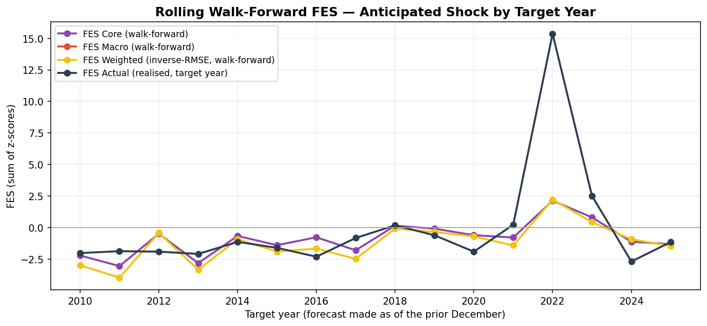 <code>figures/fes_rolling_trend.png</code>: annual 4-term FES, forecast vs realised</td>
<td align="center">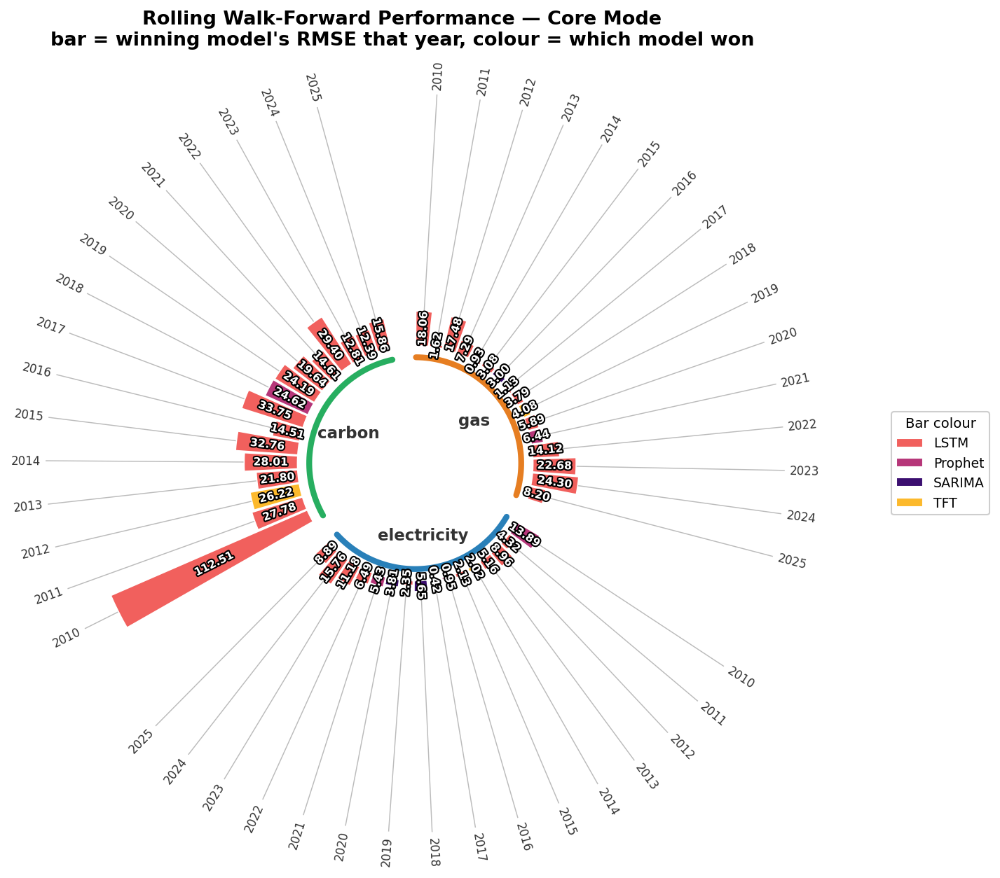 <code>figures/model_selection_polar_core.png</code>: winning model and RMSE by year</td>
<td align="center">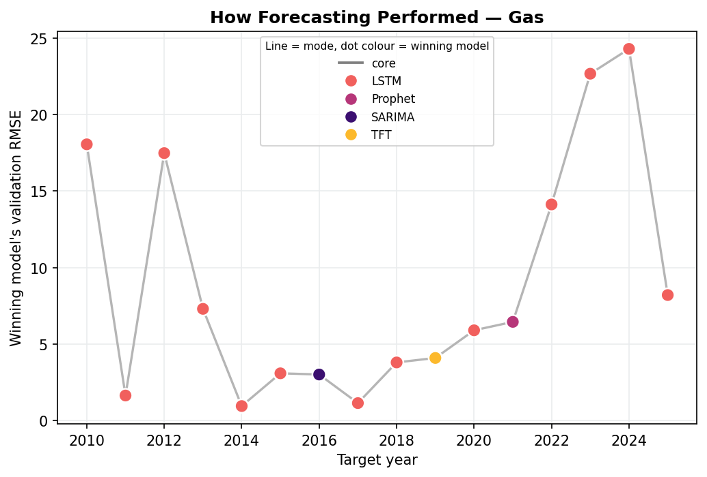 <code>figures/rolling_forecast_performance_gas.png</code></td>
</tr>
<tr>
<td align="center">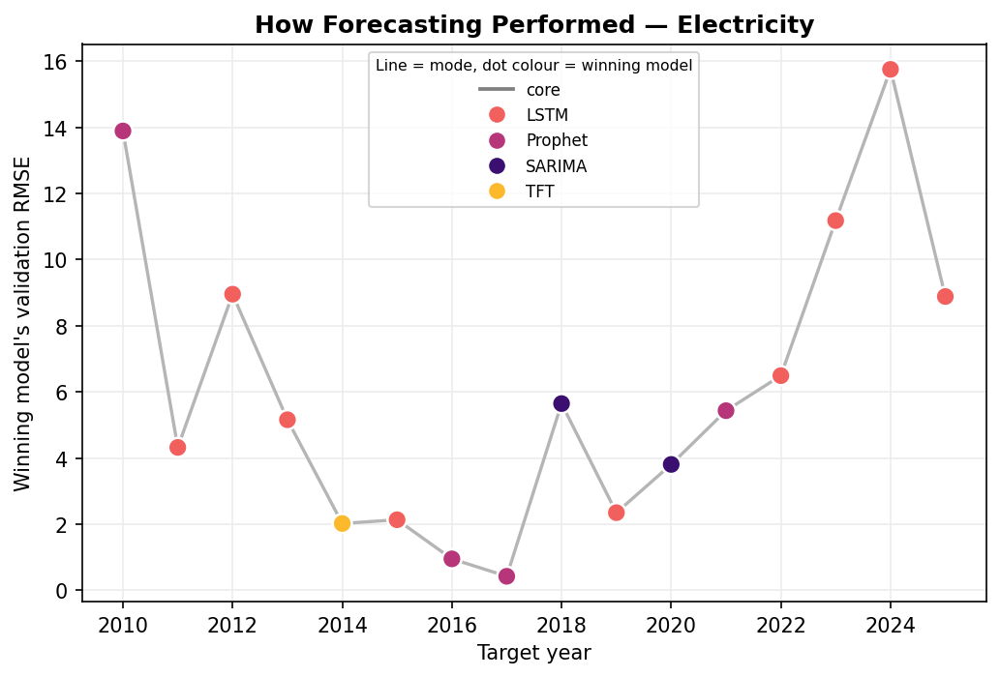 <code>figures/rolling_forecast_performance_electricity.png</code></td>
<td align="center">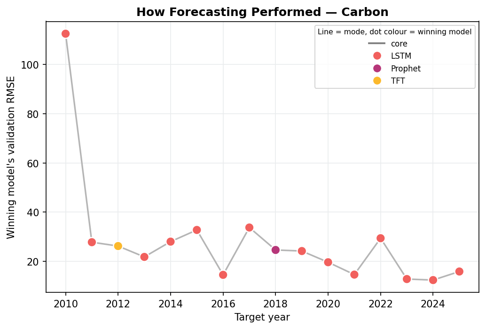 <code>figures/rolling_forecast_performance_carbon.png</code></td>
<td></td>
</tr>
</table>

Each figure also has a `.pdf` twin.

### 3.2 Evaluation (`scripts/stage2_fes_evaluation.py`)

| File | Rows | What it holds | Rendered in |
|---|---|---|---|
| `fes_eval/forecast_accuracy_pooled.csv` | 15 | RMSE, MAE, sign agreement, r, relative RMSE/MAE, MASE, % years beating naive — v1 core, v1 macro, v2 core, naive, seasonal naive | 02 §3 |
| `fes_eval/forecast_accuracy_by_year.csv` | 240 | Same metrics by target year | — (source of Figure 4-1, Table A-5) |
| `fes_eval/thesis_table_forecast_accuracy.csv` | 9 | Thesis Table 4-1 source | 02 §3 |
| `fes_eval/thesis_table_relrmse_by_year.csv` | 48 | Table A-5 source | 02 §3 |
| `fes_eval/appendix_table_mase.csv` | 15 | Table A-1 source | 02 §3 |
| `fes_eval/diebold_mariano.csv` | 18 | Table A-6 source | 02 §3 |
| `fes_eval/uncertainty_pi.csv` | 9 | 95% PI coverage and width | 02 §3 |
| `fes_eval/model_wins.csv` | 34 | Origins won per model | 02 §3 |
| `fes_eval/fes_annual.csv` | 32 | Annual FES, v1 and v2 | — |
| `fes_eval/fes_attached_v1_vs_v2.csv` | 3 | Household-attached FES, v1 vs v2 correlation and moments | 02 §3 |
| `fes_eval/fes_coverage_by_interview_year.csv` | 17 | Households with FES by interview year; mean magnitude, current, Delta | 05 §4 |
| `fes_eval/prophet_fallbacks.csv` | 1 | Prophet optimiser fallbacks (Newton 15.5%, no failed fits) | 06 §2 |

## 4. Descriptives (`scripts/descriptives_v2.py`)

| File | Rows | What it holds | Rendered in |
|---|---|---|---|
| `descriptives/prevalence_by_wave.csv` | 15 | Primary, S1, S2 and v1, weighted and unweighted, by wave | 02 §4 |
| `descriptives/prevalence_by_interview_year.csv` | 17 | Primary and S1, weighted, by interview year | 02 §4 |
| `descriptives/prevalence_by_group.csv` | 39 | Pooled rates by region, tenure, family, employment, ethnicity, disability (masked n < 100) | superseded for the thesis by Table 4-2 (with CIs) |
| `descriptives/prevalence_region_by_year.csv` | 203 | Region × interview year (masked n < 100) | Figure 4-6 |
| `descriptives/strain_structure.csv` | 9 | Strain α, item correlations, coverage | 05 §4 |
| `descriptives/strain_item_correlations.csv` | 10 | Pearson and Spearman correlations of strain items with age | 05 §4 |

<table>
<tr>
<td align="center">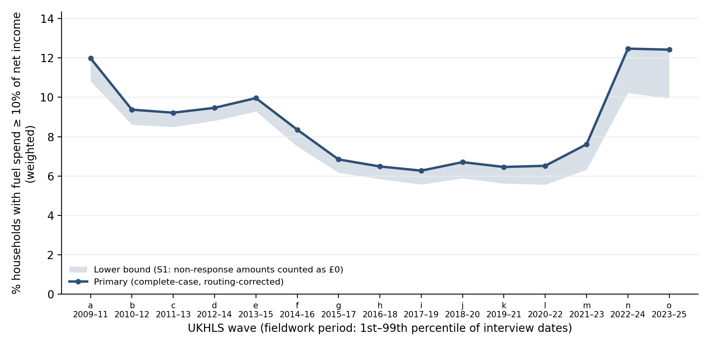 <code>descriptives/trend_primary_with_s1_band.png</code></td>
<td align="center">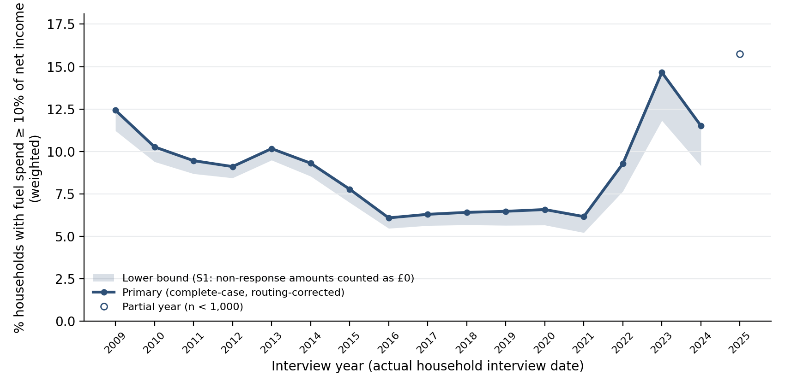 <code>descriptives/trend_by_interview_year_supplementary.png</code></td>
<td></td>
</tr>
</table>

## 5. Stage 3 — drivers (`scripts/stage3_drivers.py`)

| File | Rows | What it holds | Rendered in |
|---|---|---|---|
| `stage3/coefficients.csv` | 1,450 | Every term of every model (11 specifications × main, two-way clustered and 9 NI-oil models) | = Table A-3; 02 §5, §7 |
| `stage3/thesis_table_primary.csv` | 19 | Table 4-3 source | 02 §5 |
| `stage3/thesis_table_per_sd.csv` | 15 | Table 4-4 source | 02 §5 |
| `stage3/model_summary.csv` | 71 | N, events, PSUs, pseudo-R², AIC, convergence | = Table A-4 |
| `stage3/sample_flow.csv` | 26 | Complete-case N per specification | 06 §4 |
| `stage3/year_fe.csv` | 15 | Interview-year fixed effects, primary | 02 §5 |
| `stage3/region_fe.csv` | 649 | Region fixed effects in the NI-oil models | — |
| `stage3/ni_oil_sequence.csv` | 59 | NI, oil, NI × oil and rural ORs per NI-oil model | 02 §7 (via Table A-3) |
| `stage3/ni_oil_ame.csv` | 107 | AMEs (pp) for all specifications | Table 4-7 (primary rows) |

<table><tr>
<td align="center">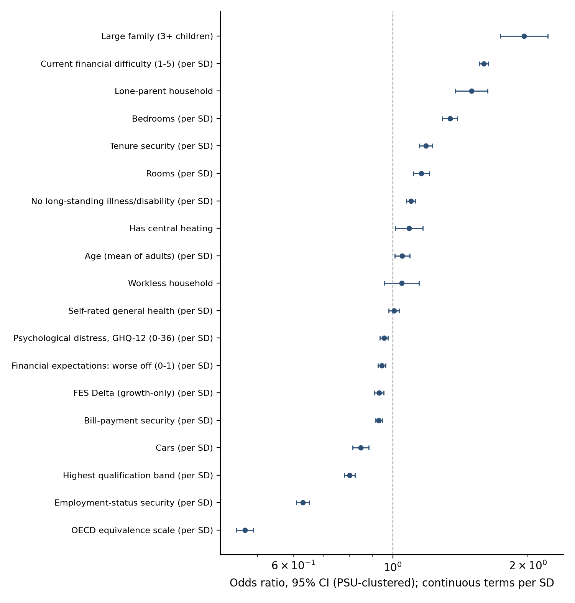 <code>stage3/figures/primary_or_forest.png</code></td>
<td></td><td></td>
</tr></table>

## 6. Stage 4 — resources and H1 (`scripts/stage4_resources.py`, `scripts/stage4_h1.py`)

| File | Rows | What it holds | Rendered in |
|---|---|---|---|
| `resources/cfa_fit.csv` | 1 | CFA fit | = Table A-9 |
| `resources/cfa_loadings.csv` | 13 | CFA loadings | = Table A-10 |
| `resources/cfa_factor_correlations.csv` | 6 | Factor correlations | 02 §6 |
| `resources/cfa_sample_composition.csv` | 5 | Tenure mix, all vs complete-case (99% owners) | 06 §6 |
| `resources/resource_decision.csv` | 1 | Decision and the list of failed criteria | 02 §6 |
| `resources/composite_alpha.csv` | 4 | α per domain (descriptive) | 02 §6 |
| `resources/composite_item_correlations.csv` | 6 | Correlations of domain composites and R | 02 §6 |
| `resources/resource_by_region.csv`, `resource_composite_by_region.csv` | 12 each | Weighted mean composites by region (identical content) | 02 §4 |
| `resources/resource_scores.csv` | row-level | Household scores; **ignored, never committed** | — |
| `stage4/h1_decision.csv` | 4 | Verdict per model | Table 4-5 |
| `stage4/h1_coefficients.csv` | 12 | R, Delta, R × Delta per model | Table 4-5 |
| `stage4/h1_slopes.csv` | 12 | Delta slopes at R p10/p50/p90 | Table 4-5 |
| `stage4/h1_buffering_bound.csv` | 3 | Largest buffering compatible with the CI | Table 4-5 |
| `stage4/h1_logit_prob_slopes.csv` | 3 | Logit slopes on the probability scale | Table 4-5 |

<table><tr>
<td align="center">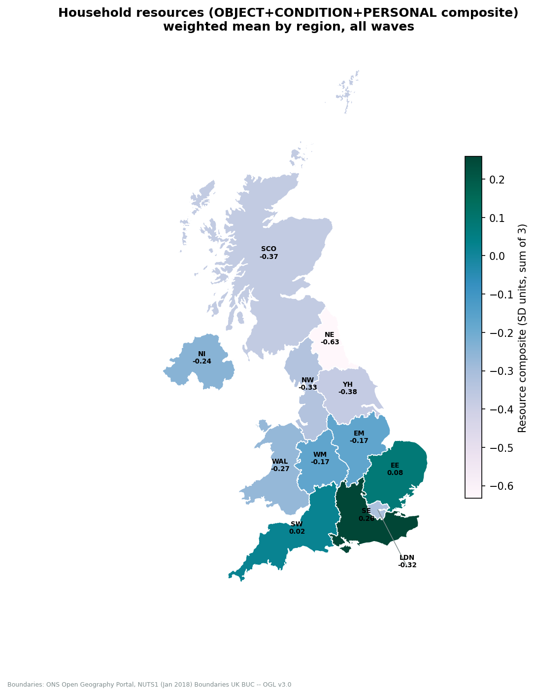 <code>resources/figures/resource_composite_by_region.png</code></td>
<td></td><td></td>
</tr></table>

## 7. Stage 5 — JRF and Northern Ireland (`scripts/jrf_comparison_v2.py`, `scripts/stage5_jrf_thesis.py`)

| File | Rows | What it holds | Rendered in |
|---|---|---|---|
| `jrf/jrf_metadata.csv` | 8 | JRF population, measure, period, page; UKHLS window and unit | = Table 3-7 |
| `jrf/jrf_comparison.csv` | 46 | Category rates, weighted and unweighted, S1 | superseded by T5.2 (with CIs) |
| `jrf/jrf_agreement.csv` | 10 | Spearman and Pearson per dimension | = T5.3 |
| `jrf/region_window_ci.csv` | 48 | Regional rates with bootstrap CIs and ranks, both windows and outcomes | = Table A-12 |
| `jrf/ni_oil.csv` | 3 | NI oil share; oil vs non-oil rates | 02 §7 |
| `jrf/oil_share_by_region.csv` | 12 | Oil heating share by region (pooled, unweighted) | 02 §7 |
| `stage5/thesis_T5_1_jrf_metadata.csv` | 8 | Thesis T5.1 | = Table 3-7 |
| `stage5/thesis_T5_2_comparison.csv` | 46 | Thesis T5.2 | = Table 4-6 (comparison) |
| `stage5/thesis_T5_3_agreement.csv` | 10 | Thesis T5.3 | = Table 4-6 (agreement) |
| `stage5/thesis_T5_4_northern_ireland.csv` | 18 | Thesis T5.4 | 02 §7 |
| `stage5/thesis_secondary_suppression_log.csv` | 1 | Secondary-suppression check (no cell triggered) | 06 §9 |

<table><tr>
<td align="center">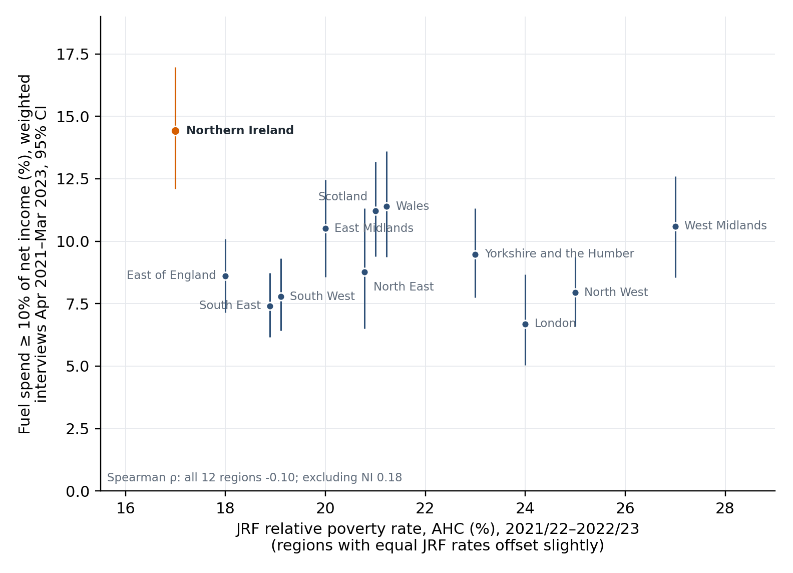 <code>stage5/figures/F5_1_region_vs_jrf.png</code></td>
<td align="center">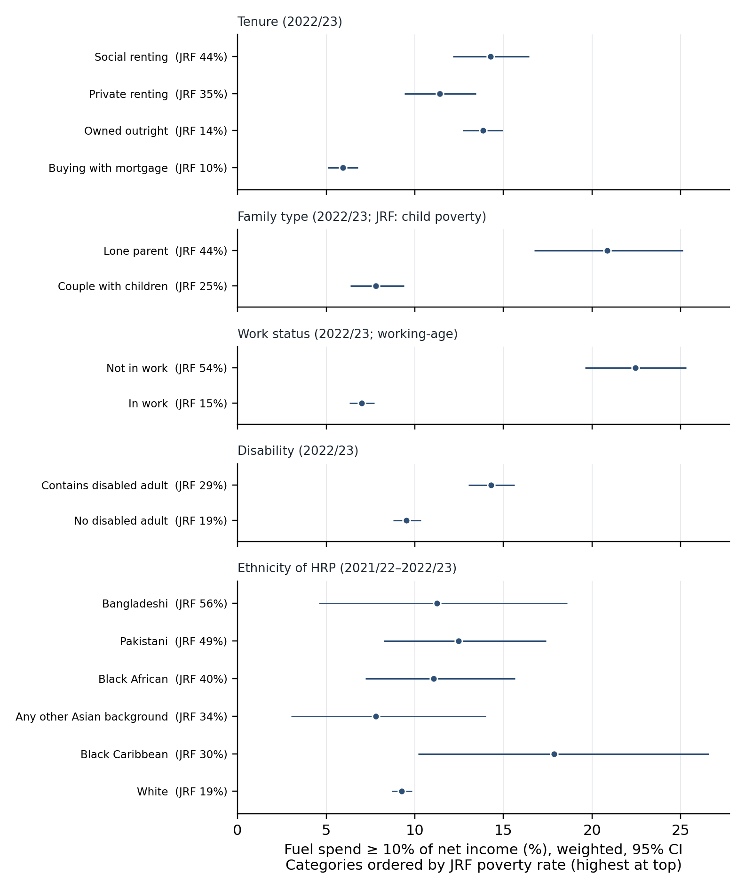 <code>stage5/figures/F5_2_dimensions_vs_jrf.png</code></td>
<td align="center">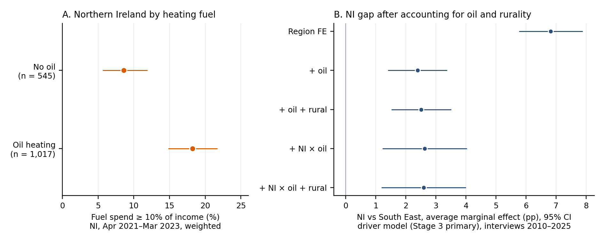 <code>stage5/figures/F5_3_ni_oil.png</code></td>
</tr></table>

## 8. Stage 6 — prediction (`scripts/stage6_prediction.py`, `scripts/stage6_p3_posthoc.py`)

| File | Rows | What it holds | Rendered in |
|---|---|---|---|
| `stage6/metrics.csv` | 18 | AUC, PR-AUC, top-5% and top-10% sensitivity/PPV with CIs, P0–P2 | Table 4-8 |
| `stage6/thesis_table_prediction.csv` | 3 | Table 4-8 source (P0–P2) | Table 4-8 |
| `stage6/delta_auc.csv` | 3 | Paired bootstrap ΔAUC | 02 §8 |
| `stage6/calibration.csv` | 3 | Calibration slope and intercept | = Table A-7 |
| `stage6/per_transition_auc.csv` | 6 | AUC by validation transition | = Table A-2 |
| `stage6/p2b_sensitivity.csv` | 2 | P2b vs P1 on the P2b sample | 02 §8 |
| `stage6/coefficients.csv` | 30 | Training-fit ORs, P0–P2 | 02 §8 |
| `stage6/sample_flow.csv` | 34 | Linked transitions, exclusions, common sample | = Table A-8 |
| `stage6/standardisation_train_stats.csv` | 6 | Training means and SDs used for standardisation | 06 §7 |
| `stage6/posthoc_p3_metrics.csv` | 12 | P3 metrics (**post-hoc, exploratory**) | Table 4-8 |
| `stage6/posthoc_p3_delta_auc.csv` | 2 | P3 − P0, P3 − P1 (**post-hoc**) | 02 §8 |

<table><tr>
<td align="center">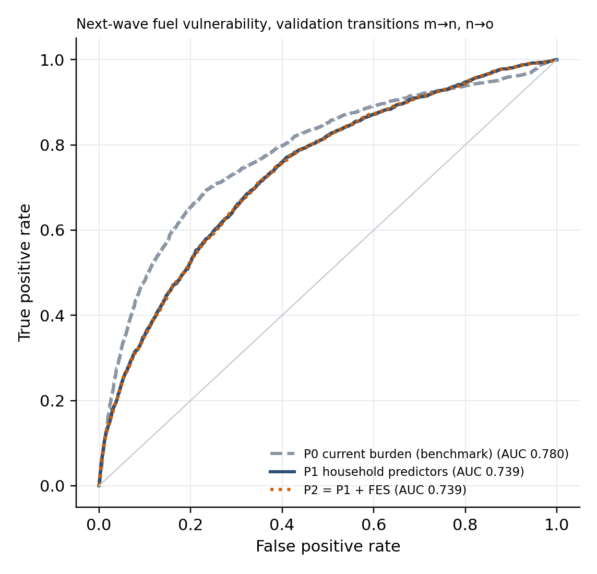 <code>stage6/figures/roc.png</code></td>
<td align="center">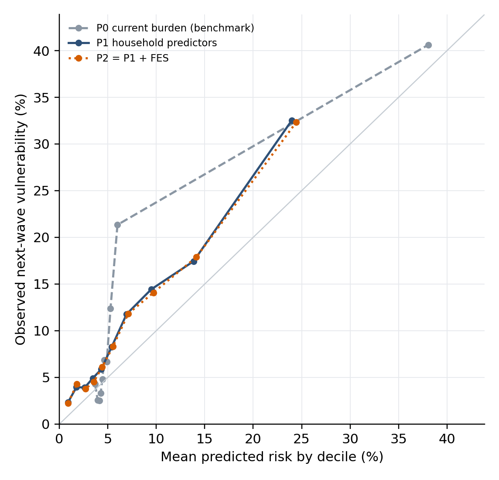 <code>stage6/figures/calibration.png</code></td>
<td></td>
</tr></table>

## 9. Stage 7 — scope (`scripts/stage7_scope.py`)

| File | Rows | What it holds | Rendered in |
|---|---|---|---|
| `stage7/sensitivity_equivalised_income_only.csv` | 5 | Flags and flips by household size | = Table A-11 |
| `stage7/prepayment_by_vulnerability.csv` | 2 | Prepayment use by status | 02 §4 |
| `stage7/regional_change_early_late.csv` | 12 | Regional change, waves a–e vs k–o | 02 §4 |
| `stage7/prevalence_by_fes_tercile.csv` | 6 | Prevalence by FES magnitude and Delta terciles | 02 §9 |

<table><tr>
<td align="center">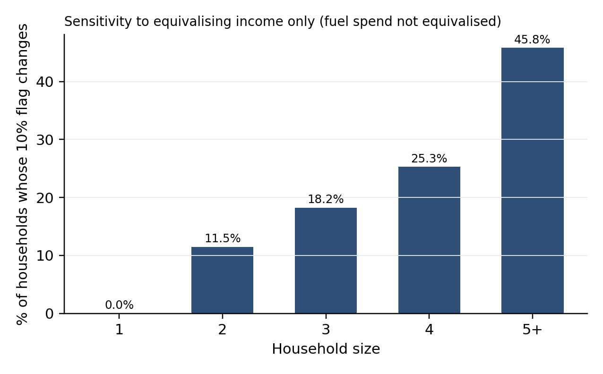 <code>stage7/figures/sensitivity_equivalised_income_only.png</code></td>
<td></td><td></td>
</tr></table>

## 10. Reports, inventory, logs

| File | What it holds |
|---|---|
| `results_inventory.csv` | 622 quotable numbers (R0001–R0622) with label, value, CI, n, unit, source file and commit (`scripts/build_results_inventory.py`) |
| `reports/v1_to_v2_change_summary.md` | Changes from v1 and their effect on each thesis claim |
| `reports/stage4_h1_draft.md` | H1 results draft (`scripts/stage4_h1.py`) |
| `reports/stage5_jrf_ni_draft.md` | JRF and NI results draft (`scripts/stage5_jrf_thesis.py`) |
| `reports/stage6_prediction_draft.md` | H5 results draft (`scripts/stage6_draft.py`) |
| `reports/appendix_scope_note.md` | What moved to the appendix and what was dropped |
| `logs/panel_build.log` | Panel build log: 339,201 rows; 324,055 with FES; 15,146 (2009 interviews) without |
| `ukhls_cleaned/ukhls_panel.csv` | Row-level panel, 339,201 × 127; **ignored, never committed** |

---

## 11. v1 outputs — `outputs/` (read-only, superseded)

`outputs/` holds the v1 pipeline results (tag `submitted-draft-v1`). The plan forbids overwriting them, and they must not be quoted as current results. Directories: `fes/`, `forecasts/`, `forecasts_rolling/`, `figures/` (single-year and rolling forecast figures, both modes), `tables/`, `models/`, `data_description/` (core and macro distribution figures and summary statistics, still valid as input descriptions; see 05 §3), `ukhls_dataset_overview/`, `ukhls_cor_sem/`, `ukhls_cor_cvae/`, `ukhls_vulnerability/`, `ukhls_policy_maps/`, `ukhls_forward_prediction/`. v1 results appear in v2 only as labelled comparisons (the `v1_core` and `v1_macro` rows of the forecast evaluation, the "v1 rule" prevalence columns, v1 FES in `fes_attached_v1_vs_v2.csv`) and in the v1 panels of Figure A-4. The v1 → v2 differences are listed in [`outputs_v2/reports/v1_to_v2_change_summary.md`](../outputs_v2/reports/v1_to_v2_change_summary.md).
