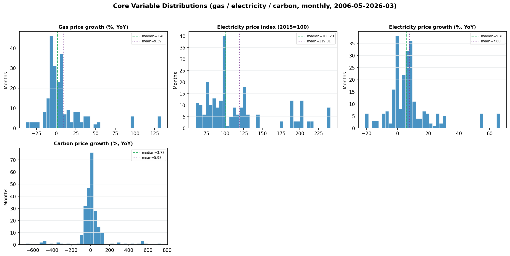
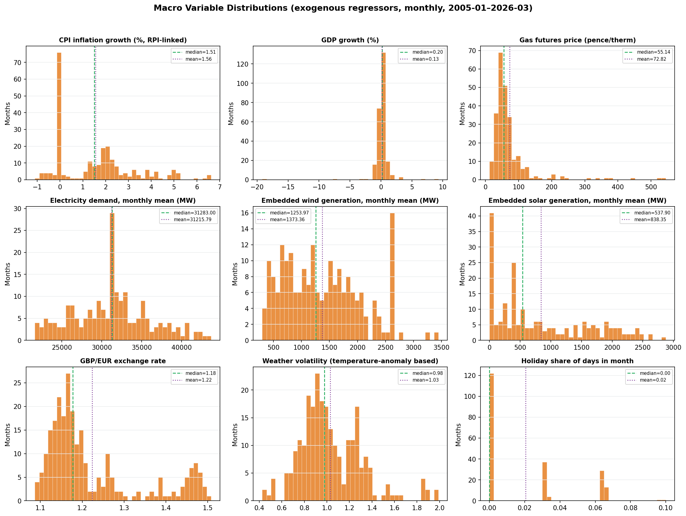

# Data Description: Sources, Coverage, and Distributions

**Project:** Anticipatory Fuel Stress Watch (AFSW) — Forecasting Anticipatory Energy–Carbon Stress and Household Fuel Vulnerability in the UK
**Scope:** every raw and processed *input* file used by the pipeline (as distinct from `reports/01_outputs_catalog.md`, which covers generated *outputs*), with exact coverage, structure, and descriptive statistics. All numbers below were read directly from the files, not approximated.

---

## 1. Overview

The project draws on four categories of input data:

1. **Raw macro-economic and energy-market time series** (`data/raw/`, 9 files) — UK gas/electricity/carbon prices, inflation, GDP, electricity demand, temperature, and exchange-rate series, spanning as far back as 1975 and as recent as 2026.
2. **Processed/feature-engineered time series** (`data/processed/`, 4 files) — the raw series above, cleaned, merged onto a common monthly index, and expanded with lag/rolling/decomposition features for the forecasting models.
3. **UKHLS household panel survey data** (`data/raw/ukhls/`, 30 Stata files) — 15 waves (a–o) of household (`hhresp`) and individual (`indresp`) questionnaire responses, 2009–2024.
4. **Geographic boundary data** (`data/geo/`, 1 GeoJSON file) — real UK NUTS1 regional boundaries for the policy-geography maps.

A fifth input, the Joseph Rowntree Foundation's *UK Poverty 2025* report, is not a file in this repository (it is an external PDF publication) but is documented here since specific values from it are hardcoded, with page/table citations, into `src/ukhls_external_validation.py`.

Sections 3.1 and 3.2 below also include generated distribution figures and full summary-statistics tables (mean/std/quantiles/skew/kurtosis) for the **core** (gas/electricity/carbon) and **macro** (exogenous regressor) variables — produced by `src/data_description_overview.py` (documented in `reports/06_methodology.md` Section 9) and saved to `outputs/data_description/{figures,tables}/`.

---

## 2. Raw Macro-Economic and Energy-Market Data (`data/raw/`)

### 2.1 `Carbon Emissions Futures Historical Data UK.csv`

**Structure:** 253 rows, columns `Date, Price, Open, High, Low, Vol., Change %`. `Price`/`Open`/`High`/`Low` are numeric; `Vol.` and `Change %` are stored as strings (e.g. `"6.44K"`, `"2.57%"`) requiring parsing before use.

**Coverage:** monthly frequency, **2005-05-01 to 2026-05-01** (dates recorded DD/MM/YYYY). The 253-day gap distribution (147×31 days, 84×30, 16×28, 5×29) confirms consistent month-start sampling with no missing months.

**Distribution (`Price`, EUR/tonne CO₂):** mean 28.33, std 27.92, min 0.01, median 15.84, max 95.88 — a right-skewed distribution consistent with the EU-ETS carbon market's historical trajectory from near-worthless allowances in its early (2005–2012) phase to substantially higher prices from the mid-2010s onward.

### 2.2 `UK NBP Natural Gas Quaterly Futures Historical Data UK.csv`

**Structure:** identical 7-column schema to the carbon file above.

**Coverage:** 268 rows, monthly frequency, **2004-02-01 to 2026-05-01**.

**Distribution (`Price`, pence/therm):** mean 71.52, std 68.66, min 11.82, median 54.04, max 544.68 — the maximum (544.68p/therm) corresponds to the extreme 2022 European gas-price spike; the wide gap between mean/median and the maximum reflects a small number of crisis months dominating the tail.

### 2.3 `gas.csv` (ONS series CZDA, dataset MM23)

**Structure:** a 2-column ONS statistical export (`Title`, `RPI:Percentage change over 12 months - Gas`), with a 6-row metadata header (CDID, source dataset ID, unit=%, release date 22-04-2026, next release 20-05-2026) preceding the data body. The data body itself mixes three frequencies in a single column (annual, quarterly, monthly rows are interleaved by label, not separated into distinct columns), requiring frequency-filtering before use — the project's own loader (`src/data_loader.py`) handles this filtering.

**Coverage:** 38 annual rows (1988–2025), 153 quarterly rows (1988 Q1–2026 Q1), 459 monthly rows (1988 JAN–2026 MAR).

**Distribution (monthly RPI 12-month % change in gas prices):** mean 6.35%, std 22.01, min −38.3%, median 1.90%, max 132.9% — a heavily right-skewed distribution (the median is far below the mean), reflecting that large gas-price increases are more extreme and more frequent than large decreases over this 38-year window.

### 2.4 `electricity.csv` (ONS series D7DT, dataset MM23)

**Structure:** same layout as `gas.csv`; column `CPI INDEX 04.5.1 : ELECTRICITY 2015=100`. Unit: index, base year=100. Release date 22-04-2026.

**Coverage:** 38 annual, 153 quarterly, 459 monthly rows, 1988–2026 (same three-frequency structure as gas.csv).

**Distribution (monthly index level, 2015=100):** mean 83.30, std 50.83, min 33.1, median 64.9, max 240.9 — this is a price *level* index, not a growth rate; the project's own preprocessing (`src/data_loader.py`) derives `electricity_growth` (12-month % change) from this level series, which appears in the processed data (Section 3.1).

### 2.5 `cpih08_188.xlsx` (ONS CPIH aggregate 04 — Housing, water, electricity, gas & other fuels)

**Structure:** an Excel workbook with two sheets — `Dataset` (a single UK-level time series) and `Metadata` (47 descriptive rows: release date 18 Feb 2026, monthly frequency, unit "Index: 2015=100", Open Government Licence v3.0).

**Coverage:** 373 monthly observations, **January 1988 to January 2019** — notably, **this file's coverage stops in 2019**, unlike every other ONS series in this data collection, which extend through 2026. Any use of this series for post-2019 analysis would require either an updated extract or reliance on the overlapping macro-controls series instead.

**Distribution:** mean 75.48, std 18.74, min 38.7, median 73.8, max 106.6; zero missing values across all 373 observations.

### 2.6 `historic_demand_2009_2024.csv` (National Grid ESO half-hourly electricity demand)

**Structure:** the largest raw input file (26MB), 279,264 data rows × 24 columns: `settlement_date, settlement_period` (1–50, with 46 or 50 rather than the nominal 48 on clock-change days — confirming genuine half-hourly granularity with correct daylight-saving handling), core demand columns (`nd`=national demand, `tsd`=transmission system demand, `england_wales_demand`), embedded generation columns (wind/solar generation and capacity), storage/pumping, a full set of interconnector flow columns (`ifa_flow`, `ifa2_flow`, `britned_flow`, `moyle_flow`, `east_west_flow`, `nemo_flow`, `nsl_flow`, `eleclink_flow`, `viking_flow`, `greenlink_flow`), and an `is_holiday` flag.

**Coverage:** **2009-01-01 to 2024-12-05**, half-hourly (the finest-grained raw data source in the project, aggregated up to monthly means for use in `macro_controls.csv`).

**Distribution (units MW, implied by National Grid ESO convention):** `nd` (national demand) mean 31,186.6, std 7,827.3, min 13,367, max 59,095; `tsd` mean 32,627.8, std 7,710.0, min 0 (a data artefact — almost certainly an early recording gap rather than a genuine zero-demand half-hour), max 60,147; `england_wales_demand` mean 28,389.0, std 7,087.6, min 0, max 53,325. Zero nulls in the three core demand columns and in the date/period columns; several interconnector-flow columns are legitimately NaN in early rows because those physical interconnectors (e.g. NSL to Norway, ElecLink, Viking, Greenlink) had not yet been commissioned — a genuine absence-of-infrastructure, not a missing-data problem.

### 2.7 `mgdp.csv` (ONS Monthly GDP by industry, chained-volume-measure, seasonally adjusted)

**Structure:** a wide ONS export, 356 total rows × 208 columns; the first 6 rows are metadata (CDID, unit, release/next-release dates, notes), followed by 350 monthly observation rows.

**Coverage:** **January 1997 to February 2026**.

**Distribution (headline "Gross Value Added — Monthly (Index 1dp), CVM SA"):** mean 84.08, std 11.29, min 61.6, median 83.2, max 103.0; zero missing values. The file also carries a specific, domain-relevant "Electricity, gas, steam and air conditioning supply" sub-index: level mean 223.53 (std 68.67, min 90.0, max 362.5), and its own period-on-period growth column (mean −0.20%, std 3.30, min −10.1%, max 12.3%, n=349 non-null — the first observation has no prior period to compute growth against).

### 2.8 `monthly-temperature-anomalies.csv` (global temperature anomaly data, multi-country)

**Structure:** a global panel (Our World in Data-style format), 220,668 total rows across 213 distinct countries/entities, columns `Entity, Code, Day, Temperature anomaly`.

**Coverage (UK subset only, `Entity="United Kingdom"`, `Code="GBR"`):** 1,036 rows, **1940-01-15 to 2026-04-15**, monthly (observation day is consistently the 15th of each month).

**Distribution (UK temperature anomaly, °C relative to a historical baseline):** mean −0.44°C, std 1.32, min −6.99, median −0.39, max 3.65; zero missing values in the UK slice. This series feeds the project's "temperature volatility" macro control, used as an exogenous regressor for the macro-mode forecasting models on the theory that unusually cold/warm periods drive heating/cooling demand and hence price stress.

### 2.9 `series-190626.csv` (ONS GBP/EUR exchange rate, series THAP, dataset MRET)

**Structure:** same 2-column ONS export format as `gas.csv`/`electricity.csv`; column `Average Sterling exchange rate: Euro XUMAERS`.

**Coverage:** 51 annual rows (1975–2025), 205 quarterly rows (1975 Q1–2026 Q1), 616 monthly rows (1975 JAN–2026 APR) — but only **352 of the 616 monthly rows are non-null**, since the Euro (and its ECU precursor) did not exist before the mid-1990s; genuine monthly values begin in **January 1997**.

**Distribution (monthly, non-null values only):** mean 1.3064, std 0.1728, min 1.0867, median 1.2214, max 1.6994.

---

## 3. Processed Time-Series Data (`data/processed/`)

### 3.1 `core_energy_carbon.csv` — the primary gas/electricity/carbon growth-rate file

This is the single most important input file for Stage 1, feeding every forecasting model directly.

**Structure:** 239 rows × 5 columns — `date, gas_growth, electricity_index, electricity_growth, carbon_growth`.

**Coverage:** **2006-05-01 to 2026-03-01**, monthly, zero missing values in any column.

**Distribution:**

| Column | Mean | Std | Min | 25th pctile | Median | 75th pctile | Max | Skew | Excess kurtosis |
|---|---|---|---|---|---|---|---|---|---|
| gas_growth (%) | 9.39 | 29.76 | −38.30 | −5.95 | 1.40 | 13.10 | 132.90 | 2.40 | 6.84 |
| electricity_index | 119.01 | 47.80 | 60.70 | 84.90 | 100.20 | 130.10 | 240.90 | 1.09 | 0.07 |
| electricity_growth (%) | 7.80 | 15.49 | −21.07 | −0.30 | 5.70 | 9.65 | 66.71 | 1.84 | 4.72 |
| carbon_growth (%) | 5.98 | 149.33 | −670.93 | −31.69 | 3.78 | 35.81 | 734.73 | 0.27 | 8.66 |

`carbon_growth`'s standard deviation (149.33) is roughly 25× its mean (5.98), and its range (−670.93 to +734.73) is by far the widest of the three series — a direct consequence of computing percentage growth off a very low base price in the carbon market's early (pre-2013) years, when small absolute price movements translate into enormous percentage swings. This is the same volatility documented from the demand side in `outputs/figures/forecast_vs_actual_carbon.png` (`reports/01_outputs_catalog.md`), and is the reason carbon's forecasting models require proportionally much wider prediction intervals than gas or electricity.

The skew/excess-kurtosis columns quantify this more precisely: `carbon_growth`'s own skew (0.27) is actually the mildest of the four — its extreme range is driven by symmetric fat tails (excess kurtosis 8.66, the highest of the four) rather than one-sided outliers — whereas `gas_growth` (skew 2.40) and `electricity_growth` (skew 1.84) are both markedly right-skewed, consistent with the "large increases more extreme/frequent than large decreases" pattern already noted for gas's raw RPI series in Section 2.3. `electricity_index` is the one column here that is a price *level*, not a growth rate, and its near-zero excess kurtosis (0.07) reflects a genuinely multi-modal rather than fat-tailed shape — visible as three separate clusters in the figure below (a pre-2021 ~60–100 regime, a 2022-crisis-era jump to ~125–145, and a distinct ~190–240 cluster for the most recent months).

**Figure — core variable distributions:**

*Monthly histograms for all four `core_energy_carbon.csv` columns, 2006-05 to 2026-03 (239 months), with mean (dotted) and median (dashed) marked. Generated by `src/data_description_overview.py::run_core`, saved to `outputs/data_description/figures/core_variable_distributions.{png,pdf}`; full summary statistics (including per-variable missingness, confirmed zero here) are in `outputs/data_description/tables/core_variable_summary_stats.csv`.*

### 3.2 `macro_controls.csv`

**Structure:** 255 rows × 48 columns, **2005-01-01 to 2026-03-01**, monthly.

**Content categories:** level variables (`gas_futures_price`, `gbp_eur_rate`, electricity-demand means/peaks, embedded wind/solar generation and capacity means, `pump_storage_pumping_mean`, `interconnector_net_flow_mean`); growth/return transforms (`inflation_growth`, `gdp_growth`, `gas_futures_log_return`, `gas_futures_yoy_growth`, and a `_yoy_growth` variant for each demand/generation series, plus `gbp_eur_yoy_change`/`gbp_eur_mom_change`); a full set of `_lag1` (and some `_lag12`) lagged versions of the above; and two regime/seasonal dummy variables (`post_2016_electricity_regime`, `winter_dummy`).

**Distribution (selected columns):** `inflation_growth` mean 1.56%, max 6.63%; `gdp_growth` mean 0.13%, max 9.30%; `gas_futures_price` mean 72.82, max 544.68 (consistent with the raw gas-futures file in Section 2.2); `gbp_eur_rate` mean 1.224, max 1.508; `electricity_demand_mean` mean 31,215.8, max 43,693.0; `holiday_share` mean 0.0206, max 0.10; `post_2016_electricity_regime` mean 0.482 (≈48% of the sample period falls after 2016); `winter_dummy` mean 0.424 (≈42% of months are winter months, consistent with a 4-of-12-months winter definition plus some rounding).

**Full distribution table (all 27 base, non-lagged, non-dummy columns):**

| Variable | Mean | Std | Min | p25 | Median | p75 | Max | N (non-null) | N missing | Skew | Excess kurtosis |
|---|---|---|---|---|---|---|---|---|---|---|---|
| inflation_growth (%) | 1.559 | 1.695 | −1.107 | 0.000 | 1.509 | 2.345 | 6.627 | 243 | 12 | 0.80 | 0.05 |
| weather_volatility | 1.030 | 0.277 | 0.425 | 0.849 | 0.977 | 1.216 | 1.990 | 250 | 5 | 0.90 | 1.35 |
| gdp_growth (%) | 0.131 | 1.628 | −19.200 | −0.100 | 0.200 | 0.500 | 9.300 | 255 | 0 | −6.02 | 82.99 |
| gas_futures_price (p/therm) | 72.818 | 69.800 | 11.820 | 42.695 | 55.140 | 71.495 | 544.680 | 255 | 0 | 4.11 | 20.04 |
| gas_futures_log_return | 0.594 | 19.595 | −72.367 | −8.497 | 0.425 | 8.548 | 92.102 | 255 | 0 | 0.56 | 3.54 |
| gas_futures_yoy_growth (%) | 29.045 | 102.429 | −79.788 | −27.826 | 2.849 | 45.050 | 563.319 | 254 | 1 | 2.64 | 8.12 |
| electricity_demand_mean (MW) | 31,215.79 | 4,879.28 | 21,610.89 | 27,939.98 | 31,283.00 | 34,230.74 | 43,693.05 | 207 | 48 | 0.19 | −0.32 |
| electricity_demand_peak (MW) | 42,626.72 | 6,946.77 | 29,061.00 | 37,518.00 | 41,944.00 | 47,058.00 | 59,095.00 | 207 | 48 | 0.15 | −0.53 |
| electricity_tsd_mean (MW) | 32,708.79 | 4,876.02 | 22,610.57 | 28,884.16 | 33,059.80 | 35,544.76 | 45,555.60 | 207 | 48 | 0.33 | −0.23 |
| england_wales_demand_mean (MW) | 28,435.45 | 4,365.60 | 19,599.77 | 25,554.38 | 28,733.63 | 31,021.38 | 39,286.27 | 207 | 48 | 0.13 | −0.37 |
| embedded_wind_generation_mean (MW) | 1,373.36 | 688.80 | 297.32 | 787.69 | 1,253.97 | 1,855.66 | 3,446.89 | 207 | 48 | 0.48 | −0.57 |
| embedded_solar_generation_mean (MW) | 838.35 | 777.36 | 0.00 | 213.18 | 537.90 | 1,520.41 | 2,874.29 | 207 | 48 | 0.72 | −0.76 |
| embedded_wind_capacity_mean (MW) | 4,613.34 | 1,972.44 | 1,403.00 | 2,129.98 | 5,305.00 | 6,527.00 | 6,622.00 | 207 | 48 | −0.38 | −1.56 |
| embedded_solar_capacity_mean (MW) | 9,334.03 | 6,096.99 | 0.00 | 2,675.34 | 12,372.00 | 13,080.00 | 17,194.07 | 207 | 48 | −0.39 | −1.38 |
| pump_storage_pumping_mean (MW) | 300.11 | 94.08 | 29.33 | 241.06 | 333.10 | 373.70 | 492.01 | 207 | 48 | −0.62 | −0.44 |
| interconnector_net_flow_mean (MW) | 1,809.72 | 1,399.86 | −2,999.90 | 1,126.13 | 2,103.65 | 2,696.33 | 5,390.54 | 207 | 48 | −0.78 | 0.97 |
| holiday_share | 0.021 | 0.027 | 0.000 | 0.000 | 0.000 | 0.032 | 0.100 | 207 | 48 | 0.88 | −0.68 |
| electricity_demand_yoy_growth (%) | −1.319 | 5.387 | −19.286 | −4.743 | −1.570 | 1.750 | 22.246 | 195 | 60 | 0.40 | 2.69 |
| electricity_peak_yoy_growth (%) | −2.003 | 4.310 | −16.695 | −4.544 | −2.371 | 0.340 | 15.813 | 195 | 60 | 0.39 | 1.82 |
| embedded_wind_generation_mean_yoy_growth (%) | 11.934 | 36.488 | −60.141 | −8.382 | 5.964 | 30.785 | 185.971 | 195 | 60 | 1.10 | 2.37 |
| embedded_solar_generation_mean_yoy_growth (%) | 190.995 | 730.238 | −34.676 | 1.813 | 26.739 | 61.244 | 8,395.819 | 180 | 75 | 8.61 | 88.86 |
| embedded_wind_capacity_mean_yoy_growth (%) | 10.119 | 16.017 | −20.110 | 0.283 | 4.681 | 15.481 | 71.101 | 195 | 60 | 1.94 | 4.31 |
| embedded_solar_capacity_mean_yoy_growth (%) | 115.048 | 304.374 | 0.000 | 5.496 | 11.421 | 69.050 | 1,435.128 | 180 | 75 | 3.30 | 9.66 |
| pump_storage_pumping_mean_yoy_growth (%) | 1.374 | 60.976 | −83.761 | −18.165 | −4.818 | 5.730 | 576.187 | 195 | 60 | 7.03 | 57.95 |
| interconnector_net_flow_mean_yoy_growth (%) | −29.168 | 652.032 | −4,587.436 | −35.509 | 6.357 | 50.606 | 5,719.615 | 195 | 60 | 0.88 | 44.99 |
| gbp_eur_rate | 1.224 | 0.116 | 1.087 | 1.147 | 1.177 | 1.263 | 1.508 | 255 | 0 | 1.20 | 0.10 |
| gbp_eur_yoy_change (%) | −0.913 | 6.562 | −20.342 | −4.273 | 0.095 | 3.046 | 15.007 | 255 | 0 | −0.49 | 0.38 |
| gbp_eur_mom_change (%) | −0.072 | 1.686 | −8.288 | −0.931 | 0.068 | 1.016 | 3.742 | 255 | 0 | −0.94 | 2.69 |

Two shape patterns stand out: `gdp_growth`'s excess kurtosis (82.99, by far the largest in the table) and strongly negative skew (−6.02) are both driven by a single extreme observation — the 2020 COVID-lockdown GDP collapse (min −19.2%) sitting far from an otherwise tightly clustered series (p25/median/p75 all within [−0.1, 0.5]); and the `_yoy_growth` columns for wind/solar generation and capacity are all right-skewed with large excess kurtosis (up to 88.86 for `embedded_solar_generation_mean_yoy_growth`), reflecting that year-on-year growth off a small base is mechanically volatile in the same way `carbon_growth` is in Section 3.1 — early in the panel, embedded solar/wind capacity was small enough that modest absolute MW increases produce enormous percentage swings.

**Figure — macro variable distributions (representative subset):**

*Monthly histograms for 9 representative `macro_controls.csv` columns (the full 27-variable table above covers every base column), 2005-01 to 2026-03, mean (dotted) and median (dashed) marked. Generated by `src/data_description_overview.py::run_macro`, saved to `outputs/data_description/figures/macro_variable_distributions.{png,pdf}`; the complete table (all 27 columns, including the ones not plotted) is in `outputs/data_description/tables/macro_variable_summary_stats.csv`.*

**A data-handling note, corrected against the current data file:** the electricity-demand/generation-derived columns (`electricity_demand_mean`, `electricity_demand_peak`, `electricity_tsd_mean`, `england_wales_demand_mean`, the `embedded_wind_*`/`embedded_solar_*` columns, `pump_storage_pumping_mean`, `interconnector_net_flow_mean`, `holiday_share`, and their `_yoy_growth` derivatives) are genuinely **NaN, not 0**, for the 48 rows (2005-01 to 2008-12) before `historic_demand_2009_2024.csv`'s 2009 coverage begins — confirmed directly against `data/processed/macro_controls.csv` for this update (an earlier draft of this report stated these were zero-filled; that is no longer accurate for the current data file and has been corrected here). The two solar columns are the one exception with a genuine, non-missing **0**: `embedded_solar_generation_mean`/`embedded_solar_capacity_mean` are legitimately 0.0 for 15 rows in the early-2010s, reflecting that grid-connected embedded solar capacity in Great Britain was genuinely near-zero before roughly 2011, not a fill artefact.

### 3.3 `core_processed.csv` — feature-engineered expansion of `core_energy_carbon.csv`

**Structure:** the same 239 rows and the same 2006-05-01–2026-03-01 date range as `core_energy_carbon.csv`, expanded from 5 to **69 columns**.

**Added features:** calendar encodings (`month`, `sin_month`/`cos_month`, `month_sin`/`month_cos` — appears twice under slightly different naming, worth noting as a minor redundancy — `winter_dummy`, `time_index`, `year`); an STL-style seasonal decomposition of gas and electricity growth into `_trend`/`_seasonal`/`_irregular` components; regime dummy variables (`post_2016_electricity_regime`, `post_2008_regime`, `low_price_regime`); boolean outlier flags for the growth series and their decomposition components; signed-log transforms (e.g. `gas_growth_signed_log`, preserving sign while compressing magnitude for series that can be negative); and a full lag/rolling-statistics feature set (`_lag1/_lag3/_lag6/_lag12`, `_rm3/_rstd3/_rm6/_rstd6/_rm12/_rstd12` — rolling mean/std at 3/6/12-month windows) for each of the three growth series. This expansion is purely additive feature engineering — no rows are added, removed, or altered in their underlying values relative to `core_energy_carbon.csv`.

### 3.4 `macro_processed.csv` — feature-engineered expansion of `macro_controls.csv`

**Structure:** the same 255 rows and 2005-01-01–2026-03-01 date range as `macro_controls.csv`, expanded from 48 to **158 columns**.

**Added features:** calendar encodings (`month`, `sin_month`/`cos_month`, `time_index`); for every `_lag1` macro control already present, a further set of second-order lag/rolling features (`_lag1_lag1`, `_lag1_lag3`, `_lag1_rm3`, `_lag1_rstd3`, `_lag1_rm6`, `_lag1_rstd6`); rolling statistics on the `post_2016_electricity_regime` dummy itself; and one cross-reference column, `electricity_growth_lag12`, linking back to the energy-carbon series' own 12-month-lagged value. Again, purely additive feature engineering relative to `macro_controls.csv` — identical rows and dates, no value alterations.

---

## 4. UKHLS Household Panel Survey Data (`data/raw/ukhls/`)

30 Stata (`.dta`) files: one household-level (`hhresp`) and one individual-level (`indresp`) file per wave, for all 15 waves (a through o). Every wave's row and variable count below was verified independently by reading each file's Stata header metadata directly (not estimated or taken from prior documentation), covering **all 15 waves, not a sample**.

### 4.1 Household-level files (`{wave}_hhresp.dta`)

| Wave | Variables | Rows | Wave | Variables | Rows | Wave | Variables | Rows |
|---|---|---|---|---|---|---|---|---|
| a | 227 | 30,169 | f | 448 | 24,454 | k | 317 | 18,139 |
| b | 227 | 30,484 | g | 341 | 23,033 | l | 507 | 16,856 |
| c | 225 | 27,751 | h | 525 | 21,746 | m | 537 | 16,156 |
| d | 527 | 25,817 | i | 334 | 20,048 | n | 600 | 21,385 |
| e | 290 | 24,325 | j | 496 | 19,252 | o | 466 | 19,586 |

**Total across all 15 waves: 339,201 household-wave rows** — this independently confirms (via a completely separate data-reading approach: raw Stata header metadata, not the pipeline's own processed panel) the same 339,201 figure already reported throughout this project's outputs and README, a useful cross-check that the two counting methods agree exactly.

Two patterns are worth noting: (1) row counts decline fairly steadily from wave a's 30,169 down to a trough of 16,156 at wave m, before rising again at wave n (21,385) — consistent with cumulative panel attrition followed by a sample refreshment/boost around wave n; and (2) the number of variables collected per wave grows substantially over the panel's life (227 at wave a to 600 at wave n), reflecting additional questionnaire modules introduced over the study's 15-year span — meaning later waves are structurally richer in available covariates than earlier ones, a consideration for any analysis (like the SEM) that pools across all 15 waves and can only use variables available in every wave it includes.

### 4.2 Individual-level files (`{wave}_indresp.dta`)

| Wave | Variables | Rows | Wave | Variables | Rows | Wave | Variables | Rows |
|---|---|---|---|---|---|---|---|---|
| a | 1,393 | 50,994 | f | 2,111 | 45,192 | k | 3,380 | 32,008 |
| b | 1,660 | 54,568 | g | 2,850 | 42,170 | l | 2,773 | 29,271 |
| c | 3,102 | 49,692 | h | 2,168 | 39,294 | m | 3,219 | 27,998 |
| d | 2,111 | 47,074 | i | 3,180 | 36,058 | n | 3,974 | 35,471 |
| e | 2,625 | 44,837 | j | 2,484 | 34,319 | o | 3,483 | 32,849 |

**Total across all 15 waves: 601,795 individual-wave rows.**

Individual-level files are far wider than household-level files (up to 3,974 variables at wave n, vs. a maximum of 600 for hhresp), reflecting the much larger individual questionnaire instrument, and are correspondingly larger on disk (up to 176MB for a single wave's `indresp.dta`). This project's own preprocessing reads only a deliberately small, named subset of these thousands of available individual-level variables per wave (documented in full in `src/ukhls_mapping.py`'s variable registry) — the vast majority of each `indresp` file's content is not used by this analysis, which is a normal and expected consequence of UKHLS's breadth as a general-purpose household panel rather than a survey purpose-built for this project's specific research questions.

**Variables added this iteration:** `HH_FAMILY_VARS`/`HH_EQUIVALISATION_VARS` (household file — `hhtype_dv`, `nkids_dv`, and related fields feeding the family-composition group and OECD-modified equivalisation scale) and `IND_EMPLOYMENT_VARS` (individual file — `jbstat`, `jbft_dv`, `jbsemp`, feeding the employment-status construct), plus `fuelduel`/`duelpay`/`elecpay` (household file — the prepayment-meter/rationing proxy). All four additions are read from variables already present in the raw wave files documented above; no new raw data files were required.

### 4.3 Implications for the merged analysis panel

The 339,201-row merged panel used throughout Stages 2–5 of this project (`outputs/ukhls_cleaned/ukhls_panel.csv`) is built from the 339,201 `hhresp` rows above, left-joined with individual-level items aggregated up from the corresponding wave's `indresp` file (mean-aggregated for ordinal/continuous items, specially handled for categorical items — see `reports/06_methodology.md` Section 3.1–3.3). Because household row counts (30,169–16,156 depending on wave) are always smaller than individual row counts (50,994–27,998), the aggregation step is a genuine many-to-one reduction (multiple individual respondents per household), not a one-to-one merge.

---

## 5. Geographic Boundary Data (`data/geo/uk_nuts1_regions.geojson`)

**Structure:** a GeoJSON `FeatureCollection` with an explicitly stated coordinate reference system (`{"type": "name", "properties": {"name": "EPSG:4326"}}` — WGS84, the standard latitude/longitude system — stated in the file itself rather than assumed by convention).

**Content:** 12 features, one per NUTS1 region, matching the UK's standard 12-region/nation breakdown used throughout this project:

| NUTS1 code | Region name | Geometry type |
|---|---|---|
| UKC | North East (England) | MultiPolygon |
| UKD | North West (England) | MultiPolygon |
| UKE | Yorkshire and The Humber | Polygon |
| UKF | East Midlands (England) | Polygon |
| UKG | West Midlands (England) | Polygon |
| UKH | East of England | MultiPolygon |
| UKI | London | Polygon |
| UKJ | South East (England) | MultiPolygon |
| UKK | South West (England) | MultiPolygon |
| UKL | Wales | MultiPolygon |
| UKM | Scotland | MultiPolygon |
| UKN | Northern Ireland | MultiPolygon |

8 of the 12 regions are `MultiPolygon` geometries (reflecting offshore islands or exclaves — e.g. Scotland's islands, South West England's islands), while 4 (Yorkshire and the Humber, East Midlands, West Midlands, London) are simple, contiguous `Polygon` geometries. Each feature additionally carries ONS-style metadata: `OBJECTID`, `nuts118cd`, `nuts118nm`, a British National Grid centroid (`bng_e`/`bng_n`), a WGS84 centroid (`long`/`lat`), computed shape area/length, and a `GlobalID` GUID — sourced from the ONS Open Geography Portal's public ArcGIS FeatureServer under the Open Government Licence v3.0.

---

## 6. External Benchmark Data (Joseph Rowntree Foundation, *UK Poverty 2025*)

Not a file within this repository's `data/` directory — an external, independently-published PDF report, cited here for completeness since specific values from it are hardcoded (with page/table references preserved as code comments) into `src/ukhls_external_validation.py`, rather than re-derived or estimated.

**Source:** Joseph Rowntree Foundation, *UK Poverty 2025*, published January 2025, using Department for Work and Pensions Households Below Average Income (HBAI) data. The measure used throughout is relative income poverty, after housing costs (AHC) — equivalised household income below 60% of the UK median — mostly averaged over the 2021/22–2022/23 period.

**Values extracted (all stated explicitly in the source report's text or tables, never estimated from a chart):**

- `JRF_POVERTY_RATE_BY_REGION` — 12 UK nations/regions (Table 6, p.51), e.g. North East 21%, London 24%, West Midlands 27% (highest), Northern Ireland 17% (lowest).
- `JRF_POVERTY_RATE_BY_ETHNICITY` — 6 ethnicity groups with an explicitly stated rate (p.9/42), e.g. White 19%, Bangladeshi 56% (highest), Pakistani 49%. Categories JRF shows only in a chart without a stated number (e.g. Indian, Chinese, Mixed ethnic groups) are deliberately excluded rather than estimated.
- `JRF_POVERTY_RATE_BY_DISABILITY` — 2 categories (Table 8, p.67): No disabled adult 19%, Contains disabled adult 29%.
- `JRF_POVERTY_RATE_BY_TENURE` — 4 tenure categories (Table 10, p.95): Owned outright 14%, Buying with mortgage 10%, Social renting 44% (highest), Private renting 35%.
- `JRF_POVERTY_RATE_BY_FAMILY_TYPE` — 2 categories (Table 5, p.36, **new this iteration**): Lone parent 44%, Couple with children 25%. These are JRF's stated *child* poverty rates by family type, not household/adult rates like the other benchmarks above — noted explicitly since it's a different unit.
- `JRF_POVERTY_RATE_BY_WORK_STATUS` — 2 categories (p.76, **new this iteration**): In work 12%, Not in work 43%.

Several category-mapping decisions are documented explicitly in the source code and should be noted by anyone extending this benchmark: JRF's "East" region label is mapped to this project's "East of England"; this project's "Private renting" tenure category folds in employer-provided rented accommodation (`tenure_dv` code 5), for which JRF has no separate category.

---

## 7. Summary: Data Provenance and Licensing

| Source | Provider | Licence | Coverage in this project |
|---|---|---|---|
| Carbon/gas futures prices | Third-party financial data provider | (as obtained; not redistributed) | 2004/2005–2026 |
| Gas/electricity/GDP/exchange-rate indices | Office for National Statistics (ONS) | Open Government Licence v3.0 | 1975/1988/1997–2026 |
| CPIH housing/energy aggregate | ONS | Open Government Licence v3.0 | 1988–2019 only |
| Half-hourly electricity demand | National Grid ESO | Public dataset | 2009–2024 |
| Temperature anomalies | Multi-country climate dataset (Our World in Data-style) | Public dataset | 1940–2026 (UK subset used) |
| UKHLS household panel | Understanding Society, UK Data Service Study 6614 | Standard End User Licence — raw data not redistributed with this repository | 2009–2024 (waves a–o) |
| UK NUTS1 boundaries | ONS Open Geography Portal | Open Government Licence v3.0 | Current UK regional boundaries |
| External poverty benchmark | Joseph Rowntree Foundation, *UK Poverty 2025* | Published report; specific stated values used with citation | 2020/21–2022/23 (varies by table) |
